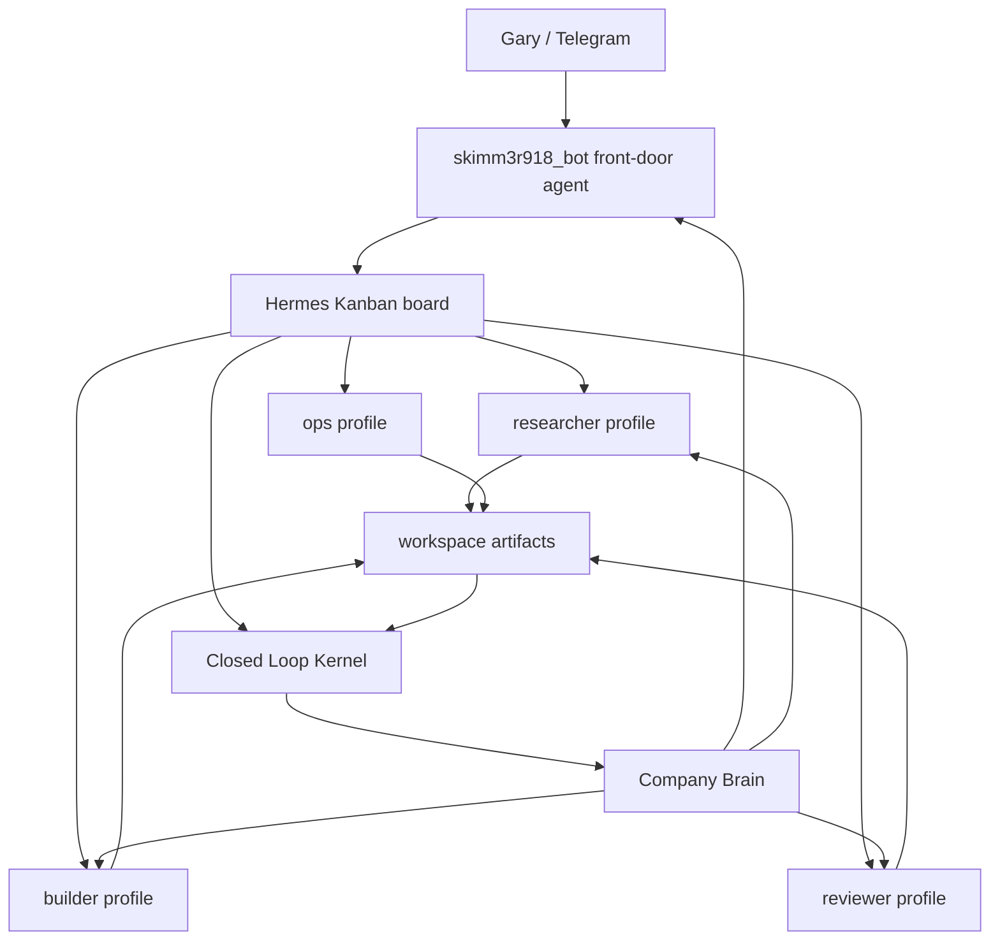

# Hermes Agent-first 架構研究

## 問題

如果現在讓 `skimm3r918_bot` 當作主要入口，下面有很多不同 profile 的小 agent 分工負責不同事情，這樣是否可行？

## 短結論

可行，而且 Hermes 的設計本來就支持這個方向。但要分清楚三種機制：

1. **Profile**：長期身份與狀態隔離。
2. **delegate_task**：短命、同步、一次性的子任務。
3. **Kanban**：durable、多 profile、多 agent 的任務板與工作佇列。

如果目標是打造 AI 原生公司，主入口 agent + 多 profile 小 agent 應該以 **Kanban + profiles** 為主，`delegate_task` 只作為短任務工具。

## Hermes 的架構邏輯

Hermes 官方架構把系統拆成幾層：

```text
Entry points
  CLI / Gateway / ACP / Batch / API
      -> AIAgent
          -> prompt builder
          -> provider resolution
          -> tool dispatch
          -> compression / caching
          -> session persistence
          -> tool backends
```

關鍵點：

- `AIAgent` 是共用核心。
- CLI、Telegram gateway、cron、ACP 都會建立或驅動同一種 agent loop。
- session 存在 SQLite + FTS5。
- profile-aware path 由 `HERMES_HOME` 控制。
- tools 透過 registry / toolsets 管理。
- gateway 是長時間常駐入口。

這代表 Hermes 很適合當「agent runtime」，但不等於已經內建完整 Company Brain。

## Profiles 適合做什麼

Profile 是 Hermes 的長期 agent 身份。

每個 profile 都有自己的：

- `config.yaml`
- `.env`
- `SOUL.md`
- memories
- sessions
- skills
- cron jobs
- state database
- gateway state

所以 profile 很適合代表不同職能：

```text
skimm3r918_bot      -> front door / router / Gary interface
researcher          -> external/internal research
builder             -> code/workflow implementation
reviewer            -> evidence review / QA / risk check
ops                 -> recurring ops / monitoring
brain-curator       -> summarize traces into company memory
```

但 profile 不是 sandbox。Hermes 文件也明確說：profile 隔離的是 state directory，不限制 filesystem access。要做真正邊界，還要靠 terminal backend、cwd、container、allowlist、approval gate 或我們自己的 kernel。

## delegate_task 適合做什麼

`delegate_task` 是同步子任務：

- parent agent 會等 child 完成。
- child 有乾淨 context。
- child 有自己的 terminal session。
- parent 只拿到 final summary。
- 適合短時間、需要推理、但不需要長期狀態的任務。

限制：

- 不 durable。
- parent 被 interrupt，child 會一起中斷。
- child 不適合需要 human-in-the-loop 的流程。
- child 的過程不天然成為公司級 audit trail。

所以它適合：

- 查三個方案再回報摘要。
- 請一個乾淨 reviewer 看某段 code。
- 對單一問題做獨立研究。

它不適合：

- 一個跨天任務。
- 需要審批、重試、轉交、追蹤的公司流程。
- 多角色接力。

## Kanban 適合做什麼

Hermes Kanban 比較接近我們要的「AI 公司工作流」。

官方設計裡，每個 task 是 SQLite 裡的一列，每個 handoff/comment 都是可讀寫的 durable row。dispatcher 會定期掃任務，依 assignee profile 產生 worker。

這個設計很符合：

```text
主入口 agent
  -> 建 task
  -> 指派 profile
  -> worker 執行
  -> 留 comment / heartbeat / complete metadata
  -> reviewer 或 human 接續
  -> brain 匯入
```

它比 `delegate_task` 更適合 AI 原生公司，因為：

- task 有狀態。
- worker 是 named profile，有長期身份。
- 可以跨 agent handoff。
- 可以 human-in-the-loop。
- 可以 crash reclaim / retry。
- task comments 和 metadata 可以被後續 agent 讀取。
- 適合接回 Closed Loop Kernel。

## 建議架構



## `skimm3r918_bot` 的定位

目前不應該讓它直接變成「什麼都做」的 agent。

它比較適合當：

- Gary 的 Telegram 入口
- 任務澄清者
- routing / decomposition agent
- approval requester
- status summarizer
- Company Brain 查詢入口

它不應該長期負責：

- 大量寫 code
- 大量 research
- 大量檔案修改
- 所有任務的唯一記憶來源

## Closed Loop Kernel 要補的部分

Hermes 提供 runtime、profiles、gateway、kanban、sessions、skills、tools。

我們要補的是公司級的閉環內核：

- unified event contract
- append-only audit
- artifact hash
- failure -> candidate -> replay -> approval -> apply
- cross-agent trace import
- human-readable review UI
- memory promotion rule
- company-level query surface

換句話說：

```text
Hermes = agent runtime / work execution layer
Closed Loop Kernel = verification / audit / approval / replay layer
Company Brain = long-term query / learning / operating memory layer
```

## 可行性判斷

可行，但要用對 primitive。

### 建議採用

- `skimm3r918_bot` 作為入口 agent。
- Hermes profiles 作為職能型長期 agent。
- Hermes Kanban 作為 durable work queue。
- Closed Loop Kernel 匯入任務與成果紀錄。
- Company Brain 只吃經過整理的 traces，不直接吃所有 raw logs。

### 不建議採用

- 只靠 `delegate_task` 做整間公司。
- 所有 profile 共用一份無邊界記憶。
- 讓入口 agent 同時負責執行、審查、批准。
- 把 profile 當成安全 sandbox。
- 先蓋一個大腦，再回頭硬接 agent。

## 第一個設計實驗

不要先讓 agent 產出正式任務。先做一個空跑設計：

1. 建一個 `gary-company` Kanban board。
2. 定義 3 個 worker profile 的 `SOUL.md` 和 `terminal.cwd`。
3. 建一個不會修改 production 的 sample task。
4. 讓 worker 只產出一份 markdown artifact。
5. Closed Loop Kernel 匯入 task / session / artifact。
6. 在 UI 顯示：
   - 誰接任務
   - 做了什麼
   - 產物在哪
   - 有沒有 reviewer
   - 是否可批准進入 memory

這樣可以驗證 agent-first 架構，而不急著把 agent 放出去做大事。

