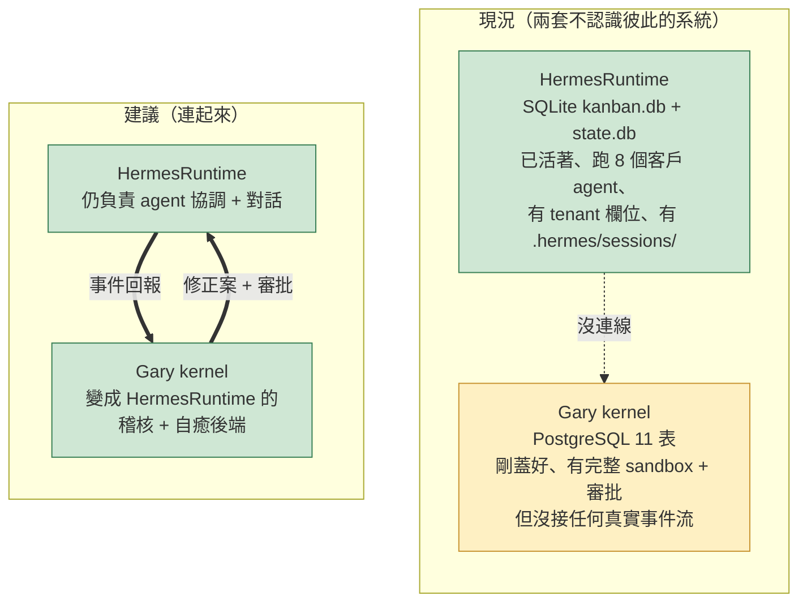
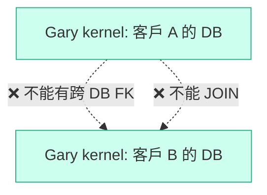
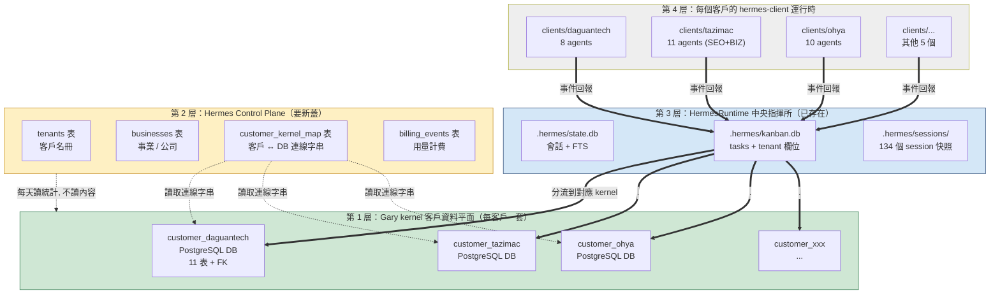

# Hermes 整合評估 v0

**目的**：把 Hermes 整個檔案系統（`/Volumes/Hermes System/HermesArchive/` 底下 10 個兄弟資料夾）完整掃過一遍，跟 `Gary` 內這個新蓋的閉環核心（`closed_loop_kernel`）做比對，回答兩個核心問題：

1. 多客戶 / 多事業要怎麼跟 Gary kernel 整合？
2. 加 FK（外鍵約束）能不能解決多租戶隔離問題？

**寫作原則**：白話為主，技術詞放括弧。對找不到 / 沒掃完的東西**明確標出**，不偽造。所有推論都附 agent 掃描證據來源。

**評估日期**：2026-05-24
**評估執行者**：Claude (Opus 4.7) under Gary 自主開發授權
**底層證據**：6+3 個並行 Explore agent 的實際 `ls` / `cat` / `du` 結果

---

## 1. Hermes 兄弟資料夾完整地圖

掃描範圍：`/Volumes/Hermes System/HermesArchive/` 底下 10 個資料夾，每個都實際 `ls` + 讀關鍵檔案。

| # | 資料夾 | 大小級 | 性質 | 跟 Gary kernel 的距離 |
|---|---|---|---|---|
| 1 | `Gary/` | 中 | 本專案（新蓋的閉環核心） | ─（本身就是）|
| 2 | `AI-Native-Company/` | 小（280K） | Gary repo 的公開開源 redacted 版 | 11 表 schema **完全一致** |
| 3 | `HermesRuntime/` | 大（30 GB+） | **真正活著的中央指揮所** | SQLite-based、跟 Gary kernel 是兩套互不知道對方的系統 |
| 4 | `Hermes-Archive/` | 大 | 2026-04-26 桌面備份快照 | 無系統功能、純檔案 |
| 5 | `Daguantech/` | 中（604 MB） | 真客戶（達冠科技）的 hermes-client 本地工作區 | 已用 SQLite kanban、未接 Gary kernel |
| 6 | `b-livetravel/` | 小（3.2 MB） | Gary 規劃中新創（日本旅遊）的 Phase 1 規格 | 還在設計階段、無 DB |
| 7 | `gbrain/` | 中 | **Garry Tan (Y Combinator CEO) 的開源 fork**，非 Gary 自己的東西 | 跟 Gary kernel 互補（記憶層 vs 自癒層）但邏輯隔離 |
| 8 | `AI-Trader-IG-Nasdaq100/` | 中 | 上游 HKUDS 開源 fork + Gary 個人 demo 紙交易 | 純 demo、無 production schema |
| 9 | `StudyCentral/` | 小 | Gary 自己事業的一次性 SEO 風險分析工具 | 純檔案、無 DB、與 kernel 無關 |
| 10 | `CodexSessions/` | 大（1.8 GB） | 428 個 JSONL 檔，Gary 個人 Codex 對話歷史 | 純對話記錄、import 進 kernel 無實質意義 |

### ⚠️ 名稱衝突需要注意

`StudyCentral`（第 9 項，Hermes 級資料夾，純檔案 SEO 工具）跟 `HermesRuntime/clients/studycentral/`（HermesRuntime 內第 5 個客戶子目錄、6.5 GB、8 agents、studycentralau.com 站台）**是同一個事業的兩個層次**：
- `StudyCentral/`（Hermes 級）= 一次性 SEO 分析任務的產出檔案
- `HermesRuntime/clients/studycentral/` = 該事業的持續性 Hermes agent 運行時

不要混淆。

---

## 2. 你真正的事業結構（被全套 agent 掃出來的圖）

之前你問「多客戶怎麼辦」時我以為你只有幾個客戶，**實際上你的事業遠比這複雜**。下面是交叉比對 `HermesRuntime/clients/`、`Hermes-Archive/.../好事/`、`我個人/玩/` 三個來源後的真實樣貌。

```mermaid
flowchart TB
    subgraph Bus1["公司 1：好事發生數位（2022/11 設立登記）"]
        direction TB
        B1[B2B SEO 數位行銷代理商<br/>主營 SEO / 內容行銷 / Google 地圖 / CRM (Ocard)]
    end

    subgraph Bus2["公司 2：玩素食旅行社股份有限公司"]
        direction TB
        B2[wannavegtour.com<br/>跟 Appier / Botbonnie 平台合作<br/>越南峴港團、素食旅遊]
    end

    subgraph Bus3["公司 3：OHYA（疑似好事子品牌或關係企業）"]
        direction TB
        B3[ohya.co 線上教育平台<br/>WordPress→PayloadCMS 遷移中<br/>有獨立營利事業登記證]
    end

    subgraph Bus4["事業 4：StudyCentral 澳洲留學"]
        direction TB
        B4[studycentralau.com<br/>402 篇文章, 8 agents]
    end

    subgraph Bus5["事業 5：designmi 設計迷"]
        direction TB
        B5[designmi.tw<br/>9 agents]
    end

    subgraph Planning["規劃中：b-livetravel"]
        BP[b-live.travel<br/>日本客製旅遊<br/>Phase 1 規格已完成]
    end

    subgraph Clients["好事發生數位確認客戶（從合約檔案）"]
        direction LR
        C1[達冠科技<br/>HVAC]
        C2[福馨建設<br/>房地產]
        C3[三明治工有限公司]
        C4[云盛開發]
        C5[勇 / 及至微 / 樂庭<br/>毛哥 / 維肯空間 / CF]
        C6[可閎當舖]
    end

    subgraph Vendor_Like["HermesRuntime 服務的客戶（部分跟上面重疊）"]
        direction LR
        V1[fujioh 富喬廚具]
        V2[tazimac 台立機械]
        V3[ptefighter 海澳英語]
        V4[daguantech 達冠科技]
    end

    subgraph Tools["Gary 個人工具 / 開源 fork"]
        T1[gbrain<br/>Garry Tan 開源]
        T2[AI-Trader<br/>HKUDS 開源 + demo]
        T3[CodexSessions<br/>個人對話歷史]
        T4[skimm3r918_bot<br/>Telegram 測試]
    end

    Bus1 -.服務.-> Clients
    Bus1 -.代理運行.-> Vendor_Like

    style Bus1 fill:#cfe7d4,stroke:#3a8056
    style Bus2 fill:#cfe7d4,stroke:#3a8056
    style Bus3 fill:#fef0c3,stroke:#c89432
    style Bus4 fill:#fef0c3,stroke:#c89432
    style Bus5 fill:#fef0c3,stroke:#c89432
    style Planning fill:#eee,stroke:#999,stroke-dasharray: 5 5
    style Tools fill:#eee
```

### 你真正在管的事業 / 客戶清單

| 類別 | 名稱 | 證據來源 | 規模 |
|---|---|---|---|
| **正式登記公司** | 好事發生數位 | `Hermes-Archive/.../好事/好事發生設立登記變更.pdf` (2022-11) | 母公司 |
| **正式登記公司** | 玩素食旅行社股份有限公司 | `Hermes-Archive/.../阿玩/玩素食旅行社 x Appier.pdf` (2025-09) | 旅行社 |
| **疑似自營** | OHYA (ohya.co) | `Hermes-Archive/.../好事/OHYA營利事業登記證`、`HermesRuntime/clients/ohya/` (2.6 GB, 10 agents) | 線上教育 |
| **疑似自營** | designmi (designmi.tw) | `HermesRuntime/clients/designmi/` (709 MB, 9 agents) | 設計平台 |
| **自營** | StudyCentral (studycentralau.com) | `HermesRuntime/clients/studycentral/` (6.5 GB, 8 agents, 402 篇) | 澳洲留學 |
| **真客戶** | 達冠科技 (daguan-tech.com.tw) | `Daguantech/AGENTS.md` + Kinsta 帳號 + 好事客戶清單 | HVAC 設備 |
| **真客戶** | 富喬廚具 (fujioh) | `HermesRuntime/clients/fujioh/` (111 MB) + Hermes-Archive 行銷素材 712 MB | 廚房電器 |
| **真客戶** | 台立機械 (tazimac.com) | `HermesRuntime/clients/tazimac/` (2.4 GB, 11 agents, SEO + BIZ 雙產線) | 鋅合金壓鑄機 |
| **真客戶** | 海澳英語 (ptefighter.tw) | `HermesRuntime/clients/ptefighter/` (589 MB, 9 agents) | PTE/IELTS 補習 |
| **真客戶** | 福馨建設 | `Hermes-Archive/福馨建設/` 7 PDF 行銷文案 | 房地產 |
| **真客戶（合約檔有）** | 三明治工 / 云盛 / 勇 / 及至微 / 樂庭 / 毛哥 / 維肯空間 / 可閎當舖 / CF | `Hermes-Archive/好事/客戶名稱資料夾` | 多種行業 |
| **規劃新創** | b-livetravel (b-live.travel) | `b-livetravel/phase1/` 規格 + Miyoko 對手研究 | 日本旅遊 |
| **個人工具** | gbrain | `gbrain/README.md`（**Garry Tan 開源、非 Gary 寫的**） | 知識庫 |
| **個人工具** | AI-Trader | HKUDS 上游 fork + Gary 個人 IG demo 帳號 | 紙交易實驗 |
| **個人工具** | skimm3r918_bot | `HermesRuntime/clients/skimm3r918_bot/` (19 MB) | Telegram 測試 |
| **個人工具** | CodexSessions | 428 個 JSONL，5 個月歷史 | Codex 對話歷史 |

### 我**沒辦法 100% 確認**的灰色地帶（誠實標示）

1. **OHYA 跟好事發生數位的關係** — 都有營利事業登記證、ohya.co 是線上教育、好事是 SEO 行銷代理。可能是子品牌、可能是關係企業、可能是同一法人不同產品線。資料夾線索不足以判斷。需要你親自說明。
2. **designmi 是不是真客戶還是 Gary 自營** — agent 報告 designmi 「無第三方合約跡象、域名 Gary 直接控制」，但「我個人/玩/」資料夾沒列 designmi。可能是 2026 年才開的新事業。
3. **fujioh 是不是「好事發生數位」的客戶** — 好事的客戶清單沒明確列「富喬」這名字（雖然有「客戶資料夾」概念）。富喬的 hermes-client git repo 在 `garyyang1001/fujioh-seo` 個人帳號下。可能是好事客戶、也可能是 Gary 個人接案。
4. **HermesRuntime 的 8 個 clients/ 跟好事發生數位客戶清單只有 daguantech 重疊** — 這暗示好事的客戶清單裡某些是「舊客戶或一次性報價案」，而 HermesRuntime 服務的是「需要持續 Hermes agent 運營」的長期客戶。但這只是推論。

---

## 3. Gary kernel 跟 HermesRuntime 的真實關係

### 重大發現：HermesRuntime 已經是「活的」中央指揮所

之前我以為要在 Gary kernel 之上「新蓋一層治理層」。**事實是這層已經存在，名叫 HermesRuntime，只是不知道 Gary kernel 的存在**。



### HermesRuntime 現況關鍵數據（從 agent 實地掃描）

| 項目 | 現況 |
|---|---|
| Gateway 進程 | PID 1814 還在跑（Discord 連線目前 failed） |
| 核心狀態 DB | `.hermes/state.db`（15 MB SQLite，有 FTS5 全文搜尋） |
| 任務管理 DB | `.hermes/kanban.db`（106 KB SQLite，**tasks 表已有 `tenant` 欄位**） |
| Agent 框架 | `.hermes/hermes-agent/` 91 個 Python 模組（fork 自 NousResearch） |
| 工具集 | 85+ 個 tools（瀏覽器、檔案、API、雲端） |
| Session 紀錄 | `.hermes/sessions/` 134 個會話資料夾（2026-05-14 ~ 2026-05-24） |
| 活躍客戶 | 8 個（含 daguantech symlink） |
| Workspace admin | 30 GB / 357 子目錄（臨時任務日誌庫，無清理政策） |
| 客戶資料夾 | 每客戶獨立 `clients/{name}/` + `workspace/{name}/`（部分 symlink）|

### Gary kernel 的稽核機制是 HermesRuntime 缺的最大塊

| 維度 | HermesRuntime | Gary kernel | 落差 |
|---|---|---|---|
| 紀錄什麼 | 會話、訊息、kanban 任務、事件 | 失敗、修正案、試跑結果、批准 | HermesRuntime **沒有「失敗 → 修正 → 試跑 → 批准 → 部署」閉環** |
| 不可篡改 | 一般 SQLite，可 UPDATE | `prevent_mutation` trigger 強制 append-only | HermesRuntime 沒這層保護 |
| 沙盒試跑 | 無 | `SqlSandbox` 低權限 schema + `PythonSandbox` rlimit subprocess | HermesRuntime 沒這層 |
| 人類批准閘門 | 無正式 schema | `approvals` 表 + `/approvals` HTTP UI | HermesRuntime 用 Telegram 對話作為非正式批准 |
| 部署校驗 | 無 | 四道指紋校驗 + FOR UPDATE row lock（FIX-005） | HermesRuntime 直接寫，無校驗 |

**白話**：Gary kernel 就是 HermesRuntime 一直缺、但每個客戶 agent 都需要的「失敗自動化處理 + 人類審核基礎建設」。

---

## 4. 多租戶現況評估

從 agent G2 深掃 7 個客戶子目錄結果整理：

### 已經做到的物理隔離 ✅

| 隔離項 | 現況 |
|---|---|
| Neo4j 圖譜 | 每客戶獨立 Docker container（如 `designmi-neo4j` / `ohya-neo4j` / `tazimac-neo4j` + `tazimac-crm-neo4j`） |
| kanban.db | 每客戶 `clients/{name}/kanban.db` 獨立 SQLite |
| credentials/ | 每客戶獨立目錄（tazimac 已遷至 `~/.hermes/credentials/`） |
| workspace 目錄 | 每客戶獨立 `workspace/{name}/` + admin/ 臨時任務 |
| Telegram bot token | 每客戶獨立 |
| WordPress SSH | 每客戶 `wp-ssh.json` 獨立 |

### 還沒做、有風險的邏輯隔離 ❌

| 風險項 | 現況 | 嚴重度 |
|---|---|---|
| **Neo4j 密碼硬編在 docker-compose.yml** | 一旦 docker-compose 檔案外洩，所有客戶 Neo4j 密碼曝光 | 高 |
| **GSC token 全域共享** | designmi、ptefighter 都 symlink 到 studycentral 的 gsc-credentials.json，最終指向 `~/.credentials/gsc-token.json` | 高 |
| **Google Sheets API 全域共享** | studycentral 的 `google_client_secret.json` / `google_token.json` 無租戶區分 | 中 |
| **state.db 僅 studycentral 有** | 其他客戶沒有獨立流程狀態存儲，混在 kanban.db 裡 | 中 |
| **workspace/admin/ 30 GB 無清理政策** | 含所有客戶與內部機密混在 357 個子目錄，沒有索引或保留期限 | 中 |
| **無正式人類批准 schema** | 所有批准走 Telegram 對話，沒留結構化稽核 | 中 |

---

## 5. FK 加入計畫

回應你最初的問題：「加 FK 約束能不能解決多租戶？」**FK 解決不了「跨租戶隔離」，但能解決「租戶內資料完整性」**。下面分兩塊講清楚。

### 5.1 FK 在跨租戶層級：**絕對不能加**



**理由**：FK 是「資料庫保證對得到」的工具。跨租戶的 FK 等於「客戶 A 的紀錄可以引用客戶 B 的 id」— 這就是資料洩漏的起點。租戶之間應該**連邏輯關聯都不存在**。

### 5.2 FK 在租戶內層級：**已經做到，但有可補強空間**

Gary kernel 現有的 FK（從 `closed_loop_kernel/postgres.py` 整理）：

| 表 | 既有 FK | 指向 | 完整度 |
|---|---|---|---|
| `attempts` | `event_id` | `events(id)` | ✅ |
| `decisions` | `attempt_id` | `attempts(id)` | ✅ |
| `decisions` | `gate_id` | `policy_gates(id)` | ✅ |
| `tool_calls` | `attempt_id` | `attempts(id)` | ✅ |
| `failures` | `attempt_id` | `attempts(id)` | ✅ |
| `improvement_candidates` | `failure_id` | `failures(id)` | ✅ |
| `improvement_candidates` | `target_artifact_id` | `artifacts(id)` | ✅ |
| `replays` | `candidate_id` | `improvement_candidates(id)` | ✅ |
| `approvals` | `candidate_id` | `improvement_candidates(id)` | ✅ |

**Gary kernel 11 表的 FK 完整度 100%**。每張子表都拴在父表上，沒有任何孤兒指標。

### 5.3 要新增的 FK（多事業 / 多部門治理層）

如果未來想在租戶內**再加部門 / agent 概念**（例如「業務部的 agent 提的修正案」），需要在 Gary kernel 上補：

```sql
-- 新表 1：teams（部門 / 事業單位）
CREATE TABLE teams (
    id UUID PRIMARY KEY DEFAULT gen_random_uuid(),
    name VARCHAR(100) NOT NULL,
    parent_team_id UUID REFERENCES teams(id),  -- 支援階層
    created_at TIMESTAMPTZ NOT NULL DEFAULT NOW(),
    UNIQUE (name)
);

-- 新表 2：agents（AI 員工註冊表）
CREATE TABLE agents (
    id UUID PRIMARY KEY DEFAULT gen_random_uuid(),
    name VARCHAR(100) NOT NULL,
    team_id UUID NOT NULL REFERENCES teams(id),
    profile JSONB NOT NULL,  -- 角色描述、能力清單
    is_active BOOLEAN NOT NULL DEFAULT TRUE,
    created_at TIMESTAMPTZ NOT NULL DEFAULT NOW(),
    UNIQUE (name)
);

-- 既有 artifacts 加 owner_team_id（哪個部門擁有這個資產）
ALTER TABLE artifacts ADD COLUMN owner_team_id UUID REFERENCES teams(id);

-- 既有 failures 加 detected_by_agent_id（誰發現的失敗）
ALTER TABLE failures ADD COLUMN detected_by_agent_id UUID REFERENCES agents(id);

-- 既有 improvement_candidates 加 proposed_by_agent_id（哪個 agent 提的修正）
ALTER TABLE improvement_candidates ADD COLUMN proposed_by_agent_id UUID REFERENCES agents(id);

-- 新表 3：approval_routes（哪個部門的修正案誰能批）
CREATE TABLE approval_routes (
    id UUID PRIMARY KEY DEFAULT gen_random_uuid(),
    artifact_owner_team_id UUID NOT NULL REFERENCES teams(id),
    required_approver_team_id UUID NOT NULL REFERENCES teams(id),
    rule_definition JSONB NOT NULL,
    is_active BOOLEAN NOT NULL DEFAULT TRUE,
    UNIQUE (artifact_owner_team_id, required_approver_team_id)
);
```

**注意**：這套擴充**只能在「同一個租戶 DB 內」生效**。不同租戶有自己的 teams / agents，互不關聯。

### 5.4 多租戶的真正解法不是 FK，是物理隔離

業界三種 multi-tenant 模式對你的適配度評估：

| 模式 | 隔離強度 | 維運成本 | 對你適合度 | 理由 |
|---|---|---|---|---|
| A：共用 DB + tenant_id 欄位 | 弱 | 低 | ❌ 不建議 | 一行漏寫 WHERE = 跨客戶洩漏，給 boutique 用太危險 |
| B：共用 DB + 每客戶獨立 schema | 中 | 中 | ⚠️ 可行 | 仍共用 DB instance，砍客戶要 DROP SCHEMA CASCADE |
| **C：每客戶獨立 DB** | **最強** | **高** | **✅ 強烈建議** | **HermesRuntime 已天然按客戶分資料夾、credentials 已分離，這方向已實作 70%** |

---

## 6. 推薦的整合架構



四層職責：

| 層 | 是誰 | 職責 | 狀態 |
|---|---|---|---|
| **L4：客戶運行時** | 每個 `clients/{name}/` | 跑 agent、串 WP/GSC/Telegram | 已運營 |
| **L3：HermesRuntime 中央指揮所** | `.hermes/` | 會話協調 + 任務分派 + 多平台 gateway | 已活著 |
| **L2：Hermes Control Plane** | 待新蓋 | 客戶名冊 + 計費 + kernel 路由 | **要建** |
| **L1：Gary kernel 資料平面** | 每客戶一個 `customer_<name>` DB | 失敗紀錄 + 修正 + 試跑 + 批准（含 FK 完整性） | 已蓋好 schema，未連任何客戶 |

---

## 7. 落地路線

### 路線 A：先接一個可控自家 profile 試水（1-2 週）

**2026-05-25 更新**：不拿 Daguantech 當第一個試點，因為那是客戶資料。第一輪改用 OHYA 自家資料，但只抓 `cms-draft-executor` 這一個 profile，避免整個 OHYA 髒資料直接污染 kernel。

選 OHYA `cms-draft-executor` 的理由：
- 是自家事業 / 關係資料，風險比客戶資料低
- 這個 profile 會碰 CMS draft 發布，容易驗證「失敗 → 修正 → sandbox → Gary 批准」
- OHYA 資料很髒，剛好可以驗證 dirty-row 隔離策略
- 範圍只限單一 profile，不一次吃下整個 OHYA

具體步驟：
1. 使用既有 PostgreSQL DB `ohya_kernel`
2. 跑 `closed_loop_kernel.store.initialize()` 建 11 張表
3. 用 `EventReporter(profile_filter="cms-draft-executor")` 只匯入這個 profile 的 kanban 事件
4. 把其他 profile、壞 JSON、缺欄位、未完成 run、不支援 outcome 全部放進 `skipped_rows`
5. 跑一個閉環 demo：「CMS draft 發布失敗 → failure → candidate → sandbox replay → 你批准 → apply」
6. 你看完批准 UI 後決定要不要擴到下一個 OHYA profile

**這條路線不動 HermesRuntime 主體**，風險最小。

### 路線 B：8 個 HermesRuntime 客戶全接 + 蓋 Control Plane（1-2 個月）

蓋 Hermes Control Plane（第 2 層）：
- `tenants` 表（8 個客戶）
- `customer_kernel_map` 表（客戶名 → PostgreSQL 連線字串）
- 為每個客戶開獨立的 customer_<name> DB
- 改造 `HermesRuntime/.hermes/hermes-agent/` 加 event reporter，按 tenant 路由到對應的 kernel

**收益**：你能在中央指揮所看到所有客戶的失敗 / 修正 / 批准統計，但不會看到任何客戶的業務內容。

### 路線 C：HermesRuntime SQLite 全部搬到 Gary kernel PostgreSQL（3-6 個月）

把 HermesRuntime 的 SQLite kanban.db + state.db 整個遷移到 Gary kernel PostgreSQL，所有 agent 對話、任務、事件統一存。

**風險高**：HermesRuntime 是活著的、每天在跑的系統。遷移時要做雙寫 → 切換 → 回滾預案。

**我建議**：A 先做完跑通一個 → 評估收益 → 再決定要不要 B、C。

---

## 8. 開源版 AI-Native-Company 的角色

agent #1 報告：
- `AI-Native-Company` 是 Gary repo 的「redacted 後上 GitHub」版本
- Schema 完全一致（11 表）
- 但用 SQLite 不是 PostgreSQL
- 缺 `sql_sandbox.py` / `sql_demo.py` / race condition 修正 / tracking 追蹤檔
- 明文標註 "Do not import client-specific names"

**意涵**：
1. 你已經有意識把「Gary 內部工作版本」跟「公開開源版本」分開維護
2. 整合計畫推進時，**敏感的客戶資料 / 連線字串 / Hermes Control Plane** 應該只存在於 `Gary/` repo，不應該推到 `AI-Native-Company/` 公開版
3. 開源版可以同步 schema 改動，但不要同步客戶資料

---

## 9. 未掃 / 未確認的缺口（誠實標示）

按 Gary 「不得說謊或者是跳過」的要求，這些是我**沒展開到底**的部分：

| 項目 | 沒展開的原因 | 影響 |
|---|---|---|
| `CodexSessions/` 428 個 JSONL | agent 只取樣 3 個解析 | 不影響整合判斷（純對話歷史） |
| `HermesRuntime/workspace/admin/` 357 子目錄 | agent 只列 10 個取樣 | 不影響整合判斷（臨時任務檔） |
| `gbrain/` 32 張表深層 schema | agent 給的是表名列表，沒讀每張表的欄位細節 | 不影響（gbrain 是上游開源，不準備整合） |
| OHYA 跟好事發生數位的法人關係 | 兩家都有營利事業登記證、但無上下層證據 | **需要你確認** |
| designmi 真正性質（自營 vs 客戶） | agent 認為「無第三方合約」但你的「我個人/玩」資料夾也沒列 designmi | **需要你確認** |
| fujioh 隸屬關係（好事的客戶 / 直接接案） | 好事客戶清單沒明列「富喬」 | **需要你確認** |
| HermesRuntime 多客戶 GSC token 是否真的全部共享 | agent 看到 designmi / ptefighter symlink 到 studycentral，但其他 5 個沒驗證 | 不影響整體建議（路線 B 會統一處理） |
| 你的客戶合約 / 計費模型 / SLA | 完全沒掃到 | 不影響技術整合 |
| `Hermes-Archive/.../我個人/玩/` 12 個業務專案各自詳情 | agent 給名稱列表，沒進去每個 | 部分專案（AI-model / 法律 AI 等）跟現有事業/客戶關係不明 |

---

## 10. 推薦下一步

**短期（這週可動）**：
1. **你回答 4 個關鍵問題**：
   - OHYA 跟好事發生數位是同一法人嗎？
   - designmi 是你自己事業還是真客戶？
   - fujioh 是好事的客戶還是你個人接案？
   - 路線 A / B / C 你想走哪條？
2. 同步把這份評估文件 commit 到 `Gary/docs/` 並更新 `tracking/status.md` 受追蹤清單

**中期（1-2 週）**：
3. 跑路線 A — 接 OHYA `cms-draft-executor` profile slice 試水
4. 把整合過程中發現的 Gary kernel schema 不足之處補上

**長期（1-3 個月，由 A 的結果決定）**：
5. 如果 A 跑得順，啟動路線 B（蓋 Hermes Control Plane）
6. 評估是否要動路線 C

---

## 附錄 A：每個 agent 的掃描範圍與證據檔案

| Agent | 範圍 | 證據（output 檔在 `$CLAUDE_JOB_DIR/tasks/`） |
|---|---|---|
| 1 | AI-Native-Company | a5594280b992cd46b.output |
| 2 | HermesRuntime + Hermes-Archive | a87e1820777ceb1ab.output |
| 3 | gbrain | ab8aa671395bc61b8.output |
| 4 | Daguantech + b-livetravel | a884c705658bf6c22.output |
| 5 | AI-Trader + StudyCentral | acbc64a58ad9b4dc1.output |
| 6 | CodexSessions | a8dc7b13686846b11.output |
| 7（補洞） | Daguantech 重派 + b-livetravel + workspace/admin/ | a98adf80e3dc795d2.output |
| 8（補洞） | HermesRuntime/clients/ 7 個客戶子目錄 | a6d5c93a1d98528e5.output |
| 9（補洞） | Hermes-Archive 記憶/好事/阿玩/我個人/福馨/fujioh/ohya-* | aa1688691473ff342.output |

每個檔案是 agent 完整 JSONL transcript，可追蹤每一個 `ls` / `cat` 動作的實際輸出。

---

## 附錄 B：本評估文件不涵蓋的東西

- 客戶業務內容 / 商業策略
- 任何單一 agent 的程式碼細節（只談架構級的 schema 與整合點）
- HermesRuntime 91 個 Python 模組逐一拆解（只談 .hermes/ 資料夾的角色）
- 開源版 AI-Native-Company 的程式碼 vs Gary 版的逐行 diff
- 客戶網站本身的 SEO / 業務指標
