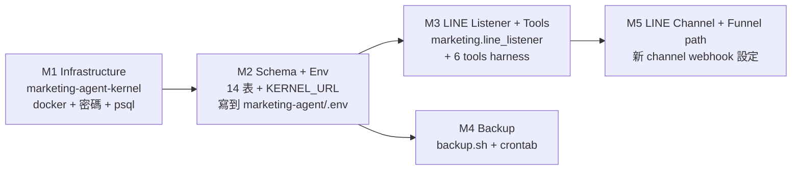

# Marketing Agent Bootstrap Plan — LINE bot 優先

**Status**: SKELETON (2026-05-26)
**Companion to**: `docs/plans/2026-05-26-op-kernel-codex-execute-plan.md` (op kernel 同樣 4 階段拆解)
**Mirrors**: `op-assistant` 整套架構,但獨立資源(獨立 LINE channel / kernel DB / listener port / credentials dir)。

> 本文件 = 行銷 agent 從 0 到 1 的設計地圖。**只描述目標狀態與必須的決策點**,不執行任何指令。實際施工會走「Claude brief → Codex 多階段執行 → Claude 驗證」流程,跟 op kernel 一樣。

---

## 1. 為什麼新開一個 agent(不延伸 op-assistant)

- OP 與 行銷 是兩個獨立部門,工作流程、權限、SLA 完全不同
- OP 主要是 read(查行程、查出團);行銷是 write(行程上架、內容產出)— write 風險面完全不同
- LINE 群組不同 → 必須獨立 channel,否則訊息混群
- 失敗隔離:行銷 agent 壞掉不能影響 OP bot 生產服務
- 「code is rule」精神:每個 agent 各自有清楚的 deterministic 路由,不共用 dispatch logic

---

## 2. 共通護線(每個施工 brief 都重複寫)

絕對不能碰:
- `wannavegtourcrm-backend-1` / `-frontend-1` / `-admin-1` / `-postgres-audit-1` / `-redis-1` (港 5433/8001/8002/3002/6379)
- `ohya-neo4j`(港 7475/7688)
- `open-webui`(港 3000)
- **op-assistant 全套**:8765 listener (PID 49146)、`op-assistant-kernel` 容器 (港 5434)、`~/.hermes/profiles/op-assistant/`、`~/.hermes/credentials/wannavegtour/op_kernel/`、OP 的 LINE channel + webhook URL、LINE 群組 `C24cf0311116b96f22aced7cc2f7cac8d`
- `hermes-gateway.service`(default profile systemd)
- Tailscale Funnel(目前指 8765 → OP)
- `/home/wannavegtour/clients/wannavegtourcrm/` 整個目錄

每階段 pre-flight + post-flight 都 verify。任一項失敗 STOP。

---

## 3. 資源命名 / port / 路徑 對照表(行銷 ⇄ OP)

| 資源 | OP (existing) | Marketing (target) |
|---|---|---|
| Profile dir | `~/.hermes/profiles/op-assistant/` | `~/.hermes/profiles/marketing-agent/` ✓ 建立完成 |
| Codename | 小弟 | **TBD**(候選:小妹 / 小行 / 上架小幫手 / 行銷小幫手) |
| LINE channel | OP channel(creds 在 `op_kernel/` 旁) | **TBD** — 新申請 channel |
| LINE 群組 ID | `C24cf0311116b96f22aced7cc2f7cac8d` | **TBD** |
| 觸發 prefix | `小弟` / `@小弟` / `/小弟` / `小弟 ?` | **TBD**(對齊 codename) |
| Listener bind | `127.0.0.1:8765` | `127.0.0.1:8766` |
| Listener PID file | `~/.hermes/run/wannavegtour/listener.pid` | `~/.hermes/run/marketing/listener.pid` |
| Listener log | `~/.hermes/run/wannavegtour/listener.log` | `~/.hermes/run/marketing/listener.log` |
| Funnel public URL | `https://spark-8035.tailb40323.ts.net/wannavegtour/line/webhook` | `https://spark-8035.tailb40323.ts.net/marketing/line/webhook`(同一台 funnel,不同 path)|
| Credentials dir | `~/.hermes/credentials/wannavegtour/` | `~/.hermes/credentials/wannavegtour/marketing/` (mode 700) |
| Kernel container | `op-assistant-kernel` (港 5434) | `marketing-agent-kernel` (港 5435) |
| Kernel DB name | `op_assistant_kernel` / user `op_kernel` | `marketing_agent_kernel` / user `marketing_kernel` |
| Kernel password file | `~/.hermes/credentials/wannavegtour/op_kernel/db_password.txt` | `~/.hermes/credentials/wannavegtour/marketing/db_password.txt` |
| Audit JSONL | `~/.hermes/line_events/wannavegtour.jsonl` | `~/.hermes/line_events/marketing.jsonl` |

---

## 4. 4 階段拆解(mirror op-kernel 的 multi-agent codex 流程)



**時序**:M1 → M2 → (M3 ∥ M4) → M5 → done。每階段 Claude 驗證後才放行下階段。

### M1 — Kernel Infrastructure
- 鏡像 op-kernel-codex C1,但全部資源換成 marketing 命名 / 5435 port
- 產出:`marketing-agent-kernel` 容器 healthy on `127.0.0.1:5435`
- Pre-flight 多一條:**confirm `op-assistant-kernel` 還 healthy**(避免施工誤傷 OP)

### M2 — Schema + Env
- 用 `closed_loop_kernel.store.KernelStore` 初始化(同 op,Gary repo 的 package)
- 14 表 + 6 prevent_mutation triggers(events / attempts / decisions / tool_calls / approvals / attempt_lifecycle_events 為 append-only)
- 寫 `KERNEL_DATABASE_URL` 到 `~/.hermes/profiles/marketing-agent/.env` (mode 600)
- Pre-flight:M1 healthy + op-assistant-kernel 仍 healthy + CRM 5433 仍在

### M3 — LINE Listener + 6 tools
新建 package(暫定路徑,跟 wannavegtour 同源頭目錄)`marketing/` 鏡像 `wannavegtour/`:
- `marketing/line_listener.py` — ThreadingHTTPServer on 8766
- `marketing/config.py` — load_config / load_line_config (mode 600 enforce)
- `marketing/router.py` — deterministic prefix + intent classifier(regex / keyword,no LLM)
- `marketing/tools/` — 6 個 tool:
  - `query_intent` — deterministic
  - `fetch_wc_data` — WC REST,read
  - `compose_reply` — LLM 內容產出(這裡才會用 LLM)
  - `validate_reply` — deterministic schema / safety check
  - `send_reply` — LINE reply API,push fallback
  - `escalate_to_gary` — 不確定就 hand-off,寫 events
- `marketing/workers/` — Type M1 / M2 / M3 workers
  - Type M2(行程上架):強制 dry_run → allowed_users gate → confirm 後才 apply,且只開 WC draft 不 publish
- audit 雙寫:JSONL + kernel events table

### M4 — Backup
- 鏡像 op-kernel C4,backup.sh + crontab,backup 路徑換成 `marketing/backup/{daily,weekly,monthly}/`

### M5 — LINE Channel + Funnel
- 新 LINE channel 申請(Messaging API)— Gary 手動在 LINE Developers Console 操作
- creds 寫到 `~/.hermes/credentials/wannavegtour/marketing/line-bot.json` (mode 600)
- Tailscale Funnel 既有 hostname 已綁 8765;加 `/marketing/line/webhook` path 路由到 8766
  - 方案 A:funnel 改前置 reverse-proxy(nginx user unit)同時轉發 `/wannavegtour/*` → 8765 + `/marketing/*` → 8766
  - 方案 B:第二個 funnel 端點(若 Tailscale plan 允許多 funnel)
  - **決策待定**,M5 才決定

---

## 5. 回報機制 + 學習機制(closed_loop_kernel 對接)

**回報** = 每個 LINE event 觸發的處理流程,寫進 kernel 的:
- `events` — 入口 event(LINE webhook payload metadata,不存原文敏感)
- `attempts` — 每次 worker 嘗試
- `attempt_lifecycle_events` — start / tool_call / decision / success / fail
- `tool_calls` — 每個 tool 呼叫的 input/output hash
- `decisions` — router 做的 deterministic 判斷(append-only)
- `failures` — 任何 worker 例外
- `approvals` — Type M2 write 操作的 allowed_users 簽核紀錄

**學習** = 不是 LLM 自動 patch。流程是:
1. failures + improvement_candidates 累積
2. Gary / Claude 定期(weekly)review
3. 確認模式 → 寫成 code change(deterministic 規則 / 新 tool / 修 router)
4. PR → Codex 執行 → Claude 驗證 → 上線
5. 在 `decisions` 表留下 trace「2026-XX-XX 因 failure pattern Y,新增規則 Z」

「code is rule」== 學習結果必須 land 成 code,不是 prompt / fine-tune。

---

## 6. 待 Gary 決策的設計點 (Decisions needed)

| # | 決策點 | 建議 default | 影響 |
|---|---|---|---|
| D1 | Bot codename | 小妹 / 小行 / 上架小幫手 / 行銷小幫手 → 任選 | SOUL.md, prefix, 群組溝通 |
| D2 | LINE channel 用法 | **新申請獨立 channel** (vs 共用 OP channel + 分 prefix) | 風險、權限、群組分流 |
| D3 | LINE 群組 | 新建群組 vs 加入現有行銷群 | 邀請流程 |
| D4 | Funnel 路由方式 | nginx reverse-proxy 統一 8765/8766 | 多 listener 並存的長期方案 |
| D5 | Type M2 allowed_users | 由 Gary 指定 LINE user_id 白名單 | 上架寫權限 |
| D6 | LLM model for compose_reply | 沿用 default profile model(`hermes config show`) | 內容品質 + cost |
| D7 | 行銷部門「行程上架」SOP | Gary 確認目前手動流程 | router 規則設計輸入 |

---

## 7. 進度追蹤

- ✅ Hermes profile 骨架建立 (`~/.hermes/profiles/marketing-agent/`)
- ✅ profile.yaml description
- ✅ SOUL.md v0 draft(見附錄 A,**之後會由 Gary 改寫**)
- ✅ Bootstrap plan(本文件)
- ⬜ D1–D7 決策
- ⬜ M1 Kernel infrastructure
- ⬜ M2 Schema + env
- ⬜ M3 Listener + tools
- ⬜ M4 Backup
- ⬜ M5 LINE channel + funnel
- ⬜ End-to-end smoke test
- ⬜ Production cut-over

---

## 8. Rollback(整個 profile 退場)

```
# 1. 停 listener (尚未啟用前不需要)
# 2. 撤 LINE webhook (M5 之後才需要)
# 3. 停 kernel
cd ~/.hermes/credentials/wannavegtour/marketing && docker compose down && docker volume rm marketing-agent-kernel-data
# 4. 刪 credentials
rm -rf ~/.hermes/credentials/wannavegtour/marketing
# 5. 刪 profile
hermes profile delete marketing-agent
```

每階段都可逆;OP bot / CRM / default profile 全程不受影響。

---

## Appendix A — SOUL.md v0 draft (2026-05-26)

> **TO BE REWRITTEN BY GARY**。這是 Claude 在 profile 骨架階段放的佔位身分書,內容僅供結構參照。
> 部署位置:`~/.hermes/profiles/marketing-agent/SOUL.md`(不入 git;只在 plan 文件留版本紀錄)。

```markdown
# Marketing Agent — 阿玩旅遊 行銷 + 行程上架助理

我是阿玩旅遊「行銷 + 行程上架」部門的 AI 助理。
我的工作範疇:支援行銷部門的內容產出、活動策劃,並協助行程上架 (WooCommerce product create/update) 的流程設計與執行。

服務對象:公司內部 行銷 / 業務 / 上架同事 (LINE 群組 ID 待定)。

姊妹 profile:`op-assistant` — OP 部門「小弟」(查行程、查出團)。
本 profile 與 op-assistant 嚴格鏡像 同一套架構:
- LINE webhook → standalone listener (Code-is-Law deterministic 路由)
- 6-tool harness:query_intent / fetch_wc_data / compose_reply / validate_reply / send_reply / escalate_to_gary
- 事件流入 marketing-agent-kernel PostgreSQL (closed_loop_kernel,14 表 + 6 prevent_mutation triggers)
- 「回報機制」= 每個 event / attempt / decision / failure 寫入 kernel,append-only,可審
- 「學習機制」= failures + improvement_candidates 表收集偏差,人工 review 才轉成 code change(無 LLM 自動 patch,「code is rule」)

## 核心原則 (繼承自 AI Native Company 設計規範)

- Code is Law / Code is Rule:routing、intent classification、dispatch 全部用 deterministic Python(regex / keyword / if-else)。LLM 只用在 content generation(compose_reply),不用在路由。詳見 spec/code-is-law-v0.md。
- Hybrid system:deterministic 結構 + LLM-augmented 內容。Mac 版本已驗證,Linux/DGX 版本繼承。
- 嚴格分權:本 profile 絕對不碰 op-assistant 的資源(LINE 8765 listener、op-assistant-kernel:5434、群組 C24cf0311...)。
- Write operations 從 Day 1 加 safeguard:行程上架 = WC write,必須 dry_run → allowed_users gate → confirm-before-apply → change_log。OP bot 的 Type 2(寫)目前刻意未上線;marketing-agent 一開始就是 write 場景,所以這些護欄要寫進 spec,不是後話。

## Bootstrap 狀態 (2026-05-26)

本 profile 為骨架階段。listener、kernel、tools、credentials 全部待實作。
完整啟動計畫見 docs/plans/2026-05-26-marketing-agent-bootstrap.md(本文件)。

在 6 個 tool 實作完成、kernel 上線、LINE channel 設定完成前,不應將此 profile 暴露到 LINE 流量。
```
