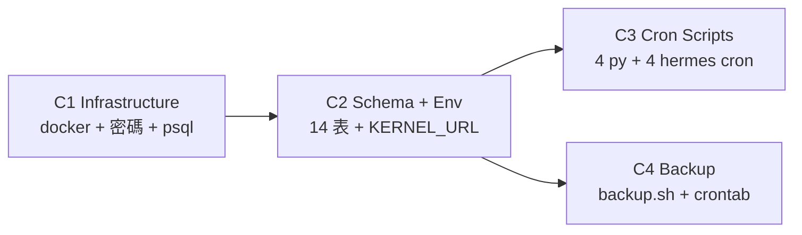

# OP Kernel Codex Execute Plan — 4 階段 multi-agent 拆解

**Status**: ACTIVE(2026-05-26)
**Companion to**: `docs/plans/2026-05-26-op-kernel-db-operations-v2.md`(v2.1 spec with Codex review fixes)
**Workflow**: Claude 寫 brief + 護線設計 → Codex 多階段執行 → Claude 驗證每階段 → 全綠才往下

## 為什麼分 4 階段(multi-agent)

Gary 2026-05-26 要求「codex 能夠分斷 分 multi agent 來分功能開發」。原因:
- 每個 agent 範圍小 → 較不會 drift / 不會跑出 scope
- 失敗點明確 → 看 C3 還是 C4 壞,各自獨立 retry
- C3 ∥ C4 平行 → 縮短 wall time
- 護線(不碰 wannavegtourcrm)在每個 brief 都重複寫,降低遺漏風險

## 依賴圖



**時序**:C1 → C2 → (C3 ∥ C4 平行)→ done。每階段 Claude 獨立驗證後才放行下階段。

## 共通護線(每 brief 都寫)

絕對不能碰:
- `wannavegtourcrm-backend-1` / `-frontend-1` / `-admin-1` / `-postgres-audit-1` / `-redis-1`(港 5433/8001/8002/3002)
- `ohya-neo4j`(港 7475/7688)
- `open-webui`(港 3000)
- 8765 standalone listener(PID 49146,生產 OP)
- Tailscale Funnel(指 8765)
- LINE webhook URL(LINE 端設定)
- `hermes-gateway.service`(default profile systemd)
- `/home/wannavegtour/clients/wannavegtourcrm/` 整個目錄

每階段 pre-flight + post-flight 都 verify 這些還在。任一失敗 STOP。

## CRM Baseline(2026-05-26 14:xx snapshot,Codex 每階段比對用)

```
wannavegtourcrm-backend-1          Up 17 hours       0.0.0.0:8001->8000/tcp
wannavegtourcrm-frontend-1         Up 17 hours       0.0.0.0:3002->80/tcp
wannavegtourcrm-admin-1            Up 17 hours       0.0.0.0:8002->8001/tcp
wannavegtourcrm-postgres-audit-1   Up 17 hours       127.0.0.1:5433->5432/tcp  (healthy)
wannavegtourcrm-redis-1            Up 17 hours       6379/tcp                   (healthy)
ohya-neo4j                         Up 17 hours       0.0.0.0:7475->7474/tcp     (healthy)
open-webui                         Up 17 hours       0.0.0.0:3000->8080/tcp     (healthy)
```

## Rollback

若 Codex 執行過程出問題,各階段 rollback:
- **C1**: `cd ~/.hermes/credentials/wannavegtour/op_kernel && docker compose down && docker volume rm op-assistant-kernel-data && rm -rf ~/.hermes/credentials/wannavegtour/op_kernel`
- **C2**: 刪除 `op-assistant-kernel` DB 即可重 init;從 `~/.hermes/profiles/op-assistant/.env` 移除 `KERNEL_DATABASE_URL` 那行
- **C3**: `hermes -p op-assistant cron remove op-etl op-daily-curate op-weekly-report op-monthly-maint`;`rm ~/.hermes/profiles/op-assistant/scripts/op_assistant_*.py`
- **C4**: `crontab -e` 刪 3 條 op_kernel/backup.sh 行;`rm ~/.hermes/credentials/wannavegtour/op_kernel/backup.sh`

每階段都是可逆(無破壞性)— 失敗就 rollback 重來。

---


---

# Codex Brief C1 — Op-Assistant Kernel Infrastructure

You are Codex. Set up the PostgreSQL container for op-assistant-kernel. Read the doc first, then execute.

**Doc reference**: `/home/wannavegtour/Desktop/AI Native Company/Gary/docs/plans/2026-05-26-op-kernel-db-operations-v2.md` — read the "Infrastructure" + "啟動順序" sections (steps 1-5 from "啟動順序"段).

## HARD CONSTRAINTS (read 3 times, do NOT violate)

### DO NOT TOUCH these containers (production CRM + other projects):
- `wannavegtourcrm-backend-1` (port 8001)
- `wannavegtourcrm-frontend-1` (port 3002)
- `wannavegtourcrm-admin-1` (port 8002)
- `wannavegtourcrm-postgres-audit-1` (port 5433) — **this is CRITICAL,千萬不要碰**
- `wannavegtourcrm-redis-1`
- `ohya-neo4j`
- `open-webui`

**Any `docker` command must be limited to creating/managing the new `op-assistant-kernel` container only.** NEVER use `docker compose down` without `-p` or in a directory that could affect other compose files.

### DO NOT TOUCH:
- Tailscale Funnel
- LINE webhook URL (LINE Developers Console)
- Any file under `/home/wannavegtour/.hermes/profiles/op-assistant/` (that's C2's job)
- Any file under `/home/wannavegtour/clients/wannavegtourcrm/`
- The standalone listener on port 8765 (PID 49146)
- `hermes-gateway.service` (default profile, already running)

### DO NOT:
- print any secrets / passwords / tokens / api keys to stdout
- git commit anything (Claude commits after verification)
- pip install anything globally
- Use `sudo` for anything except `apt install postgresql-client`

## Pre-flight check (DO FIRST,STOP if any fails)

```bash
# 1. CRM containers all up
EXPECTED_CRM=("wannavegtourcrm-backend-1" "wannavegtourcrm-frontend-1" "wannavegtourcrm-admin-1" "wannavegtourcrm-postgres-audit-1" "wannavegtourcrm-redis-1")
for c in "${EXPECTED_CRM[@]}"; do
  docker ps --filter "name=^${c}$" --format '{{.Names}}' | grep -q "^${c}$" || { echo "PRE-FLIGHT FAIL: $c not running"; exit 1; }
done

# 2. Port 5434 free
ss -lntp 2>/dev/null | grep -q ":5434" && { echo "PRE-FLIGHT FAIL: 5434 already in use"; exit 1; }

# 3. Target container doesn't exist yet
docker ps -a --filter "name=^op-assistant-kernel$" --format '{{.Names}}' | grep -q "op-assistant-kernel" && { echo "PRE-FLIGHT FAIL: op-assistant-kernel already exists"; exit 1; }

# 4. We're not in any wannavegtourcrm directory
[ "$(pwd)" = "/home/wannavegtour/clients/wannavegtourcrm"* ] && { echo "PRE-FLIGHT FAIL: cwd is in CRM dir"; exit 1; }

echo "✓ pre-flight pass"
```

## Tasks

### 1. Create credentials directory

```bash
mkdir -p ~/.hermes/credentials/wannavegtour/op_kernel/backup/{daily,weekly,monthly}
chmod 700 ~/.hermes/credentials/wannavegtour/op_kernel
chmod 700 ~/.hermes/credentials/wannavegtour/op_kernel/backup
chmod 700 ~/.hermes/credentials/wannavegtour/op_kernel/backup/daily
chmod 700 ~/.hermes/credentials/wannavegtour/op_kernel/backup/weekly
chmod 700 ~/.hermes/credentials/wannavegtour/op_kernel/backup/monthly
```

### 2. Generate password (URL-safe hex per v2.1 H1 fix)

```bash
openssl rand -hex 24 > ~/.hermes/credentials/wannavegtour/op_kernel/db_password.txt
chmod 600 ~/.hermes/credentials/wannavegtour/op_kernel/db_password.txt
# DO NOT cat this file or print it
```

### 3. Write docker-compose.yml

Use this EXACT content (matches v2.1 doc spec):

```yaml
services:
  op-assistant-kernel:
    image: postgres:16-alpine
    container_name: op-assistant-kernel
    restart: unless-stopped
    ports:
      - "127.0.0.1:5434:5432"
    environment:
      POSTGRES_DB: op_assistant_kernel
      POSTGRES_USER: op_kernel
      POSTGRES_PASSWORD_FILE: /run/secrets/db_password
    secrets:
      - db_password
    volumes:
      - op-assistant-kernel-data:/var/lib/postgresql/data
    healthcheck:
      test: ["CMD-SHELL", "pg_isready -U op_kernel -d op_assistant_kernel"]
      interval: 30s
      timeout: 5s
      retries: 5

secrets:
  db_password:
    file: ./db_password.txt

volumes:
  op-assistant-kernel-data:
    name: op-assistant-kernel-data
```

Save to `~/.hermes/credentials/wannavegtour/op_kernel/docker-compose.yml`.

### 4. Start container (compose must run from THAT directory only)

```bash
cd ~/.hermes/credentials/wannavegtour/op_kernel/
docker compose up -d
sleep 12

# Wait until healthy (max 60s)
for i in $(seq 1 12); do
  status=$(docker inspect --format '{{.State.Health.Status}}' op-assistant-kernel 2>/dev/null)
  [ "$status" = "healthy" ] && break
  sleep 5
done

# Final state
docker ps --filter "name=^op-assistant-kernel$" --format '{{.Names}} {{.Status}}'
```

If status != healthy after 60s, STOP and report.

### 5. Install psql client (if missing)

```bash
which psql >/dev/null 2>&1 || sudo apt install -y postgresql-client
psql --version
```

### 6. Test connection (don't print password)

```bash
PGPASSWORD=$(cat ~/.hermes/credentials/wannavegtour/op_kernel/db_password.txt) \
  psql -h 127.0.0.1 -p 5434 -U op_kernel -d op_assistant_kernel \
  -c "SELECT version();" >/dev/null && echo "✓ connect OK" || echo "✗ connect FAIL"
```

## Post-flight check (DO LAST,everything must still pass)

```bash
# CRM containers still up + same image
for c in "${EXPECTED_CRM[@]}"; do
  status=$(docker ps --filter "name=^${c}$" --format '{{.Status}}')
  [ -z "$status" ] && { echo "POST-FLIGHT FAIL: $c GONE"; exit 1; }
  echo "  ✓ $c → $status"
done

# Port 5433 (CRM PG) still bound by CRM container
ss -lntp 2>/dev/null | grep -E ":5433\b" | grep -q "5433" || { echo "POST-FLIGHT FAIL: 5433 not bound"; exit 1; }

# Port 5434 now bound by op-assistant-kernel
ss -lntp 2>/dev/null | grep -E ":5434\b" | grep -q "5434" || { echo "POST-FLIGHT FAIL: 5434 not bound"; exit 1; }

# Standalone listener still alive
curl -s -o /dev/null -w "8765 healthz: %{http_code}\n" --max-time 2 http://127.0.0.1:8765/healthz | grep -q "200" || { echo "POST-FLIGHT FAIL: 8765 lost"; exit 1; }

echo "✓ post-flight pass — CRM intact, op-kernel up"
```

## Report

After execution, print structured markdown:

```
## C1 Infrastructure Execution Report
- Pre-flight: PASS / FAIL (reason)
- Task 1 (mkdir): ✓ / ✗
- Task 2 (password): ✓ (24 hex bytes, mode 600) / ✗
- Task 3 (docker-compose.yml): ✓ / ✗
- Task 4 (container up healthy): ✓ (after Xs) / ✗
- Task 5 (psql installed): ✓ / ✗ (already had)
- Task 6 (connection test): ✓ / ✗
- Post-flight: PASS / FAIL (reason)

## CRM container check
(for each of 5 CRM containers + ohya-neo4j + open-webui: name → status)

## Next
Hand off to C2 (schema + env).
```

Stop after report. Do NOT proceed to C2 work — that's a separate brief.

---

# Codex Brief C2 — Schema + Env Setup

You are Codex. Initialize kernel schema (14 tables) + wire op-assistant profile to it.

**Doc reference**: same v2.1 doc, "啟動順序" steps 6-8.
**Depends on**: C1 must have completed (op-assistant-kernel container healthy on 5434).

## HARD CONSTRAINTS (same as C1)

- DO NOT TOUCH any `wannavegtourcrm-*` container, `ohya-neo4j`, `open-webui`
- DO NOT TOUCH standalone listener (PID 49146 on 8765)
- DO NOT TOUCH `hermes-gateway.service` (default profile,already running)
- DO NOT print any password / secret values
- DO NOT git commit
- DO NOT modify any file under `/home/wannavegtour/clients/wannavegtourcrm/`

## Pre-flight check

```bash
# C1 must have completed
docker inspect --format '{{.State.Health.Status}}' op-assistant-kernel 2>/dev/null | grep -q healthy || { echo "PRE-FLIGHT FAIL: op-assistant-kernel not healthy (run C1 first)"; exit 1; }

# Password file exists, mode 600
[ -f ~/.hermes/credentials/wannavegtour/op_kernel/db_password.txt ] || { echo "PRE-FLIGHT FAIL: no password file"; exit 1; }
[ "$(stat -c %a ~/.hermes/credentials/wannavegtour/op_kernel/db_password.txt)" = "600" ] || { echo "PRE-FLIGHT FAIL: password file mode != 600"; exit 1; }

# op-assistant profile exists
[ -d ~/.hermes/profiles/op-assistant ] || { echo "PRE-FLIGHT FAIL: op-assistant profile dir missing"; exit 1; }

# repo exists (need closed_loop_kernel package)
[ -d "/home/wannavegtour/Desktop/AI Native Company/Gary/closed_loop_kernel" ] || { echo "PRE-FLIGHT FAIL: repo missing"; exit 1; }

# CRM intact
ss -lntp 2>/dev/null | grep -q ":5433" || { echo "PRE-FLIGHT FAIL: CRM PG (5433) not bound"; exit 1; }

echo "✓ pre-flight pass"
```

## Tasks

### 1. Initialize 14-table schema + 6 prevent_mutation triggers

```bash
cd "/home/wannavegtour/Desktop/AI Native Company/Gary"

KERNEL_URL="postgresql://op_kernel:$(cat ~/.hermes/credentials/wannavegtour/op_kernel/db_password.txt)@127.0.0.1:5434/op_assistant_kernel"

KERNEL_DATABASE_URL="$KERNEL_URL" python3 -c "
import os
from closed_loop_kernel.store import KernelStore
store = KernelStore.from_url(os.environ['KERNEL_DATABASE_URL'])
store.initialize()
print('✓ initialize() returned')
store.close()
"
```

### 2. Verify 14 tables + 6 triggers

```bash
PGPASSWORD=$(cat ~/.hermes/credentials/wannavegtour/op_kernel/db_password.txt) \
  psql -h 127.0.0.1 -p 5434 -U op_kernel -d op_assistant_kernel <<'EOF'
\dt
SELECT COUNT(*) AS table_count FROM information_schema.tables
  WHERE table_schema = 'public' AND table_type = 'BASE TABLE';
SELECT trigger_name, event_object_table FROM information_schema.triggers
  WHERE trigger_name LIKE 'trg_protect_%' ORDER BY event_object_table;
EOF
```

Expected:
- 14 tables (teams, agents, approval_routes, events, artifacts, policy_gates, attempt_lifecycle_events, attempts, decisions, tool_calls, failures, improvement_candidates, replays, approvals)
- 6 triggers (trg_protect_events / attempt_lifecycle_events / attempts / tool_calls / decisions / approvals)

If count != 14 OR triggers != 6, STOP and report.

### 3. Write KERNEL_DATABASE_URL to op-assistant profile .env

```bash
ENV_PATH=~/.hermes/profiles/op-assistant/.env

# Check if KERNEL_DATABASE_URL already set (idempotent)
if grep -q "^KERNEL_DATABASE_URL=" "$ENV_PATH"; then
  echo "KERNEL_DATABASE_URL already in .env — skip append"
else
  # Append, preserve mode 600
  echo "" >> "$ENV_PATH"
  echo "# closed_loop_kernel PG (added 2026-05-26 by C2)" >> "$ENV_PATH"
  echo "KERNEL_DATABASE_URL=postgresql://op_kernel:$(cat ~/.hermes/credentials/wannavegtour/op_kernel/db_password.txt)@127.0.0.1:5434/op_assistant_kernel" >> "$ENV_PATH"
  echo "✓ appended KERNEL_DATABASE_URL"
fi

chmod 600 "$ENV_PATH"

# Verify (count only, don't print value)
grep -c "^KERNEL_DATABASE_URL=" "$ENV_PATH"
# Expect: 1
stat -c '%a' "$ENV_PATH"
# Expect: 600
```

### 4. Set cron script timeout (per v2.1 H2 fix)

```bash
hermes config set cron.script_timeout_seconds 300 2>&1 | tail -3
# Verify
hermes config show 2>&1 | grep -A1 "cron" | head -5
```

If `hermes config set cron.script_timeout_seconds` fails (key not supported in this Hermes version), try alternative:
```bash
# Fallback: set env var via .env
grep -q "^HERMES_CRON_SCRIPT_TIMEOUT=" ~/.hermes/.env || \
  echo "HERMES_CRON_SCRIPT_TIMEOUT=300" >> ~/.hermes/.env
```

Report which approach worked.

## Post-flight check

```bash
# CRM containers all up
for c in wannavegtourcrm-backend-1 wannavegtourcrm-frontend-1 wannavegtourcrm-admin-1 wannavegtourcrm-postgres-audit-1 wannavegtourcrm-redis-1; do
  docker ps --filter "name=^${c}$" --format '{{.Names}}' | grep -q "^${c}$" || { echo "POST-FLIGHT FAIL: $c GONE"; exit 1; }
done

# Standalone listener intact
curl -s -o /dev/null -w "8765 healthz: %{http_code}\n" --max-time 2 http://127.0.0.1:8765/healthz | grep -q "200" || { echo "POST-FLIGHT FAIL: 8765 lost"; exit 1; }

# Kernel container still healthy
docker inspect --format '{{.State.Health.Status}}' op-assistant-kernel 2>/dev/null | grep -q healthy || { echo "POST-FLIGHT FAIL: kernel went unhealthy"; exit 1; }

# default profile gateway still running
systemctl --user is-active hermes-gateway.service | grep -q active || { echo "POST-FLIGHT FAIL: default gateway stopped"; exit 1; }

echo "✓ post-flight pass"
```

## Report

```
## C2 Schema + Env Execution Report
- Pre-flight: PASS / FAIL
- Task 1 (initialize): ✓ / ✗
- Task 2 (14 tables, 6 triggers verified): tables=N, triggers=N
- Task 3 (KERNEL_DATABASE_URL in profile .env): ✓ / ✗
- Task 4 (cron timeout set): ✓ (which method) / ✗
- Post-flight: PASS / FAIL

## Next
Hand off to C3 (cron scripts) and C4 (backup) — these can run in parallel.
```

Stop after report.

---

# Codex Brief C3 — 4 Cron Scripts (op-assistant profile)

You are Codex. Write 4 Python scripts into op-assistant profile scripts/ directory, then register 4 hermes cron jobs.

**Doc reference**: v2.1 doc — "4 條 Cron Job" section. Each script's full code is in that doc. Copy verbatim (v2.1 already has all Codex review fixes applied).

**Depends on**: C2 (KERNEL_DATABASE_URL must be in profile .env, kernel must be initialized).

## HARD CONSTRAINTS

- DO NOT TOUCH any `wannavegtourcrm-*` container, `ohya-neo4j`, `open-webui`
- DO NOT TOUCH standalone listener (8765) — these cron jobs run alongside it, don't touch
- DO NOT run any of the cron jobs against production yet — JUST REGISTER them
- DO NOT write scripts to `~/.hermes/scripts/` — must go in profile-local `~/.hermes/profiles/op-assistant/scripts/`
- DO NOT use absolute paths in `--script` arg — must be filename only
- DO NOT skip the `_load_profile_env()` helper at top of each script

## Pre-flight check

```bash
# C2 done?
grep -q "^KERNEL_DATABASE_URL=" ~/.hermes/profiles/op-assistant/.env || { echo "PRE-FLIGHT FAIL: KERNEL_DATABASE_URL not in profile .env (run C2)"; exit 1; }
docker inspect --format '{{.State.Health.Status}}' op-assistant-kernel 2>/dev/null | grep -q healthy || { echo "PRE-FLIGHT FAIL: kernel unhealthy"; exit 1; }

# scripts dir
mkdir -p ~/.hermes/profiles/op-assistant/scripts

# CRM intact
for c in wannavegtourcrm-backend-1 wannavegtourcrm-postgres-audit-1; do
  docker ps --filter "name=^${c}$" --format '{{.Names}}' | grep -q "^${c}$" || { echo "PRE-FLIGHT FAIL: $c GONE"; exit 1; }
done

echo "✓ pre-flight pass"
```

## Tasks

### 1. Write `op_assistant_etl.py`

Source: v2.1 doc, "Cron 1:每 4 小時 ETL" code block. Copy verbatim into:
`~/.hermes/profiles/op-assistant/scripts/op_assistant_etl.py`

After writing, verify:
- `_load_profile_env()` helper at top ✓
- absolute paths for SESSION_DB and MAPPING_PATH (no `~`) ✓
- `mode=ro` + `PRAGMA busy_timeout` (not `immutable=1`) ✓
- `uuid5(ETL_NAMESPACE, ...)` for dedup ✓

```bash
chmod 700 ~/.hermes/profiles/op-assistant/scripts/op_assistant_etl.py
python3 -c "import ast; ast.parse(open('/home/wannavegtour/.hermes/profiles/op-assistant/scripts/op_assistant_etl.py').read())" && echo "✓ syntax valid"
```

### 2. Write `op_assistant_daily_curate.py`

Source: v2.1 doc, "Cron 2:每日 09:00 curation" code block. Copy verbatim.

Path: `~/.hermes/profiles/op-assistant/scripts/op_assistant_daily_curate.py`

Verify:
- `_load_profile_env()` ✓
- `uuid5(DAILY_NAMESPACE, period_key)` + `ON CONFLICT DO NOTHING` ✓
- `_push_telegram_summary` wraps requests.post in try/except RequestException ✓

```bash
chmod 700 .../op_assistant_daily_curate.py
python3 -c "import ast; ast.parse(open('...'))"
```

### 3. Write `op_assistant_weekly_report.py`

Source: v2.1 doc, "Cron 3:每週一 09:00 週報" code block. Copy verbatim.

Path: `~/.hermes/profiles/op-assistant/scripts/op_assistant_weekly_report.py`

Verify:
- `_push_weekly_report()` has real implementation (not `pass`) ✓
- `uuid5(WEEKLY_NAMESPACE, week_key)` + `ON CONFLICT DO NOTHING` ✓
- helper `_get_telegram_bot_token` + `_get_telegram_home_channel` defined ✓

### 4. Write `op_assistant_monthly_maintenance.py`

Source: v2.1 doc, "Cron 4:每月 1 日 05:00 維護" code block. Copy verbatim.

Path: `~/.hermes/profiles/op-assistant/scripts/op_assistant_monthly_maintenance.py`

Verify:
- subprocess wrapped in try/except (VACUUM failure doesn't lose health event) ✓
- DOCKER_BIN = "/usr/bin/docker" ✓

### 5. Register 4 cron jobs

```bash
# Pre-check: no duplicate job names
hermes -p op-assistant cron list 2>&1 | tail -10

# Register
hermes cron create '0 */4 * * *' --name op-etl              --script op_assistant_etl.py              --no-agent --profile op-assistant
hermes cron create '0 9 * * *'   --name op-daily-curate     --script op_assistant_daily_curate.py     --no-agent --profile op-assistant
hermes cron create '0 9 * * 1'   --name op-weekly-report    --script op_assistant_weekly_report.py    --no-agent --profile op-assistant
hermes cron create '0 5 1 * *'   --name op-monthly-maint    --script op_assistant_monthly_maintenance.py --no-agent --profile op-assistant
```

If any cron register fails (e.g., script path validation), STOP and report. Don't bypass with --force.

### 6. Verify registrations

```bash
hermes -p op-assistant cron list 2>&1
# Expect 4 jobs: op-etl, op-daily-curate, op-weekly-report, op-monthly-maint
```

### 7. Smoke test ETL (manual one-shot,真正寫進 kernel)

```bash
# Make sure env loads correctly + DB connection works
hermes -p op-assistant cron run op-etl 2>&1 | tail -20

# Verify events table got rows (or stayed at previous count if no new messages in last 4hr)
PGPASSWORD=$(cat ~/.hermes/credentials/wannavegtour/op_kernel/db_password.txt) \
  psql -h 127.0.0.1 -p 5434 -U op_kernel -d op_assistant_kernel \
  -c "SELECT event_type, COUNT(*) FROM events GROUP BY event_type;"
```

**This smoke test WILL write into kernel events table — that's intended.** It's just our own ETL, no LINE traffic redirected.

## Post-flight check

```bash
# CRM intact
for c in wannavegtourcrm-backend-1 wannavegtourcrm-frontend-1 wannavegtourcrm-postgres-audit-1; do
  docker ps --filter "name=^${c}$" --format '{{.Names}}' | grep -q "^${c}$" || { echo "POST-FLIGHT FAIL: $c GONE"; exit 1; }
done

# 8765 alive
curl -s -o /dev/null -w "8765: %{http_code}\n" --max-time 2 http://127.0.0.1:8765/healthz | grep -q "200" || { echo "POST-FLIGHT FAIL: 8765 lost"; exit 1; }

# 4 cron jobs registered
N=$(hermes -p op-assistant cron list 2>&1 | grep -E "op-(etl|daily-curate|weekly-report|monthly-maint)" | wc -l)
[ "$N" = "4" ] || { echo "POST-FLIGHT FAIL: expected 4 cron jobs, found $N"; exit 1; }

echo "✓ post-flight pass"
```

## Report

```
## C3 Cron Scripts Execution Report
- Pre-flight: PASS/FAIL
- Task 1 (etl.py written + syntax valid): ✓/✗
- Task 2 (daily_curate.py): ✓/✗
- Task 3 (weekly_report.py): ✓/✗
- Task 4 (monthly_maintenance.py): ✓/✗
- Task 5 (4 cron registered): ✓/✗ (which failed)
- Task 6 (cron list verified): N jobs found
- Task 7 (ETL smoke test): ✓/✗
- Post-flight: PASS/FAIL

## Events table state
(output of SELECT event_type, COUNT(*) GROUP BY event_type)
```

Stop after report.

---

# Codex Brief C4 — Backup Script + Crontab

You are Codex. Write backup script + register 3 system crontab entries (daily / weekly / monthly).

**Doc reference**: v2.1 doc — "備份(三層,**無加密 無異地**)" section.
**Depends on**: C1 (container exists) only. **Can run in parallel with C3.**

## HARD CONSTRAINTS

- DO NOT TOUCH `wannavegtourcrm-*`, `ohya-neo4j`, `open-webui`
- DO NOT backup CRM's PG (5433) — only op-assistant-kernel (5434)
- DO NOT write backup target outside `~/.hermes/credentials/wannavegtour/op_kernel/backup/`
- DO NOT add backup encryption (Gary 明確不做)
- DO NOT push backup off-host (Gary 明確不做異地)

## Pre-flight check

```bash
docker inspect --format '{{.State.Health.Status}}' op-assistant-kernel 2>/dev/null | grep -q healthy || { echo "PRE-FLIGHT FAIL: kernel unhealthy"; exit 1; }

# Backup dirs from C1
for d in daily weekly monthly; do
  [ -d ~/.hermes/credentials/wannavegtour/op_kernel/backup/$d ] || { echo "PRE-FLIGHT FAIL: backup/$d missing"; exit 1; }
done

# psql client (used by backup script via docker exec only, but good to have)
which docker >/dev/null || { echo "PRE-FLIGHT FAIL: docker not on PATH"; exit 1; }

echo "✓ pre-flight pass"
```

## Tasks

### 1. Write backup.sh (per v2.1 doc, L3 fix included)

Path: `~/.hermes/credentials/wannavegtour/op_kernel/backup.sh`

Content (verbatim from v2.1 doc):

```bash
#!/bin/bash
# 用法:bash backup.sh daily|weekly|monthly
set -euo pipefail
TYPE="${1:?usage: backup.sh daily|weekly|monthly}"
BASE="$HOME/.hermes/credentials/wannavegtour/op_kernel"
DIR="$BASE/backup/$TYPE"
mkdir -p "$DIR" && chmod 700 "$DIR"

case "$TYPE" in
  daily)   FNAME="$(date +%Y-%m-%d).sql.gz" ;;
  weekly)  FNAME="$(date +%Y-W%V).sql.gz" ;;
  monthly) FNAME="$(date +%Y-%m).sql.gz" ;;
  *) echo "bad type"; exit 1 ;;
esac

OUT="$DIR/$FNAME"
# 絕對路徑(cron PATH 不全)+ stderr 進 log
/usr/bin/docker exec op-assistant-kernel pg_dump \
  -U op_kernel -d op_assistant_kernel \
  --no-owner --no-acl \
  2>> "$BASE/backup/backup.log" \
  | gzip > "$OUT"

chmod 600 "$OUT"

# Retention
case "$TYPE" in
  daily)   find "$DIR" -name "*.sql.gz" -mtime +14 -delete ;;
  weekly)  find "$DIR" -name "*.sql.gz" -mtime +90 -delete ;;
  monthly) find "$DIR" -name "*.sql.gz" -mtime +400 -delete ;;
esac

echo "[$(date -Iseconds)] backup ${TYPE}: $FNAME ($(du -h "$OUT" | cut -f1))" >> "$BASE/backup/backup.log"
```

```bash
chmod 700 ~/.hermes/credentials/wannavegtour/op_kernel/backup.sh
```

### 2. Smoke test backup.sh once (daily)

```bash
bash ~/.hermes/credentials/wannavegtour/op_kernel/backup.sh daily
# Verify output file
ls -la ~/.hermes/credentials/wannavegtour/op_kernel/backup/daily/
# Should see today's YYYY-MM-DD.sql.gz mode 600
```

If smoke test fails (docker exec error, file not created, mode wrong), STOP and report.

### 3. Register 3 cron entries (system crontab,not Hermes cron)

Reason: backup should run even if hermes-gateway is down. System crontab is more reliable for backup.

```bash
# Read current crontab (don't fail if empty)
CURRENT=$(crontab -l 2>/dev/null || true)

# Avoid duplicate entries
NEW_ENTRIES=""
add_if_missing() {
  local line="$1"
  echo "$CURRENT" | grep -qF "$line" || NEW_ENTRIES="${NEW_ENTRIES}${line}"$'\n'
}

add_if_missing "0 2 * * *     bash $HOME/.hermes/credentials/wannavegtour/op_kernel/backup.sh daily"
add_if_missing "30 2 * * 0    bash $HOME/.hermes/credentials/wannavegtour/op_kernel/backup.sh weekly"
add_if_missing "0 3 1 * *     bash $HOME/.hermes/credentials/wannavegtour/op_kernel/backup.sh monthly"

if [ -n "$NEW_ENTRIES" ]; then
  ( echo "$CURRENT"; echo "$NEW_ENTRIES" ) | crontab -
  echo "✓ added cron entries"
else
  echo "(all entries already present)"
fi

# Verify
crontab -l 2>&1 | grep "op_kernel/backup.sh"
```

### 4. Verify retention logic compiles correctly

```bash
# Dry-run: list files older than retention thresholds (should be 0 since we just started)
find ~/.hermes/credentials/wannavegtour/op_kernel/backup/daily/   -name "*.sql.gz" -mtime +14
find ~/.hermes/credentials/wannavegtour/op_kernel/backup/weekly/  -name "*.sql.gz" -mtime +90
find ~/.hermes/credentials/wannavegtour/op_kernel/backup/monthly/ -name "*.sql.gz" -mtime +400
# (all should be empty)
```

## Post-flight check

```bash
# CRM intact
for c in wannavegtourcrm-backend-1 wannavegtourcrm-postgres-audit-1; do
  docker ps --filter "name=^${c}$" --format '{{.Names}}' | grep -q "^${c}$" || { echo "POST-FLIGHT FAIL: $c GONE"; exit 1; }
done

# Kernel still healthy
docker inspect --format '{{.State.Health.Status}}' op-assistant-kernel | grep -q healthy || { echo "POST-FLIGHT FAIL: kernel unhealthy"; exit 1; }

# Daily backup file exists (smoke test created it)
ls ~/.hermes/credentials/wannavegtour/op_kernel/backup/daily/*.sql.gz >/dev/null 2>&1 || { echo "POST-FLIGHT FAIL: no daily backup"; exit 1; }

# crontab has 3 entries
N=$(crontab -l 2>&1 | grep -c "op_kernel/backup.sh")
[ "$N" = "3" ] || { echo "POST-FLIGHT FAIL: expected 3 cron entries, found $N"; exit 1; }

echo "✓ post-flight pass"
```

## Report

```
## C4 Backup Execution Report
- Pre-flight: PASS/FAIL
- Task 1 (backup.sh written): ✓/✗
- Task 2 (daily smoke test): ✓ (file size: X KB) / ✗
- Task 3 (3 crontab entries): ✓ (added N, present N) / ✗
- Task 4 (retention dry-run): ✓
- Post-flight: PASS/FAIL

## Backup state
ls -la ~/.hermes/credentials/wannavegtour/op_kernel/backup/daily/
```

Stop after report.
