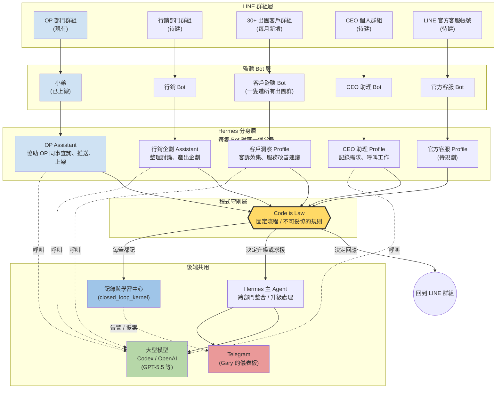

# 阿玩旅遊全公司 AI 部門地圖 (Plan v2)

**取代之前的**: `docs/plans/2026-05-26-hermes-wannavegtour-integration-plan-v1.md` 不是廢掉,v1 是「現有 OP Bot 怎麼進到下一階」的施工順序,本份 v2 是「整間公司最後長什麼樣」的完整地圖。v1 的 Phase 0(基礎建設)是 v2 全部 Bot 共用的地基。

**狀態**: 草稿(立即動工項目已鎖定,其他 4 隻 Bot 待處理)
**日期**: 2026-05-26
**作者**: Claude(根據 Gary 親口口述 vision + Hermes 官方架構驗證)

---

## ⚡ 立即動工:OP 小弟 接 Hermes Profile

**Gary 2026-05-26 決定**: 只先做 OP 小弟接 Hermes Profile,其他 4 隻 Bot 全部標記待處理(下面各節已標)。設計**必須照 Hermes 官方架構**。

**Gary 後續指示**(2026-05-26 14:xx): 不要繞路,**必須用 Hermes 原生 LINE 路徑** — 排除 β / γ,鎖定 **方案 α(Hermes 官方 LINE plugin)**。先把 Hermes ↔ LINE 串接起來,哪個 Agent 設定等會再處理。

### 架構釐清(Gary 2026-05-26 後續補強)

Gary 補了三條,影響命名 + 未來 Default 角色:

1. **這台 DGX 只服務阿玩旅遊**(無 multi-tenant)— 之前提到 OHYA / Daguantech 全部不適用,文件提到的都忽略。Hermes Integration Assessment v0 的 Path A/B/C(8 客戶 framework)在本機不適用。
2. **Default profile = supervisor(主腦)**:
   - 擁有所有權限,**能讀取底下所有 sub-profile 的資料**(state / memories / sessions / kanban)
   - 「能讀 sub-profile」這條 Hermes 沒原生機制,實作有 3 條路(α 直接讀檔 / β 走 closed_loop_kernel 中介 / γ MCP)
   - **此項暫緩**,等 OP Assistant 跑起來再回來討論
3. **Sub-profile 資料對 Default 開放讀取**(資料流向上,Default 不會被 sub-profile 讀)

**命名簡化**:既然單一公司,profile 從 `wannavegtour-op-assistant` rename 為 **`op-assistant`**(2026-05-26 已執行 `hermes profile rename` 完成,alias 同步 → `/home/wannavegtour/.local/bin/op-assistant`)。未來 4 隻待處理 bot 命名同理:`marketing-assistant` / `customer-listener` / `ceo-assistant` / `oa-bot`(不再加 `wannavegtour-` 前綴)。

**Default profile 暫不動**(Gary 指示),目前狀態維持:
- 接 `@skimm3r918_bot` Telegram(personal chat)
- 模型 GPT-5.5 / Codex OAuth
- 不接 LINE,沒任何 sub-profile 監督功能

當下焦點 = **op-assistant profile 6 個 tool 實作 + cutover**。Default 的 supervisor 能力等之後再設計。

### 進度更新(2026-05-26)— Hermes 已升 v0.14.0,LINE plugin 已串接 ✓

Gary 在這次討論之間把 Hermes 從 v0.8.0 升到 **v0.14.0 (release 2026.5.16)**,**LINE plugin 內建上線了**(原本我記的「DGX 沒 LINE adapter」已過時)。實際在 `/home/wannavegtour/.hermes/hermes-agent/plugins/platforms/line/`:

| 項目 | 狀態 | 證據 |
|---|---|---|
| LINE plugin 檔案 | ✅ | `plugins/platforms/line/{adapter.py (1638 行), plugin.yaml, __init__.py}` |
| Plugin enabled | ✅ | `hermes plugins enable platforms/line` 已執行,寫進 `~/.hermes/config.yaml plugins.enabled` |
| Codex OAuth 登入 | ✅ | `~/.hermes/auth.json`,`active_provider: openai-codex`,`auth_mode: chatgpt`,2026-05-25 refresh |
| LINE env 變數設定 | ✅ | `~/.hermes/.env`(mode 600)有完整 8 個 `LINE_*` 變數,值從 `~/.hermes/credentials/wannavegtour/line-bot.json` 抓 |
| Gateway smoke test | ✅ | `hermes gateway run --quiet` 起得來,bind `127.0.0.1:8646`,`GET /line/webhook/health → 200`,正常關閉 |
| 預設模型 | gpt-5.4 | `hermes status` 顯示 |

**Env vars 設定值**(實際填的):
- `LINE_CHANNEL_ACCESS_TOKEN` / `LINE_CHANNEL_SECRET` — 從現有 credentials 帶
- `LINE_PORT=8646`(Hermes 預設,跟舊 listener 的 8765 不衝突)
- `LINE_HOST=127.0.0.1`(只接 Tailscale Funnel reverse proxy,防外網直連)
- `LINE_PUBLIC_URL=https://spark-8035.tailb40323.ts.net`(媒體外部 URL)
- `LINE_ALLOWED_GROUPS=C24cf0311116b96f22aced7cc2f7cac8d`(只 OP 群,白名單)
- `LINE_HOME_CHANNEL=C24cf0311116b96f22aced7cc2f7cac8d`(cron/通知預設目標)
- `LINE_SLOW_RESPONSE_THRESHOLD=45`(45 秒沒回就觸發 postback 按鈕)

**還沒做的事(等 agent 實作 + Telegram 設定 + Gary 點頭才動)**:
- ❌ Hermes gateway **沒**持續跑(只測完關掉了)
- ❌ Tailscale Funnel **沒切換**,還指 8765 → 舊 listener
- ❌ LINE Developers Console / API 上的 webhook URL **沒換**,還是 `https://spark-8035.tailb40323.ts.net/wannavegtour/line/webhook`(舊 listener path)
- ❌ 舊 listener **沒停**,8765 還在收 webhook 並回應 OP 群
- ❌ 6 個 tool 還沒實作(query_intent / fetch_wc_data / compose_reply / validate_reply / send_reply / escalate_to_gary)— spec 在 `docs/plans/2026-05-26-op-bot-hermes-harness-spec.md`
- ❌ Telegram 還沒設(default profile 接 Gary 個人 Telegram)— **blocked on Gary 提供 bot token + 個人 user ID**

**已做的事(2026-05-26 15:xx,Codex 執行 + Claude 驗證)**:
- ✅ **建好 `op-assistant` 專屬 profile** (`~/.hermes/profiles/op-assistant/`)
- ✅ Default profile + wannavegtour profile 兩邊 model 都設成 `openai/gpt-5.5`,provider `OpenAI Codex` (OAuth)
- ✅ 8 個 LINE_* env 從 default `.env` 搬到 wannavegtour profile `.env`,default 現在 0 個,wannaveg 8 個
- ✅ LINE plugin: default profile **disabled**,wannavegtour profile **enabled**(避免 default 試圖搶 LINE 路徑)
- ✅ SOUL.md 寫進初版佔位文(指向 spec doc,明確標「6 tool 沒實作前不切流量」)
- ✅ 兩邊 .env 維持 mode 600
- ✅ smoke test:wannavegtour profile gateway 起得來,bind 8646,/line/webhook/health 200,正常停
- ✅ 生產 listener (PID 49146, 8765) 全程沒被影響,/healthz 還 200

**為什麼還不切換**: 一但 LINE webhook URL 指向 Hermes:8646,**Codex (GPT-5.4) 會直接生 reply 給 OP 同事**,沒走我們的 `query_parser` + `availability_checker` 等決定性流程。OP 會拿到「LLM 隨便回答」的答案,違反 Code is Law,而且資訊也錯。

### Cutover Checklist(Gary 同意 + agent 設計確定後才動)

1. 決定 agent 架構(下節「三件還沒對的事」)
2. 啟動 Hermes gateway 為持續服務:`hermes gateway install`(systemd 接管,boot 自動)
3. Tailscale Funnel 切換:`tailscale funnel reset` → 重設指向 `127.0.0.1:8646`
4. LINE webhook URL 切換:`PUT /v2/bot/channel/webhook/endpoint` 設新 URL = `https://spark-8035.tailb40323.ts.net/line/webhook`(注意路徑變了)
5. `POST /v2/bot/channel/webhook/test` 驗證新 URL 回 200
6. 停舊 listener:`bin/wannavegtour-line-down`
7. 連續觀察 30 分鐘:有沒有 reply 失敗、有沒有 Code is Law 違反

**回退方案**(若 cutover 後出問題):
- LINE webhook URL 切回 `/wannavegtour/line/webhook`
- Tailscale Funnel 切回 8765
- 重啟舊 listener:`bin/wannavegtour-line-up-linux`
- Hermes gateway 停下(`hermes gateway stop`)或留著無流量(沒人指過去就閒置)

### Code is Law 跟 α 方案的衝突(已解決 — 走 Option E)

方案 α 預設行為是 **LINE webhook → Hermes adapter → AIAgent(LLM)直接寫 reply → Hermes 回 LINE**,違反 P4。

**2026-05-26 解決**: Gary 推回 D (純規則,LLM 不在流程) 的初步推薦,要求「智能在 harness 內運作」(harness engineering)。經對齊 Diana YC talk(`EN7frwQIbKc-transcript.txt` line 139-149 Strong DM 「software factory」案例) + 2026 harness engineering 領域研究,合成新方案 **Option E**。

**Option E:LLM 提案 + Harness 驗證 + 迭代或 escalate**

```
LINE webhook
  → Hermes LINE adapter (HMAC / reply token / push fallback)
  → Hermes AIAgent (Codex GPT-5.4 via OAuth)
      └─ SOUL.md 強制工具順序:query_intent → fetch_wc_data
         → compose_reply → validate_reply → send_reply / escalate
  → AIAgent 內部 loop:
      tool: query_intent(text)             → JSON {intent, entities, confidence}
      tool: fetch_wc_data(intent, entities) → 真實 WC 資料(或 null)
      tool: compose_reply(intent, data)     → template 生 reply 草稿
      tool: validate_reply(draft, ...)      → pass / fail + reasons
        ├─ pass → tool: send_reply(draft)   → Hermes 送 LINE
        ├─ fail → agent 看 reasons 修一版重 validate(max 3 次)
        └─ 3 次都 fail → tool: escalate_to_gary(...) → Telegram
  → 全程進 closed_loop_kernel events 表
```

**為什麼這滿足所有條件**:

| 原則 | Option E 表現 |
|---|---|
| Code is Law(control flow 在 code) | ✅ Tool contract 是 code,LLM 只在 tool 間決定順序,SOUL 強制順序 |
| LLM 不直接寫 reply | ✅ reply 由 `compose_reply` template 生成,LLM 不寫字 |
| 智能,不是 dumb 規則 | ✅ `query_intent` tool 內部可用 LLM 補規則表抓不到的 fuzzy intent |
| Diana spec + harness + iterate + threshold | ✅ validate = harness,retry = iterate,3 次 = threshold |
| Hermes 原生路徑 | ✅ 用 AIAgent + tool-calling,idiomatic |
| Token maxing (Diana) | ✅ 每筆 LINE 訊息可能 3-5 次 LLM call |
| Closed loop(每筆進 kernel) | ✅ events 表自然存所有 cycle,可 replay |
| OAuth 訂閱計費 | ✅ 留在 Hermes `openai-codex` shim(Anthropic 2026 已禁第三方 Claude OAuth) |
| 不繞路 | ✅ Hermes 從頭管到尾 |

**詳細實作 spec**: 見 [`docs/plans/2026-05-26-op-bot-hermes-harness-spec.md`](./2026-05-26-op-bot-hermes-harness-spec.md)(SOUL.md 完整稿、6 個 tool 規格、validator 規則、test plan、edge case 清單)。

### Historical candidates(已捨棄,留檔)

下面 4 個是 2026-05-26 早上提出的初版候選,**已被 Option E 取代**,留檔供未來決策回溯:

- ~~**A. AIAgent subclass 成 deterministic dispatcher**~~ — LLM 當 JSON classifier。被取代理由:仍要 hack Hermes 程式碼;Diana harness engineering 模式更接近 Option E 的「tool 順序強制 + iterate」。
- ~~**B. SOUL prompt 強制只 call tool**~~ — 純靠 prompt 約束 LLM。被取代理由:prompt 不是強制,LLM 不爽會違反;Option E 的「強制工具順序 + validator gate」是真正可驗證的 harness。
- ~~**C. Sidecar validator 在 send 前擋**~~ — LLM 寫,validator 一次擋。被取代理由:擋下後沒 retry 路徑,reply 直接失敗;Option E 的「validate 失敗 → agent retry → 三次後 escalate」是 Diana 描述的「iterate until probabilistic satisfaction threshold」。Option E ⊃ C(C 是 E 的一次性簡化版)。
- ~~**D. Hermes 當 dumb webhook proxy**~~ — LLM 完全不在流程。被取代理由:違反 Gary「不要繞路」+ Diana「token maxing」+ harness engineering 領域研究「natural-language control logic beat Python (+17 pts, 1200→34 calls)」(MindStudio 2026 finding)。

### Hermes 官方架構驗證結果(2026-05-26 在 DGX 上實際查過)

| 項目 | 狀態 | 證據 |
|---|---|---|
| `hermes` CLI | ✅ 已安裝 v0.8.0 | `/home/wannavegtour/.local/bin/hermes` |
| `hermes profile create/use/list` | ✅ 真實官方指令 | `hermes profile --help` 確認 |
| Codex OAuth(`openai-codex` provider) | ✅ 官方支援 | `hermes_cli/runtime_provider.py:151, 488, 695` |
| Profile 目錄規範 | ✅ 已定義 | `~/.hermes/profiles/<name>/{config.yaml, .env, state.db, SOUL.md, memories/, sessions/, skills/, ...}` |
| **LINE 平台 adapter** | ❌ **官方沒有** | `gateway/platforms/` 有 16 個平台(telegram, slack, discord, signal 等),**LINE 沒** |
| 加新平台的官方指南 | ✅ 有 | `gateway/platforms/ADDING_A_PLATFORM.md` |
| 通用 webhook adapter | ✅ 有 | `gateway/platforms/webhook.py` (671 行) |
| Programmatic AIAgent | ✅ 有 | `batch_runner.py` 示範模式 |

**重要修正**: 之前 session-context 提到「`~/.hermes/hermes-agent/plugins/platforms/line/adapter.py` 1606 行已存在」,**這在 DGX 上不對**。可能是 Mac 上某個自製版本,或記憶有誤。DGX 上**完全沒有 LINE adapter**,要走以下三條路其中一條。

### 三條接法,選一條(我推薦 β)

#### 方案 α:照官方步驟寫一個完整 LINE Adapter
- 在 `gateway/platforms/line.py` 寫新 adapter,繼承 `BasePlatformAdapter`
- 照 `ADDING_A_PLATFORM.md` checklist 全部實作:`connect / disconnect / send / send_typing / send_image / send_document / get_chat_info` 等 7+ 個方法
- 在 `gateway/config.py` 的 `Platform` enum 加 `LINE = "line"`
- **跑法**:`hermes -p op-assistant gateway` 整套接管 LINE webhook
- **工作量**:中-大(~1-2 週,要做完整 platform 規格)
- **優點**:跟 Hermes 100% 對齊,未來 LINE 圖片/語音/檔案功能跟其他平台共用
- **缺點**:殺雞用牛刀,我們現階段只要文字回答;大改現有 listener
- 技術名詞:full platform adapter, `BasePlatformAdapter` subclass

#### 方案 β:現有 listener 直接 call Hermes Profile(推薦)
- 現有 `wannavegtour/line_listener.py` **不動**(LINE webhook 接收、簽章驗證、reply API 全部留)
- 在 `wannavegtour/line_router.py` 多一段:用 Python 直接 `instantiate` `AIAgent`(照 `batch_runner.py` 的 pattern),把 LINE 訊息丟給 Agent 問「這是什麼意圖?回 JSON」
- Agent 返回 structured JSON(例如 `{"intent": "availability", "confidence": 0.9, "destination_hint": "日本"}`)
- 現有 `query_parser` + `line_router` 用 **Code is Law** 規則 dispatch — Agent 只當 classifier sensor
- Profile 提供:模型 config / OAuth / SOUL.md 身分 / memories / sessions
- **跑法**:listener 還是 `python -m wannavegtour.line_listener`(或之後的 systemd),Agent 是 in-process,不啟動 gateway
- **工作量**:小(~1-2 天,~50 行 code)
- **優點**:現有系統不動;Code is Law 紅線天然守住(LLM 不在 control flow,只在 classifier 一個 function 內);Hermes profile 提供身分 + 模型 + 記憶
- **缺點**:沒走 Hermes gateway,LINE 流量管理在 listener 自己(但這目前就是這樣)
- 技術名詞:programmatic AIAgent (per `batch_runner.py`), in-process classifier

#### 方案 γ:用 Hermes 通用 webhook adapter
- 用現有 `gateway/platforms/webhook.py`(671 行,通用 HTTP + HMAC + payload→prompt template)
- 設定 webhook route 接 LINE webhook,在 config 寫 prompt template
- LINE 簽章是 `x-line-signature` HMAC-SHA256,要驗證 webhook.py 的 HMAC 是不是 LINE 規格相容(可能要小改)
- **跑法**:`hermes gateway` 啟動 webhook 服務,LINE platform 那邊把 webhook URL 指過來
- **工作量**:中(~3-5 天,要客製 LINE signature + 回 LINE reply token 的反向流程)
- **優點**:用 Hermes 內建框架;比 α 輕
- **缺點**:LINE 的 reply_token(1 分鐘有效)+ push fallback 是 LINE 特殊流程,通用 webhook 不一定 cover;LINE 圖片/sticker 之後要做還是要寫 LINE 邏輯
- 技術名詞:generic webhook adapter, payload template

### 我的推薦:方案 β

**理由**:
1. **現有 OP Bot 不能中斷** — α 跟 γ 都要動 listener / 切 webhook URL,β 是純加法
2. **Code is Law 最乾淨** — Agent 只在「判斷意圖」一個 function 內被呼叫,前後全 Python rule,LLM 永遠不寫 reply 字
3. **Hermes profile 真正帶來的價值是模型 + OAuth + 記憶 + 身分** — 這些 β 全拿到,α/γ 多拿的「gateway 流量管理」我們現階段用不到
4. **未來不擋路** — 第 2 個客戶 / 第 2 個 channel 出現時要升 α,β 的 Agent 呼叫程式 + Profile 設定可以直接搬

### 方案 β 具體實作計畫

#### 步驟 1: 建 Hermes Profile

```bash
hermes profile create op-assistant
# 會自動建立 ~/.hermes/profiles/op-assistant/ 目錄,
# 含 config.yaml / .env / SOUL.md / memories/ / sessions/ / state.db 等
```

技術名詞:`hermes_cli/profiles.py` 的 `create_profile()` function

#### 步驟 2: 設定 config.yaml

`~/.hermes/profiles/op-assistant/config.yaml`:

```yaml
model:
  default: "openai/gpt-5.5"          # 待 Gary 確認模型名(見開放問題)
  provider: "openai-codex"            # Codex OAuth
  context_length: 131072
  max_tokens: 4096

terminal:
  backend: "local"
  cwd: "/home/wannavegtour/Desktop/AI Native Company/Gary"

memory:
  memory_enabled: true                # 開啟長期記憶
  user_profile_enabled: true          # 記錄 OP 用戶習慣
  memory_char_limit: 2200
  user_char_limit: 1375

compression:
  enabled: true                       # 對話過長自動壓縮
  threshold: 0.50
  protect_last_n: 20
```

技術名詞:Hermes config schema (`cli-config.yaml.example`)

#### 步驟 3: Codex OAuth 登入

```bash
hermes -p op-assistant login --provider openai-codex
# 跳出瀏覽器 OAuth flow,完成後 token 存進 profile 的 auth.json
```

技術名詞:`hermes_cli/auth.py`,OAuth credential pool

#### 步驟 4: 寫 SOUL.md(Agent 身分 + 約束)

`~/.hermes/profiles/op-assistant/SOUL.md` 草稿:

```markdown
# OP Assistant — 阿玩旅遊 OP 部門助理

## 我是誰
我是阿玩旅遊 OP(營運)部門的 AI 助理「小弟」。
我服務的對象是公司內部 OP 同事,在內部 LINE 群組裡幫忙查行程、查出團、推送資訊。

## 我能做什麼
- 看懂 OP 同事的訊息意圖,回傳結構化 JSON 給 Code is Law 程式
- 我不直接寫回應文字,回應文字由程式 template 生成
- 我不做任何修改類動作(改價、改頁、刪資料一律拒絕分類)

## 嚴格約束(不可違反)
1. 所有 control flow 在 Python,不在我「腦袋裡」
2. 我只是 classifier sensor,輸出永遠是 structured JSON
3. 我不能決定「要不要回」、「回什麼」 — 程式決定
4. 我不能呼叫外部 API,所有資料查詢由程式呼叫工具
5. 我看不到 channel_secret / access_token / 任何密碼

## 我說的語言
- 對 OP 同事:繁體中文,簡短
- 內部 JSON:英文 key,值看內容

## 記憶範圍
- 短期:這次 session 內的對話
- 長期:OP 同事常問什麼意圖(用於改善 classification)、官網有什麼旅遊產品(用於 lookup speed)
```

技術名詞:SOUL.md(`AGENTS.md` 段 "Profile-Specific Customization")

#### 步驟 5: 接 listener 端

`wannavegtour/line_router.py` 加一個 helper:

```python
# 新增 import
from hermes_cli.profiles import get_profile_dir
from run_agent import AIAgent
import json

_HERMES_PROFILE = "op-assistant"
_agent = None

def _get_agent():
    """Lazy-init Hermes Agent. Called once per process."""
    global _agent
    if _agent is None:
        # 切到 profile HERMES_HOME
        import os
        os.environ["HERMES_HOME"] = str(get_profile_dir(_HERMES_PROFILE))
        _agent = AIAgent(
            platform="line",
            session_id=None,        # 每次訊息一個 session,或 per-LINE-group
            # provider 自動從 profile config 讀 (openai-codex)
        )
    return _agent

def _classify_with_hermes(text: str, group_id: str, user_id: str) -> dict:
    """LLM 當 classifier sensor。永遠回 JSON。"""
    prompt = (
        f"分類以下 OP 訊息意圖。回 JSON 格式: "
        f'{{"intent": "...", "confidence": 0-1, "extracted": {{...}}}}\n\n'
        f"訊息: {text}\n群組: {group_id}\n用戶: {user_id}"
    )
    try:
        raw = _get_agent().chat(prompt)
        return json.loads(raw.strip())
    except Exception as e:
        log.warning(f"Hermes classify failed: {e}; fallback to rule-based only")
        return {"intent": "unknown", "confidence": 0.0, "extracted": {}}
```

呼叫點(在現有 `dispatch_event` 開頭,**輔助** rule-based parser 而不是取代):

```python
# 現有 deterministic parser (Code is Law) 先跑
parser_result = query_parser.parse(event.text)

# 如果 parser 沒抓到,問 Hermes Agent 是不是有別的意圖
if parser_result.intent == "unknown":
    agent_hint = _classify_with_hermes(event.text, event.group_id, event.user_id)
    # 用 hint 當 parser 的「第二意見」,但最終 dispatch 還是 Python 規則決定
    parser_result = query_parser.merge_with_hint(parser_result, agent_hint)

# 之後完全照原 dispatch 邏輯
...
```

**重要**:Agent 只「提示」,最終 dispatch action 還是 Python 寫死的 if-else / rule table — Code is Law 守住。

#### 步驟 6: 環境變數設定

`bin/wannavegtour-line-up-linux` 或之後的 systemd unit 加:

```bash
# Hermes profile 自動切換(也可以 listener 內 os.environ 設,兩種方式都行)
# 推薦在 listener init 程式內設,避免 PATH/env 漂移
```

#### 步驟 7: 驗收

- listener 收到「小弟 日本團 7月有幾位」→ rule parser 抓到 → 走原流程(沒呼叫 Agent,latency 不變)
- listener 收到「小弟 那個賣最好的歐洲團是哪個啊」→ rule parser 抓不到 → 呼叫 Hermes Agent → Agent 回 `{"intent": "aggregate", "extracted": {"region": "europe"}}` → Python merge → 走 aggregate worker
- listener 收到「小弟 把日本團改成 9900」→ rule parser 抓到 PRICE_EDIT → **不**呼叫 Agent(已知意圖),直接走拒絕流程
- 每次 Agent 呼叫都記進 `closed_loop_kernel` event,之後可以 replay(對應 v1 Phase 0.1 / 0.2)

#### 步驟 8: 監測

- Agent 呼叫次數 / 成功率(JSON parse 成功 vs 失敗 fallback)
- Agent latency(p50 / p95) — Codex OAuth 預期 ~500-2000ms
- 「rule parser 抓不到,Agent 也抓不到」的訊息累積成 audit signal,Gary review 後決定加 rule

### 三件還沒對的事(等 Gary 確認再動)

1. **模型名**: `config.yaml` 我寫 `openai/gpt-5.5`,但 Codex OAuth 對應的可選 model 我沒實際 query。要 `hermes login` 之後 `hermes model` 看清單。Gary 提的 GPT-5.5 是訂閱方案的最新還是別的?
2. **session_id 策略**: 每筆訊息一個 session,還是 per LINE group 一個 session,還是 per OP user 一個 session?各有 trade-off(記憶範圍 vs 隔離),建議先 per group。
3. **memory 內容**: SOUL.md 之外,memories/ 要不要先 seed?例如把目前 query_parser 的 intent 清單寫進 MEMORY.md,Agent 知道我們有哪些 intent。

### v1 Phase 0 仍然要做(地基)

這份 OP Agent 加上去之後,**Phase 0(events 進 kernel + replay + Telegram bridge)變更急** — 因為每次 Agent classify 都會產生 audit data,沒 kernel 收就只是 JSONL,沒法 replay 或自我改進。

優先順序(2026-05-26 鎖定):
1. **本檔「立即動工」段** — OP Agent 接 Hermes Profile(本週)
2. **v1 Phase 0.1** — line_router 寫 event 進 kernel(下週)
3. **v1 Phase 0.2** — replay 工具(2 週內)
4. **v1 Phase 0.3** — Telegram bridge(3 週內)
5. **其他 4 隻 Bot** — 全部 defer(本檔下方各節已標)

---

## 為什麼寫這份

我們現在已經有一隻 Bot(小弟)在 OP 部門 LINE 群組裡跑,測試完確認:會持續監聽訊息、會回答查詢。**但「只用程式規則回答」(Code is Law)其實還不完整** — 真正的全貌是「Agent 用腦判斷 + 程式規則當護欄」,而且不只 OP 一個部門,**整間公司每個工作群組都會有一隻自己的 Bot**,共用同一套大腦。

這份文件畫出最後長什麼樣,跟 v1 的「先蓋哪一塊地基」搭著看。

---

## 整體想像(一張圖)



**怎麼讀這張圖**:
- **由上往下** = 訊息流動方向(LINE 群組 → Bot → 分身 → 程式守則 → 回 LINE / 寫記錄 / 找主腦)
- **黃色框** = 程式守則(Code is Law),最重要的安全閘
- **藍色框** = 記錄中心,每筆事情都進去
- **綠色框** = 大型模型(會花錢的部分,所有分身共用)
- **紅色框** = Telegram(Gary 一個人看到全公司動態的窗口)

---

## 五隻 Bot 的分工(白話一隻一隻講)

### 1. OP 部門 Bot「小弟」(現有,持續加功能)

**在哪**:OP 內部 LINE 群組(已上線跑著)

**現在會做的事**(已上線):
- 持續看大家在群裡聊什麼,有需要就回答
- 查行程資訊
- 查出團人數
- 查出團日期
- 講錯不回應(被動模式)

**接下來要加的事**:
- 主動推送官網上沒賣完的行程資訊(例如「下個月日本團還缺 5 人」)
- **新功能:上架行程** — 同事丟一份行程文件,Bot 自動拆解內容,上架到官網
- 後續還可以再加新功能(這就是「每個能力 = 一個 worker」的精神)

**底下接什麼**:Hermes 裡的一個分身,叫做 **OP Assistant**
- 注意:**不是接最頂層的 Hermes 主 Agent**,而是 Hermes 裡的一個次級分身(技術名詞:Hermes Profile)
- 為什麼?因為主 Agent 是跨部門的,單一部門的事情交給專屬分身比較乾淨

**工作流程**:
1. 群裡有人講話 → Bot 收到訊息
2. 分身(OP Assistant)用腦判斷:「這在問什麼?該怎麼回?」
3. 把判斷結果交給 **程式守則** 檢查(技術名詞:Code is Law guard rail)
4. 守則決定要不要回、回什麼、要不要呼叫工具(查 WC、推送商品等)
5. 程式回應(注意:**不是分身直接寫回應文字**)
6. 同時把這筆事情記到記錄中心(技術名詞:closed_loop_kernel events 表)

**為什麼分身不能直接回?**
- Code is Law 原則:控制流程一定要在程式碼裡,不能在分身的「腦袋裡」
- 分身可以判斷意圖,但不能決定動作
- 這樣才能保證錯不到哪去、能 replay、能 audit

**完全不能做的事**:
- 不能直接改商品價格 / 改頁面內容(技術名詞:Type 2 編輯,目前明確拒絕)
- 不能直接刪資料
- 不能無批准就推大規模通知

---

### 2. 行銷部門 Bot(新建) — 🕓 待處理

> **狀態 2026-05-26**:**defer**(本週只動 OP 小弟接 Hermes Profile)。下面內容是長期 vision,等 OP 小弟跑穩、Phase 0 地基蓋完再啟動本節。

**在哪**:行銷部門 LINE 群組(目前還沒這個 Bot)

**主要工作**:
- 持續監聽行銷同事在群裡的討論
- **被點名時做事**,例如有人說「幫我整理近期的對話做一份企劃」,Bot 就要產出
- 跟 OP Bot 一樣是被動監聽,有指令才出手

**底下接什麼**:Hermes 裡另一個分身,叫做 **行銷企劃 Assistant**(命名待定)

**跟 OP Bot 不同的點**:
- OP 分身偏「查詢」(看資料、回答)
- 行銷分身偏「產出」(整理對話、生成企劃文件)
- 但**程式守則層一樣是 Code is Law** — 分身產文件,但「要不要寄出 / 要不要存檔 / 要不要通知誰」由程式規則決定

**待辦事項(此 Bot 必須有的功能)**:
- 對話記錄保存機制(技術名詞:retention policy) — 先列待辦,實作再規劃

---

### 3. 客戶群組監聽 Bot(新建,跨多個群) — 🕓 待處理

> **狀態 2026-05-26**:**defer**。隱私敏感度最高,要先確定 retention / 加密策略 + LINE 圖片處理可行性研究(下方待辦清單第 3 項)再動。

**在哪**:**所有出團客戶的 LINE 群組**
- 我們一個月出 30 幾團 = 30 幾個客戶群
- **一隻 Bot 進所有這些群**(不是每團一隻)
- 每新出一團就把這隻 Bot 加進去

**主要工作**:
- 收集所有出團群組的對話
- 幾個重點:
  1. 從對話裡找出「官網服務可以改善的地方」(例如客人重複問同一個問題 → 官網 FAQ 缺這條)
  2. **客訴自動偵測 + 記錄**,標記要被處理的
  3. 重要事件回報給 Hermes **主 Agent**(這隻 Bot 是少數會跟主 Agent 直接對話的)

**底下接什麼**:Hermes 裡的 **客戶洞察 Profile**(命名待定)

**Gary 要研究的問題**(列 TODO 給我去查):
- LINE API 在群組裡,如果客人傳**圖片**,Bot 能不能整理下來?(常見場景:客人傳行程截圖、護照照片、訂位確認單)
- 如果可以,我會回報你,我們再額外討論

**為什麼這隻特別**:
- 唯一一隻會「主動回報主 Agent」的 Bot,因為客戶洞察的價值在跨群匯總
- 唯一一隻會「進大量群組」的 Bot,加 / 移除要自動化
- 隱私敏感度最高 — 處理的是付費客戶對話

**待辦事項**:
- 對話記錄保存機制(retention) — TODO
- 圖片處理可行性研究 — TODO
- 客戶資料去識別化 / 加密策略 — TODO(我先列,等你決定方向)

---

### 4. CEO 個人助理 Bot(新建) — 🕓 待處理

> **狀態 2026-05-26**:**defer**。Gary 沒選為第一個動工(原本我推薦這個當 dogfood,Gary 決定先做 OP 小弟接 Hermes)。等 OP 小弟跑穩、Hermes profile 模式驗證後再啟動。

**在哪**:CEO 自己的 LINE 群組(可以是個人聊天室或自建小群)

**主要工作**:
- 監聽 CEO 在群裡講什麼
- CEO 直接呼叫:「幫我做 X」、「記錄一下我想到的 Y」
- **記錄需求** — CEO 想到什麼就丟進來,Bot 整理成待辦清單 / 想法庫

**底下接什麼**:Hermes 裡的 **CEO 助理 Profile**

**跟其他 Bot 不同的點**:
- 完全為 CEO 個人服務,不是部門共用
- 比較像「私人秘書」,接話頻率最低但每筆權限最高
- 可以呼叫其他分身做事(例如 CEO 說「叫 OP 那邊查一下下月日本團」,助理可以幫忙打到 OP Assistant)

**待辦事項**:
- 跟 Telegram 的關係:Telegram 是 Gary 收**告警 + 批准**的儀表板,CEO LINE 助理是收**口頭指令 + 想法**的窗口。兩條通道並存,還是要合併?— 等 Gary 決定

---

### 5. LINE 官方客服帳號 Bot(待規劃,你之後會做的) — 🕓 待處理

> **狀態 2026-05-26**:**defer**。Gary 講「之後還會有」,規格未定。

**在哪**:阿玩旅遊的 LINE 官方帳號(LINE OA,對外的客戶第一接觸點)

**主要工作**(暫定):
- 收 LINE 官方帳號傳來的客戶問題(不是內部群組)
- 跟「3. 客戶群組監聽 Bot」差異:這是**對外**(潛客戶詢問),那是**對內**(已成團客戶私群)

**現在還不急做** — 你說「之後還會有」,我先列在地圖上,實際規格之後再寫

---

## 共同原則(所有 Bot 都遵守)

### 1. 程式守則(Code is Law)是不可妥協的紅線

- **流程**:訊息 → 分身判斷 → **程式守則檢查** → 程式回應
- 分身可以**判斷意圖**(「這個人在問行程嗎?」)
- 分身**不能決定動作**(「我要回他什麼」)
- 分身**不能直接寫回應文字**(回應文字由程式 template 生成,或由程式呼叫工具產出)
- 分身**不能直接修改任何東西**(改商品、改頁、刪資料,一律走 candidate → 批准 → apply)

**技術名詞**:Code is Law(`spec/code-is-law-v0.md`),四層部署指紋防線(`tracking/status.md`)

### 2. 共用一個大腦(模型)

- 所有 Hermes 分身呼叫的大型模型是 **Codex / OpenAI 最新模型**(目前是 GPT-5.5 等)
- 接法:**OAuth 授權**(技術名詞:OAuth flow,你已有的 Codex 訂閱授權)
- 為什麼共用:統一帳單、統一模型版本、新模型出來統一升級

**待確認**:GPT-5.5 是你目前訂閱的最新版嗎?如果是別的(例如 Claude 4.7 / GPT-5.x / Gemini 2.x),我這份計畫直接改

### 3. 每筆事情都記到記錄中心

- 每隻 Bot、每次接收訊息、每次回應、每次失敗 — 全部進 **記錄中心**(技術名詞:closed_loop_kernel events 表)
- 為什麼:這是 AI 公司「Everything Recorded」原則 — 沒記錄等於沒發生
- 記錄拿來做什麼:未來分身要自我改進,需要看過去資料來提案 + 沙盒驗證

**技術名詞**:append-only event store (PostgreSQL),`prevent_mutation` trigger

### 4. 對話記錄保存(Retention)

**目前所有 Bot 都需要這個機制,先列 TODO**:
- 群裡的對話要保存多久?
- 要不要 1 個月後自動壓縮?6 個月後封存?12 個月後刪除?
- 隱私敏感度高的(客戶群、CEO 群)有沒有不同規則?

**先暫定全部「永遠保存」**,實作 retention policy 等 Gary 決定政策後再加(技術名詞:logrotate / retention scheduler)

### 5. Gary 看全部:Telegram 儀表板

- 所有 Bot 出狀況 / 提改進建議 / 需要批准的事 → 全部統一從 **Telegram** 推給 Gary
- 為什麼不是 LINE:LINE 是「客戶 / 同事接觸點」,Telegram 是 Gary「管理駕駛艙」,要分開
- 技術上走 Hermes 的 `skimm3r918_bot`(現有)

---

## 跟前一份計畫(v1)的關係

v1 是「先蓋哪一塊」的施工順序,v2 是「最後長什麼樣」的全景。兩份要一起看:

| v1 提的 Phase | 在 v2 裡是什麼 |
|---|---|
| Phase 0.1 events 進記錄中心 | **5 隻 Bot 共用的地基**,沒這個任何 Bot 都不能進閉環學習 |
| Phase 0.2 過去資料 replay | **5 隻 Bot 共用的測試工具**,任何新 worker 上線前都要過 |
| Phase 0.3 Telegram bridge | **5 隻 Bot 共用的告警 + 批准通道**,Gary 一個人看全部 |
| Phase 1.A 上架 worker | **OP Bot 的新功能**(本 v2 第 1 節「接下來要加的事」) |
| Phase 1.B 修復 escalation | **跨 Bot 通用機制** — 同事不滿 → 升級主 Agent → LLM 修一輪 |
| Phase 1.C 主動通知 worker | **OP Bot 的新功能**(本 v2 第 1 節「主動推送」) |
| Phase 1.D LLM observer | **5 隻 Bot 共用的 META 路徑** — 觀察自己的對話,提改進建議 |
| Phase 2 Hermes 深整合 | 仍然是 v2 全部 Bot 共用,等第 2 個客戶或多 channel |

**所以 v1 的 Phase 0 不變,優先級依然最高**:沒這 3 塊地基,v2 任何一隻 Bot 都不能跑完整流程。

---

## 待辦清單(我先收齊,等你決定每項該怎麼處理)

1. **行銷 Bot 的對話保存機制** — retention policy 規格
2. **客戶監聽 Bot 的對話保存機制** — 同上,但敏感度更高,可能需要去識別化
3. **LINE API 圖片處理可行性研究** — 我去查 LINE Messaging API 規格,看能不能抓群組內圖片
4. **CEO 助理 Bot vs Telegram 兩個窗口的分工** — 要合併還是並存?
5. **官方客服 Bot(第 5 隻)的詳細規格** — 待 Gary 決定優先級時補
6. **客戶監聽 Bot 進 / 退群組自動化** — 30 幾團每月新增,手動加 Bot 不可持續
7. **模型統一確認** — Codex / OpenAI 最新模型具體是哪個?接法 OAuth 細節
8. **隱私 / 加密策略** — 客戶對話、CEO 對話的儲存加密?誰能讀?
9. **跨 Bot 工具共用** — 例如「呼叫 WC API」是每隻 Bot 各自接,還是共用一個工具層?
10. **Bot 命名定案** — OP Assistant / 行銷企劃 Assistant / 客戶洞察 Profile / CEO 助理 Profile 都是暫定名,要不要 Gary 取正式名

---

## 不在這份計畫範圍裡(明確不做的)

- **跨公司 / Multi-tenant 架構** — 阿玩旅遊一台 DGX Spark 跑這整套就好,沒有跨公司資料共用
- **分身用 LLM 寫回應文字** — 永遠由程式控制回應內容(Code is Law)
- **無批准的寫入操作** — 任何改商品 / 改頁 / 刪資料一律走 candidate + 批准
- **客戶私訊轉發給 OP** — 客戶監聽 Bot 只蒐集模式,不轉發個別訊息(隱私)

---

## 開放問題(等 Gary 決定方向)

1. **5 隻 Bot 哪一隻先動?** OP Bot 已上線。下一個是 (a) 行銷 Bot,(b) 客戶監聽 Bot,(c) CEO 助理 Bot?
   - 我的建議:**CEO 助理先做**,因為它服務的人就是你,你會用它,反饋最快,當 dogfood 最理想
2. **Hermes 主 Agent 什麼時候啟動?**
   - 現在 DGX 上 Hermes runtime 是 fresh 沒跑過
   - 第一隻 Bot 加 Hermes 分身的時候(可能就 OP Bot 升級)才需要啟動主 Agent
   - 還是先把 Hermes 主 Agent 跑起來(空跑),Bot 接的時候比較順?
3. **模型接法:OAuth 還是 API Key?**
   - 你說 Codex / OpenAI OAuth — 確認你訂閱的是 ChatGPT Pro / Team / Enterprise 哪個方案?
   - 因為 OAuth 接法跟 API Key 接法在 Hermes 裡的設定方式不一樣
4. **客戶監聽 Bot 進群授權**
   - 客戶群是 OP 同事建的,要 OP 同事手動加 Bot 嗎?
   - 還是 Bot 自己看到新群就自動加入?(技術上 LINE 不允許 Bot 自己加群,只能被邀請)
5. **這份 v2 跟 v1 哪個先 commit 為「正式 roadmap」?**
   - 建議:v2 為正式 product roadmap,v1 為 v2 第一塊地基的施工 spec
   - 兩份都留在 repo 裡 cross-reference

---

## 怎麼往下走

我先把這份推上 repo,你看完之後告訴我:
- (a) 哪些理解錯了?
- (b) 5 隻 Bot 哪隻先動?
- (c) Hermes 主 Agent 啟不啟動?
- (d) 待辦清單哪幾項你想我先查?

我等你回。

---

## 附錄:技術名詞速查表(備註)

| 白話 | 技術名詞 | 在 repo 裡哪裡 |
|---|---|---|
| 監聽程式 / Bot | LINE webhook listener | `wannavegtour/line_listener.py` |
| 分身 | Hermes Profile | `docs/agent-profile-registry-v0.md` |
| 主 Agent | Hermes main agent (`skimm3r918_bot`) | `~/.hermes/hermes-agent/` |
| 程式守則 | Code is Law / guard rail | `spec/code-is-law-v0.md` |
| 記錄中心 | closed_loop_kernel events table | `closed_loop_kernel/store.py` |
| 候選提案 | improvement_candidate | `closed_loop_kernel/engine.py` |
| 沙盒驗證 | sandbox replay | `closed_loop_kernel/sandbox.py`, `sql_sandbox.py` |
| 批准閘門 | apply_candidate (4-point fingerprint) | `closed_loop_kernel/engine.py:358` |
| Telegram 儀表板 | Telegram bridge (via Hermes) | (待建,v1 Phase 0.3) |
| 大型模型 | LLM (OpenAI / Codex,GPT-5.5 等) | (待接) |
| 對話保存 | retention policy | (待建) |
| 上架 | WC create_product API | (待建,v1 Phase 1.A) |
| 主動推送 | LINE push API + cron | (待建,v1 Phase 1.C) |
| 修復升級 | escalation handoff | (待建,v1 Phase 1.B) |
| 自我改進 | observer (Stage 1) + proposer (Stage 2) | (待建,v1 Phase 1.D) |
| LINE 客戶 OA | LINE Official Account | (待建,本 v2 第 5 節) |
