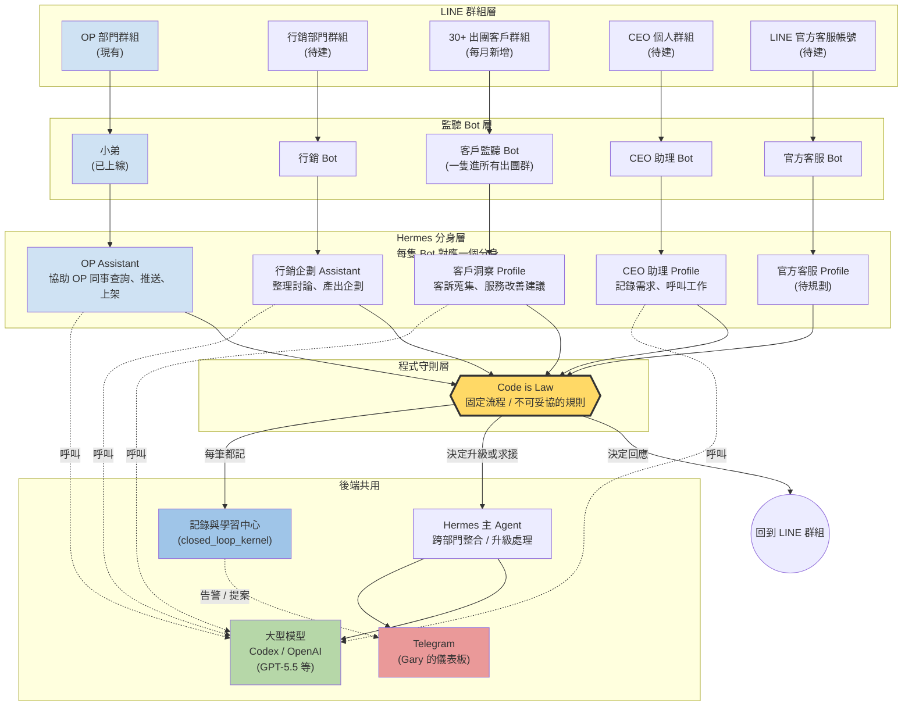

# 阿玩旅遊全公司 AI 部門地圖 (Plan v2)

**取代之前的**: `docs/plans/2026-05-26-hermes-wannavegtour-integration-plan-v1.md` 不是廢掉,v1 是「現有 OP Bot 怎麼進到下一階」的施工順序,本份 v2 是「整間公司最後長什麼樣」的完整地圖。v1 的 Phase 0(基礎建設)是 v2 全部 Bot 共用的地基。

**狀態**: 草稿(等 Gary 確認)
**日期**: 2026-05-26
**作者**: Claude(根據 Gary 親口口述 vision 整理)

---

## 為什麼寫這份

我們現在已經有一隻 Bot(小弟)在 OP 部門 LINE 群組裡跑,測試完確認:會持續監聽訊息、會回答查詢。**但「只用程式規則回答」(Code is Law)其實還不完整** — 真正的全貌是「Agent 用腦判斷 + 程式規則當護欄」,而且不只 OP 一個部門,**整間公司每個工作群組都會有一隻自己的 Bot**,共用同一套大腦。

這份文件畫出最後長什麼樣,跟 v1 的「先蓋哪一塊地基」搭著看。

---

## 整體想像(一張圖)

**怎麼讀這張圖**:
- **由上往下** = 訊息流動方向(LINE 群組 → Bot → 分身 → 程式守則 → 回 LINE / 寫記錄 / 找主腦)
- **黃色框** = 程式守則(Code is Law),最重要的安全閘
- **藍色框** = 記錄中心,每筆事情都進去
- **綠色框** = 大型模型(會花錢的部分,所有分身共用)
- **紅色框** = Telegram(Gary 一個人看到全公司動態的窗口)

---

## 五隻 Bot 的分工(白話一隻一隻講)

### 1. OP 部門 Bot「小弟」(現有,持續加功能)

**在哪**:OP 內部 LINE 群組(已上線跑著)

**現在會做的事**(已上線):
- 持續看大家在群裡聊什麼,有需要就回答
- 查行程資訊
- 查出團人數
- 查出團日期
- 講錯不回應(被動模式)

**接下來要加的事**:
- 主動推送官網上沒賣完的行程資訊(例如「下個月日本團還缺 5 人」)
- **新功能:上架行程** — 同事丟一份行程文件,Bot 自動拆解內容,上架到官網
- 後續還可以再加新功能(這就是「每個能力 = 一個 worker」的精神)

**底下接什麼**:Hermes 裡的一個分身,叫做 **OP Assistant**
- 注意:**不是接最頂層的 Hermes 主 Agent**,而是 Hermes 裡的一個次級分身(技術名詞:Hermes Profile)
- 為什麼?因為主 Agent 是跨部門的,單一部門的事情交給專屬分身比較乾淨

**工作流程**:
1. 群裡有人講話 → Bot 收到訊息
2. 分身(OP Assistant)用腦判斷:「這在問什麼?該怎麼回?」
3. 把判斷結果交給 **程式守則** 檢查(技術名詞:Code is Law guard rail)
4. 守則決定要不要回、回什麼、要不要呼叫工具(查 WC、推送商品等)
5. 程式回應(注意:**不是分身直接寫回應文字**)
6. 同時把這筆事情記到記錄中心(技術名詞:closed_loop_kernel events 表)

**為什麼分身不能直接回?**
- Code is Law 原則:控制流程一定要在程式碼裡,不能在分身的「腦袋裡」
- 分身可以判斷意圖,但不能決定動作
- 這樣才能保證錯不到哪去、能 replay、能 audit

**完全不能做的事**:
- 不能直接改商品價格 / 改頁面內容(技術名詞:Type 2 編輯,目前明確拒絕)
- 不能直接刪資料
- 不能無批准就推大規模通知

---

### 2. 行銷部門 Bot(新建)

**在哪**:行銷部門 LINE 群組(目前還沒這個 Bot)

**主要工作**:
- 持續監聽行銷同事在群裡的討論
- **被點名時做事**,例如有人說「幫我整理近期的對話做一份企劃」,Bot 就要產出
- 跟 OP Bot 一樣是被動監聽,有指令才出手

**底下接什麼**:Hermes 裡另一個分身,叫做 **行銷企劃 Assistant**(命名待定)

**跟 OP Bot 不同的點**:
- OP 分身偏「查詢」(看資料、回答)
- 行銷分身偏「產出」(整理對話、生成企劃文件)
- 但**程式守則層一樣是 Code is Law** — 分身產文件,但「要不要寄出 / 要不要存檔 / 要不要通知誰」由程式規則決定

**待辦事項(此 Bot 必須有的功能)**:
- 對話記錄保存機制(技術名詞:retention policy) — 先列待辦,實作再規劃

---

### 3. 客戶群組監聽 Bot(新建,跨多個群)

**在哪**:**所有出團客戶的 LINE 群組**
- 我們一個月出 30 幾團 = 30 幾個客戶群
- **一隻 Bot 進所有這些群**(不是每團一隻)
- 每新出一團就把這隻 Bot 加進去

**主要工作**:
- 收集所有出團群組的對話
- 幾個重點:
  1. 從對話裡找出「官網服務可以改善的地方」(例如客人重複問同一個問題 → 官網 FAQ 缺這條)
  2. **客訴自動偵測 + 記錄**,標記要被處理的
  3. 重要事件回報給 Hermes **主 Agent**(這隻 Bot 是少數會跟主 Agent 直接對話的)

**底下接什麼**:Hermes 裡的 **客戶洞察 Profile**(命名待定)

**Gary 要研究的問題**(列 TODO 給我去查):
- LINE API 在群組裡,如果客人傳**圖片**,Bot 能不能整理下來?(常見場景:客人傳行程截圖、護照照片、訂位確認單)
- 如果可以,我會回報你,我們再額外討論

**為什麼這隻特別**:
- 唯一一隻會「主動回報主 Agent」的 Bot,因為客戶洞察的價值在跨群匯總
- 唯一一隻會「進大量群組」的 Bot,加 / 移除要自動化
- 隱私敏感度最高 — 處理的是付費客戶對話

**待辦事項**:
- 對話記錄保存機制(retention) — TODO
- 圖片處理可行性研究 — TODO
- 客戶資料去識別化 / 加密策略 — TODO(我先列,等你決定方向)

---

### 4. CEO 個人助理 Bot(新建)

**在哪**:CEO 自己的 LINE 群組(可以是個人聊天室或自建小群)

**主要工作**:
- 監聽 CEO 在群裡講什麼
- CEO 直接呼叫:「幫我做 X」、「記錄一下我想到的 Y」
- **記錄需求** — CEO 想到什麼就丟進來,Bot 整理成待辦清單 / 想法庫

**底下接什麼**:Hermes 裡的 **CEO 助理 Profile**

**跟其他 Bot 不同的點**:
- 完全為 CEO 個人服務,不是部門共用
- 比較像「私人秘書」,接話頻率最低但每筆權限最高
- 可以呼叫其他分身做事(例如 CEO 說「叫 OP 那邊查一下下月日本團」,助理可以幫忙打到 OP Assistant)

**待辦事項**:
- 跟 Telegram 的關係:Telegram 是 Gary 收**告警 + 批准**的儀表板,CEO LINE 助理是收**口頭指令 + 想法**的窗口。兩條通道並存,還是要合併?— 等 Gary 決定

---

### 5. LINE 官方客服帳號 Bot(待規劃,你之後會做的)

**在哪**:阿玩旅遊的 LINE 官方帳號(LINE OA,對外的客戶第一接觸點)

**主要工作**(暫定):
- 收 LINE 官方帳號傳來的客戶問題(不是內部群組)
- 跟「3. 客戶群組監聽 Bot」差異:這是**對外**(潛客戶詢問),那是**對內**(已成團客戶私群)

**現在還不急做** — 你說「之後還會有」,我先列在地圖上,實際規格之後再寫

---

## 共同原則(所有 Bot 都遵守)

### 1. 程式守則(Code is Law)是不可妥協的紅線

- **流程**:訊息 → 分身判斷 → **程式守則檢查** → 程式回應
- 分身可以**判斷意圖**(「這個人在問行程嗎?」)
- 分身**不能決定動作**(「我要回他什麼」)
- 分身**不能直接寫回應文字**(回應文字由程式 template 生成,或由程式呼叫工具產出)
- 分身**不能直接修改任何東西**(改商品、改頁、刪資料,一律走 candidate → 批准 → apply)

**技術名詞**:Code is Law(`spec/code-is-law-v0.md`),四層部署指紋防線(`tracking/status.md`)

### 2. 共用一個大腦(模型)

- 所有 Hermes 分身呼叫的大型模型是 **Codex / OpenAI 最新模型**(目前是 GPT-5.5 等)
- 接法:**OAuth 授權**(技術名詞:OAuth flow,你已有的 Codex 訂閱授權)
- 為什麼共用:統一帳單、統一模型版本、新模型出來統一升級

**待確認**:GPT-5.5 是你目前訂閱的最新版嗎?如果是別的(例如 Claude 4.7 / GPT-5.x / Gemini 2.x),我這份計畫直接改

### 3. 每筆事情都記到記錄中心

- 每隻 Bot、每次接收訊息、每次回應、每次失敗 — 全部進 **記錄中心**(技術名詞:closed_loop_kernel events 表)
- 為什麼:這是 AI 公司「Everything Recorded」原則 — 沒記錄等於沒發生
- 記錄拿來做什麼:未來分身要自我改進,需要看過去資料來提案 + 沙盒驗證

**技術名詞**:append-only event store (PostgreSQL),`prevent_mutation` trigger

### 4. 對話記錄保存(Retention)

**目前所有 Bot 都需要這個機制,先列 TODO**:
- 群裡的對話要保存多久?
- 要不要 1 個月後自動壓縮?6 個月後封存?12 個月後刪除?
- 隱私敏感度高的(客戶群、CEO 群)有沒有不同規則?

**先暫定全部「永遠保存」**,實作 retention policy 等 Gary 決定政策後再加(技術名詞:logrotate / retention scheduler)

### 5. Gary 看全部:Telegram 儀表板

- 所有 Bot 出狀況 / 提改進建議 / 需要批准的事 → 全部統一從 **Telegram** 推給 Gary
- 為什麼不是 LINE:LINE 是「客戶 / 同事接觸點」,Telegram 是 Gary「管理駕駛艙」,要分開
- 技術上走 Hermes 的 `skimm3r918_bot`(現有)

---

## 跟前一份計畫(v1)的關係

v1 是「先蓋哪一塊」的施工順序,v2 是「最後長什麼樣」的全景。兩份要一起看:

| v1 提的 Phase | 在 v2 裡是什麼 |
|---|---|
| Phase 0.1 events 進記錄中心 | **5 隻 Bot 共用的地基**,沒這個任何 Bot 都不能進閉環學習 |
| Phase 0.2 過去資料 replay | **5 隻 Bot 共用的測試工具**,任何新 worker 上線前都要過 |
| Phase 0.3 Telegram bridge | **5 隻 Bot 共用的告警 + 批准通道**,Gary 一個人看全部 |
| Phase 1.A 上架 worker | **OP Bot 的新功能**(本 v2 第 1 節「接下來要加的事」) |
| Phase 1.B 修復 escalation | **跨 Bot 通用機制** — 同事不滿 → 升級主 Agent → LLM 修一輪 |
| Phase 1.C 主動通知 worker | **OP Bot 的新功能**(本 v2 第 1 節「主動推送」) |
| Phase 1.D LLM observer | **5 隻 Bot 共用的 META 路徑** — 觀察自己的對話,提改進建議 |
| Phase 2 Hermes 深整合 | 仍然是 v2 全部 Bot 共用,等第 2 個客戶或多 channel |

**所以 v1 的 Phase 0 不變,優先級依然最高**:沒這 3 塊地基,v2 任何一隻 Bot 都不能跑完整流程。

---

## 待辦清單(我先收齊,等你決定每項該怎麼處理)

1. **行銷 Bot 的對話保存機制** — retention policy 規格
2. **客戶監聽 Bot 的對話保存機制** — 同上,但敏感度更高,可能需要去識別化
3. **LINE API 圖片處理可行性研究** — 我去查 LINE Messaging API 規格,看能不能抓群組內圖片
4. **CEO 助理 Bot vs Telegram 兩個窗口的分工** — 要合併還是並存?
5. **官方客服 Bot(第 5 隻)的詳細規格** — 待 Gary 決定優先級時補
6. **客戶監聽 Bot 進 / 退群組自動化** — 30 幾團每月新增,手動加 Bot 不可持續
7. **模型統一確認** — Codex / OpenAI 最新模型具體是哪個?接法 OAuth 細節
8. **隱私 / 加密策略** — 客戶對話、CEO 對話的儲存加密?誰能讀?
9. **跨 Bot 工具共用** — 例如「呼叫 WC API」是每隻 Bot 各自接,還是共用一個工具層?
10. **Bot 命名定案** — OP Assistant / 行銷企劃 Assistant / 客戶洞察 Profile / CEO 助理 Profile 都是暫定名,要不要 Gary 取正式名

---

## 不在這份計畫範圍裡(明確不做的)

- **跨公司 / Multi-tenant 架構** — 阿玩旅遊一台 DGX Spark 跑這整套就好,沒有跨公司資料共用
- **分身用 LLM 寫回應文字** — 永遠由程式控制回應內容(Code is Law)
- **無批准的寫入操作** — 任何改商品 / 改頁 / 刪資料一律走 candidate + 批准
- **客戶私訊轉發給 OP** — 客戶監聽 Bot 只蒐集模式,不轉發個別訊息(隱私)

---

## 開放問題(等 Gary 決定方向)

1. **5 隻 Bot 哪一隻先動?** OP Bot 已上線。下一個是 (a) 行銷 Bot,(b) 客戶監聽 Bot,(c) CEO 助理 Bot?
   - 我的建議:**CEO 助理先做**,因為它服務的人就是你,你會用它,反饋最快,當 dogfood 最理想
2. **Hermes 主 Agent 什麼時候啟動?**
   - 現在 DGX 上 Hermes runtime 是 fresh 沒跑過
   - 第一隻 Bot 加 Hermes 分身的時候(可能就 OP Bot 升級)才需要啟動主 Agent
   - 還是先把 Hermes 主 Agent 跑起來(空跑),Bot 接的時候比較順?
3. **模型接法:OAuth 還是 API Key?**
   - 你說 Codex / OpenAI OAuth — 確認你訂閱的是 ChatGPT Pro / Team / Enterprise 哪個方案?
   - 因為 OAuth 接法跟 API Key 接法在 Hermes 裡的設定方式不一樣
4. **客戶監聽 Bot 進群授權**
   - 客戶群是 OP 同事建的,要 OP 同事手動加 Bot 嗎?
   - 還是 Bot 自己看到新群就自動加入?(技術上 LINE 不允許 Bot 自己加群,只能被邀請)
5. **這份 v2 跟 v1 哪個先 commit 為「正式 roadmap」?**
   - 建議:v2 為正式 product roadmap,v1 為 v2 第一塊地基的施工 spec
   - 兩份都留在 repo 裡 cross-reference

---

## 怎麼往下走

我先把這份推上 repo,你看完之後告訴我:
- (a) 哪些理解錯了?
- (b) 5 隻 Bot 哪隻先動?
- (c) Hermes 主 Agent 啟不啟動?
- (d) 待辦清單哪幾項你想我先查?

我等你回。

---

## 附錄:技術名詞速查表(備註)

| 白話 | 技術名詞 | 在 repo 裡哪裡 |
|---|---|---|
| 監聽程式 / Bot | LINE webhook listener | `wannavegtour/line_listener.py` |
| 分身 | Hermes Profile | `docs/agent-profile-registry-v0.md` |
| 主 Agent | Hermes main agent (`skimm3r918_bot`) | `~/.hermes/hermes-agent/` |
| 程式守則 | Code is Law / guard rail | `spec/code-is-law-v0.md` |
| 記錄中心 | closed_loop_kernel events table | `closed_loop_kernel/store.py` |
| 候選提案 | improvement_candidate | `closed_loop_kernel/engine.py` |
| 沙盒驗證 | sandbox replay | `closed_loop_kernel/sandbox.py`, `sql_sandbox.py` |
| 批准閘門 | apply_candidate (4-point fingerprint) | `closed_loop_kernel/engine.py:358` |
| Telegram 儀表板 | Telegram bridge (via Hermes) | (待建,v1 Phase 0.3) |
| 大型模型 | LLM (OpenAI / Codex,GPT-5.5 等) | (待接) |
| 對話保存 | retention policy | (待建) |
| 上架 | WC create_product API | (待建,v1 Phase 1.A) |
| 主動推送 | LINE push API + cron | (待建,v1 Phase 1.C) |
| 修復升級 | escalation handoff | (待建,v1 Phase 1.B) |
| 自我改進 | observer (Stage 1) + proposer (Stage 2) | (待建,v1 Phase 1.D) |
| LINE 客戶 OA | LINE Official Account | (待建,本 v2 第 5 節) |
