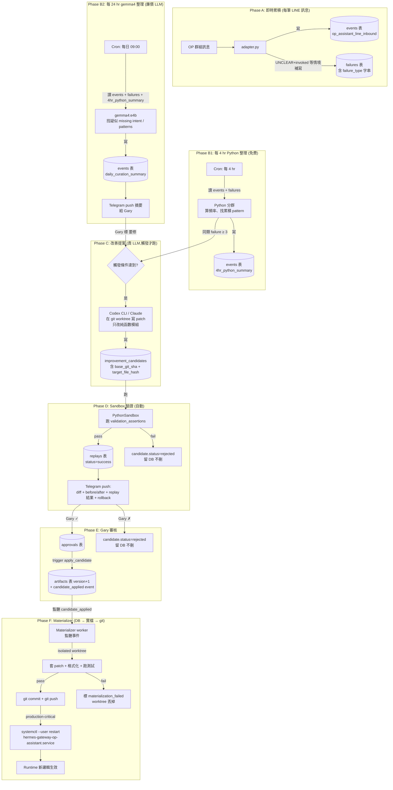

# OP Bot Learning Loop Design v0

**狀態**:草案,待 Gary review
**日期**:2026-05-27
**作者**:Claude(基於 Gary 2026-05-27 口述 mental model + Codex consult session `019e6576-53de-7ac0-8b33-749dafd9958c`)
**Supersedes / 補完**:`docs/plans/2026-05-26-op-kernel-db-operations-v2.md` 的 Phase A 寫入路徑(因 6-tool harness 已於 2026-05-27 01:39 retire)

---

## 為什麼有這份

v2 doc 把整套 learning loop 設計鎖住了 — 14 步 lifecycle、improvement_candidates schema、PythonSandbox、pattern_routes 退場機制都齊。但 v2 doc 通篇假設 Phase A(訊息 → events / attempts / tool_calls / failures)是由 6-tool harness 寫的。

今天上午我們把 6-tool harness 從 production retire 了(`~/.hermes/plugins/op-assistant-tools/` → `retired-plugins/`),改成 B1 Python-first 路由 — 100% invoked OP 訊息走 `wannavegtour.LineRouter.dispatch()` 直接送 reply,不經 Hermes agent。

結果:**Phase A 沒人寫了**,learning loop 餓死。同時 Gary 2026-05-27 提的 mental model「每 4 hr gemma4 整理 → 背景 agent 用 sandbox 改善 → Telegram 提交 → 通過 commit/push、拒絕存起來」,v2 doc 也沒明文寫 git commit/push 的步驟。

這份 v0 文件補這個 gap,把 4 個缺塊 + cadence 釐清的部分定下來。

---

## Gary 的 mental model(2026-05-27)

> bot 持續收集對話,然後每 4 個小時用 gemma4 來做研究、分類,找出可以被優化的點,或是沒有被辨識但是可以被加入 python 判斷式的問句、需求或關鍵字。接著背景 agent 自己用 sandbox 進行改善、測試、確認沒問題,就提出修改建議到我的 Telegram。我審核通過之後,就進行更新,接著 commit、push。然後如果拒絕,就存起來。

---

## 整體流程(完整版)

---

## 缺塊 1:失敗紀錄員(Failure Writer)

### 情境

OP 美鳳在群組打「小弟有國內團嗎?」。bot 回了 `UNCLEAR_ACK_TEXT`(「看不出你想問什麼,試試 ...」)因為 `wannavegtour/query_parser.py` 沒有「依類別查詢」這個 intent。

### 現在會發生什麼

這條訊息只在「我有收到」紀錄表留一筆(technical: `events.op_assistant_line_inbound`)。**沒有人說「這次其實答錯了」**。Failure 表永遠空。

### 怎麼補

| | 內容 |
|---|---|
| 寫入點 | `plugins/op-assistant-line/adapter.py` `_handle_message_event` 在 LineRouter dispatch 完成後,根據結果有條件補寫 |
| 寫進哪 | `failures` 表(technical: `closed_loop_kernel/postgres.py:138`),`status='open'` |
| 觸發條件 |  (a) `result.action == REPLY` 且 `result.intent == 'unclear'`(invoked 但分類為 UNCLEAR) (b) `result.action == REPLY` 且後續 OP 在 N 分鐘內表達不滿(例如打「不是這個」、「沒回到我問的」) (c) Gary 在 Telegram 手動標 |
| failure_type 字串約定 | `unclear_invoked_no_intent` / `wrong_intent_classification` / `over_triggered_reply` / `missing_keyword_alias` / `op_complained_in_followup`(暫定,實作時再 lock) |
| context payload | `{message_id, text, parsed_intent, parsed_extras, reply_sent, user_id, group_id, ts}` |
| failure mode | adapter 寫 failure 失敗 **絕不擋訊息回覆**(同 _log_inbound_to_kernel 的 catch-warn 模式) |

### 依賴

無。`failures` 表已存在(v2 doc 已建)。psycopg 已裝(2026-05-27 00:24)。

---

## 缺塊 2:改善提案 Owner(Candidate Proposer)

### 情境

過了一週,`failures` 累積 8 筆 `unclear_invoked_no_intent`,文字都跟「國內團」、「便宜行程」、「最近有沒有」相關。

理論上應該要有「人」(或某個 AI)看到這個 pattern 後說:「query_parser.py 缺一條規則,我來提一份改善版」。

### 現在會發生什麼

v2 doc line 173 寫「Hermes 主 Agent 或你手動」— 翻譯成白話:目前沒人負責。今天上午把 6-tool harness 退場後,連 Hermes agent 都不在 production 跑了。

### 怎麼補(Codex 建議的兩層)

| 層 | 跑誰 | 多久跑一次 | 做什麼 | 預期成本 |
|---|---|---|---|---|
| 廉價研究員 | gemma4:e4b(本地 Ollama) | 每 4 hr Python 整理 + 每 24 hr LLM curation | 分群、算頻率、找 pattern、寫人話摘要。**不寫 patch、不改檔** | 約等於零(本地) |
| 貴的提案者 | Codex CLI / Claude(雲端付費) | 達門檻才跑 | 在隔離 git worktree 內寫具體 patch,patch_type=`code_patch`,target_artifact 限定 `wannavegtour/query_parser.py` 或更窄的純函數模組 | 高,但稀疏 |

### 門檻(觸發貴 LLM 的條件,任一即觸發)

1. 同一 failure_type + 同一 entity-shape signature 累積 ≥ 3 筆
2. Gary 在 Telegram 摘要上回覆「這個要修」(寫 `events.gary_marked_for_fix`)
3. 自動測試 suite 有紅燈(未來才會有,目前沒)

### candidate writer 的硬約束

- **只能改 pure function 模組**(query_parser.py 可,line_router.py 不可,adapter.py 完全不可) — sandbox AST lint 禁 `os/sys/subprocess/socket/shutil/open/__import__`
- 必須在 isolated git worktree 跑(technical: `git worktree add /tmp/op-bot-candidate-<id>`)
- 必須產出 `validation_assertions` JSONB,內含過往真實 audit 樣本(例如「給 query_parser 輸入 X,intent 必須 = Y」)
- 寫入 `improvement_candidates` 表時必須帶 `base_git_sha`(那條 worktree 的 git HEAD)、`target_file_hash`、`target_artifact_version`

### 依賴

- 缺塊 1(failure writer)必須先有東西,提案者才有資料看
- 一個「触發 dispatcher」cron / 服務 — 負責決定門檻達到時,叫哪個貴 LLM(這部分需要再 spec)

---

## 缺塊 3:Materializer(DB → 實檔 → git)

### 情境

Gary 在 Telegram 看到提案:「query_parser.py 多一條規則:訊息含『國內團』就分類成 `category_query`」。Gary 看了 diff 沒問題,按 ✓。

### 現在會發生什麼

現在的 `apply_candidate`(technical: `closed_loop_kernel/engine.py:358`)**只在資料庫加一筆 artifact version+1**。但 production bot 讀的是實檔 `wannavegtour/query_parser.py`,不是 DB!

結果:
- DB 說「已套用」 ✓
- git 沒紀錄 ✗
- 實檔沒變 ✗
- production 行為沒變 ✗

Codex 評為 **不可審計的雙重真相**,P0。

### 怎麼補(Outbox / Event-Driven Materializer)

**不要把寫檔 + commit + push 塞進 `apply_candidate`**。拆成兩個獨立 stage:

#### Stage A:`apply_candidate` 只做 DB 狀態轉移(已實作,維持不變)

- 寫 `artifacts` (version+1, is_active=true)
- 寫 `improvement_candidates.status='applied'`
- 寫 `failures.status='resolved'`
- 發 `events.candidate_applied` 事件(已實作 `engine.py:429`)

#### Stage B:Materializer worker(新增,監聽 candidate_applied 事件)

| 步驟 | 動作 | 失敗處理 |
|---|---|---|
| 1 | 從 event payload 拿 candidate_id,fetch `improvement_candidates` row |  |
| 2 | 驗證 actor separation:approver != proposer | 失敗 → 標 `materialization_failed`,不繼續 |
| 3 | 驗證 `base_git_sha` 仍等於目前 main 的 HEAD;`target_file_hash` 仍等於實檔 hash | 失敗 → 標 `needs_rebase` |
| 4 | 建立 isolated git worktree:`git worktree add /tmp/op-bot-mat-<candidate_id>` |  |
| 5 | 在 worktree 內寫入 `proposed_content`(technical: `improvement_candidates.proposed_content` 欄位) |  |
| 6 | 跑格式化(black / ruff,如有) |  |
| 7 | 跑 PythonSandbox 對 `validation_assertions` 做最後一次 replay 確認 | 失敗 → 標 `materialization_failed`,丟 worktree |
| 8 | 跑 unit tests(`python3 -m unittest discover -s tests`) | 失敗 → 同上 |
| 9 | `git commit -m "Apply candidate <id>: <patch_type> to <artifact_name>"` |  |
| 10 | `git push origin worktree-wannavegtour-op-assistant-kernel`(或 main,依分支策略) | 失敗(網路 / auth)→ retry policy |
| 11 | 寫 `events.materialization_completed` |  |
| 12 | 拆 worktree:`git worktree remove /tmp/op-bot-mat-<candidate_id>` |  |

### Race control

每個 candidate 在寫入 `improvement_candidates` 時必須帶:
- `base_git_sha` — proposer 看到的 git HEAD
- `target_file_hash` — proposer 看到的實檔 sha256
- `target_artifact_version` — proposer 看到的 DB artifact version

Materializer 在步驟 3 重新驗證。任何 mismatch 變 `needs_rebase`,不硬套。

### 依賴

- 缺塊 2 寫的 candidate 必須帶 `base_git_sha` + `target_file_hash`(schema 已有 `base_artifact_hash`,可能要新增 `base_git_sha` 欄位 — 或塞進 validation_assertions JSONB)
- 一個 worker 進程跑 Materializer。候選實作:
  - (a) Hermes cron 加一條 `hermes cron create '*/5 * * * *' --name op-materializer --script materialize.py --no-agent --profile op-assistant`,每 5 分鐘掃一次未處理的 `candidate_applied` event
  - (b) 獨立 systemd 服務 + Postgres LISTEN/NOTIFY
  - 推薦 (a):省力,跟 v2 doc 既有 cron 一致

---

## 缺塊 4:Runtime Source-of-Truth

### 情境

Materializer 把 query_parser.py 改完、commit + push 了。production bot(systemd 服務 `hermes-gateway-op-assistant.service`)什麼時候才會跑新邏輯?

### 現在會發生什麼

從來沒講清楚。可能是:
- (a) 重啟 service → Python 重新 import
- (b) 監聽 git pull → 自動 reload
- (c) DB artifact 變化 → runtime 自動下載新檔
- (d) Gary 手動重啟

### 怎麼補

**明文選 (a):重啟 service**。理由:
- 最簡單、最 deterministic
- Hermes 沒有 "hot module reload" 機制(沒見過 reference)
- 重啟 5 秒以內,影響可忽略

### 流程

Materializer 步驟 10 push 成功後:
- 如果 patch_type 是 `code_patch` 且 target_artifact 在 `wannavegtour/` 套件下 → 算 production-critical
- 執行 `systemctl --user restart hermes-gateway-op-assistant.service`
- 跑 healthcheck:`curl -X POST http://127.0.0.1:8646/line/webhook -d '{}' -w '%{http_code}'`,期望 401(簽章拒絕 = server up)
- 失敗 → 寫 `events.runtime_reload_failed`,push Telegram alert

### 依賴

systemd user unit 已存在(`hermes-gateway-op-assistant.service`)。`loginctl enable-linger wannavegtour` 已設。

---

## Bonus:Cadence 釐清

你說「每 4 小時用 gemma4 整理」。實際上文件設計是分兩節奏:

| 節奏 | 跑誰 | 做什麼 | 成本 |
|---|---|---|---|
| 每 4 hr | Python(無 LLM) | 從 events / failures 表 deterministic 分群、算頻率、找累積夠的 pattern。寫進 `events.4hr_python_summary` | 約等於零 |
| 每 24 hr 09:00 | gemma4:e4b(本地 Ollama) | 讀 24 hr events + failures + 4 條 4hr_python_summary,寫人話摘要 + 找疑似 missing intent。寫進 `events.daily_curation_summary`,push Telegram | 本地推論,單次 < $0.01 等價 |

兩個各司其職:Python 4hr 提供「我看到 X 出現 8 次」這種**事實**;gemma4 24hr 提供「這 8 次看起來都跟『國內團』有關,可能要加 keyword」這種**詮釋**。

只有 24 hr 那條會主動 push Telegram。4hr 整理是內部材料,給 24hr LLM 吃。

---

## 各元件 spec 總表

| 元件 | 在哪寫 | 寫進哪 | Trigger | 失敗時 |
|---|---|---|---|---|
| 1. Failure Writer | `adapter.py:_handle_message_event` | `failures` 表 | UNCLEAR-invoked / OP follow-up 負面 / Gary 標 | catch-warn,不擋訊息 |
| 2a. 廉價研究員(4hr) | 新增 `~/.hermes/profiles/op-assistant/scripts/op_assistant_4hr_cluster.py` | `events.4hr_python_summary` | cron `0 */4 * * *` | log error,下次再跑 |
| 2b. 廉價研究員(24hr) | 既有 v2 doc `op_assistant_daily_curate.py` | `events.daily_curation_summary` + Telegram | cron `0 9 * * *` | log error,下次再跑 |
| 2c. 貴的提案者 | 新增 `~/.hermes/profiles/op-assistant/scripts/op_assistant_propose_candidate.py` | `improvement_candidates` 表 | 廉價研究員找到門檻達到 OR Gary 標 | candidate.status='draft_failed' |
| 3. Sandbox replay | 既有 `closed_loop_kernel/sandbox.py` | `replays` 表 | candidate 寫完即跑 | candidate.status='rejected' |
| 4. Materializer | 新增 `~/.hermes/profiles/op-assistant/scripts/op_assistant_materialize.py` | git commit + push + restart service | 監聽 `candidate_applied` event | event `materialization_failed` + Telegram alert |
| 5. Runtime SoT | `systemctl restart hermes-gateway-op-assistant.service` | runtime 行為變更 | Materializer 步驟 11 | event `runtime_reload_failed` + Telegram |

---

## 跟 v2 doc 的關係

| v2 doc 寫的 | 本 v0 文件如何處理 |
|---|---|
| Phase A(events / attempts / tool_calls / failures 由 6-tool harness 寫) | **改寫**:`events.op_assistant_line_inbound` 由 adapter.py 寫(已實作);`failures` 由 adapter.py 補寫(缺塊 1);`attempts` / `tool_calls` 在 B1 路徑下意義不明,暫時不寫,未來如恢復 agent fallback 再恢復 |
| Phase B(每日 09:00 gemma4 curation) | **保留**,加上 4 hr Python 整理當前置 |
| Phase C(improvement_candidates → replays → approvals → apply_candidate) | **保留**,加 `base_git_sha` + `target_file_hash` 欄位約束 |
| Phase D(pattern_routes 退場機制) | **保留**,但目前 0 row;真正動的是缺塊 4(runtime restart) |
| Telegram push | **保留**,加 Materializer 完成 / 失敗的 alert push |

---

## 開放問題(下一輪要決的)

1. **failure_type 字串 taxonomy 要不要鎖死?** 暫定 5 個,要不要先用 free-form 看實際累積再 lock?
2. **「廉價研究員找到門檻達到」具體門檻**(目前暫寫「同類 ≥ 3」)— 要不要 Gary 看一週 4hr 整理後再 set?
3. **`base_git_sha` 欄位**要新增到 `improvement_candidates` schema,還是塞進 `validation_assertions` JSONB? schema 變更需要走 candidate 流程嗎(self-bootstrap 矛盾)?
4. **貴 LLM 用哪個**?Codex CLI(已裝)/ Claude API / 兩個都試?Cost vs quality 怎麼平衡?
5. **Materializer 推 Telegram 失敗 alert 要不要二次 retry?** 還是只 log?
6. **Codex 提的 9 個 hole**(ground truth、outbound decision log、action space、sandbox allowlist、shadow mode、rollback、alert fatigue、PII 治理、actor separation)有幾個跟本文件設計衝突或需先消化?— 另一份討論

---

## Acceptance criteria(這份文件 v0 → v1 要達到的)

- [ ] 上面 6 個開放問題逐項與 Gary 對齊
- [ ] failure_type taxonomy 鎖定
- [ ] Materializer worker 的 script skeleton 寫出來(不一定 run)
- [ ] Cron schedule 表確認(4hr / 24hr / 5min materializer)
- [ ] schema 變更(若有)走 v2 doc 的 candidate 流程
- [ ] 跟 v2 doc 合併或互引

---

## Cross-references

- `docs/plans/2026-05-26-op-kernel-db-operations-v2.md` — v2 canonical
- `closed_loop_kernel/postgres.py:147-181` — improvement_candidates / replays / approvals schema
- `closed_loop_kernel/engine.py:358-430` — apply_candidate(含 race-condition)
- `closed_loop_kernel/sandbox.py:139-153` — PythonSandbox AST lint
- `spec/code-is-law-v0.md` §3 — patch_type 三類
- `wannavegtour/query_parser.py` — 目前 Python 判斷邏輯
- `wannavegtour/line_router.py` — DispatchAction enum
- `plugins/op-assistant-line/adapter.py:1059-1135` — B1 redesign(Python-first routing)
- AGENTS.md `## How To Talk With Gary` — 本文件遵守的溝通風格
- Codex consult session: `019e6576-53de-7ac0-8b33-749dafd9958c`(stored in `.context/codex-session-id`)
