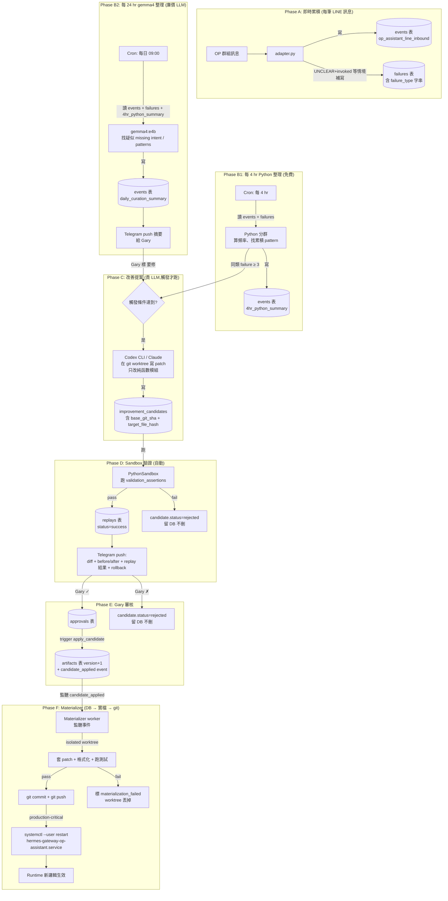

# OP Bot Learning Loop Design v0.1

**狀態**:草案,待 Gary review
**日期**:2026-05-27(v0 → v0.1 同日,Codex review 後)
**作者**:Claude + Codex consult session `019e6576-53de-7ac0-8b33-749dafd9958c`(基於 Gary 2026-05-27 口述 mental model)
**Supersedes / 補完**:`docs/plans/2026-05-26-op-kernel-db-operations-v2.md` 的 Phase A 寫入路徑(因 6-tool harness 已於 2026-05-27 01:39 retire)

---

## v0.1 修訂 (2026-05-27, Codex review 後)

這版不是重寫方向,是把 v0 裡幾個會讓 learning loop 變成空轉的缺口補實。

- **缺塊 1 改名為「失敗紀錄員 + 決策日誌」**
  原本只想寫 failure。v0.1 改成同時寫 failure、outbound decision、correlation id。原因很簡單:只有 failure_type,沒有當時 parser 怎麼判、router 怎麼走、bot 回了什麼,一週後沒辦法 replay,也沒辦法知道該修哪裡。

- **不把 raw 對話直接存進 failure row**
  failure row 只存 `message_hash`、`redacted_preview`、`user_hash`。raw text 留在原始事件來源或既有 event reference 裡,不在 failure/candidate pipeline 裡到處複製。這是 PII 最小化 (data minimization),不是完整隱私系統,但 v0 就要先做。

- **candidate writer 的「只能改 query_parser.py」改成硬限制**
  不能只寫在文件裡。v0.1 要求 schema 或 materializer 強制 target path allowlist。PythonSandbox 的 AST blacklist 不是安全模型;真正的安全邊界是「這個 candidate 根本不能指向 allowlist 以外的 artifact」。

- **4hr / 24hr 節奏維持拆開**
  4hr 做收集、聚類、低成本整理、failure 累積。24hr 或達門檻後才叫貴 proposer。不要每 4hr 產 code patch,否則 noise 會比 signal 多。

- **每次 routing 都寫 decision log,不只失敗才寫**(新增設計原則)
  沒有正常樣本就沒有 baseline → 無法算 failure rate、無法 shadow mode、無法判斷新 candidate 是改善還是 over-trigger。failure row 只在命中 trigger 時寫;decision log 每次 routing 都寫。詳見缺塊 1 末段。

- **把 Codex review 的 9 個 hole 分桶**
  v0.1 已吸收 ground truth、outbound decision log、PII 最小化、correlation id、sandbox allowlist 升級。shadow mode、rollback、actor separation 先不硬塞進 failure writer,但要在第一次自動 materialize production patch 前補上。詳見「開放問題」第 6 點。

---

## 為什麼有這份

v2 doc 把整套 learning loop 設計鎖住了 — 14 步 lifecycle、improvement_candidates schema、PythonSandbox、pattern_routes 退場機制都齊。但 v2 doc 通篇假設 Phase A(訊息 → events / attempts / tool_calls / failures)是由 6-tool harness 寫的。

今天上午我們把 6-tool harness 從 production retire 了(`~/.hermes/plugins/op-assistant-tools/` → `retired-plugins/`),改成 B1 Python-first 路由 — 100% invoked OP 訊息走 `wannavegtour.LineRouter.dispatch()` 直接送 reply,不經 Hermes agent。

結果:**Phase A 沒人寫了**,learning loop 餓死。同時 Gary 2026-05-27 提的 mental model「每 4 hr gemma4 整理 → 背景 agent 用 sandbox 改善 → Telegram 提交 → 通過 commit/push、拒絕存起來」,v2 doc 也沒明文寫 git commit/push 的步驟。

這份 v0 文件補這個 gap,把 4 個缺塊 + cadence 釐清的部分定下來。

---

## Gary 的 mental model(2026-05-27)

> bot 持續收集對話,然後每 4 個小時用 gemma4 來做研究、分類,找出可以被優化的點,或是沒有被辨識但是可以被加入 python 判斷式的問句、需求或關鍵字。接著背景 agent 自己用 sandbox 進行改善、測試、確認沒問題,就提出修改建議到我的 Telegram。我審核通過之後,就進行更新,接著 commit、push。然後如果拒絕,就存起來。

---

## 整體流程(完整版)



---

## 缺塊 1: 失敗紀錄員 + 決策日誌(Failure & Decision Log)

### 情境

美鳳傳 LINE 問:

> 今天晚上六點還有位嗎?

這句對 OP bot 來說其實有明確 intent:查詢可預約時段或座位。

但目前 Python-first routing 如果沒有吃到關鍵字,可能會走到 fallback,或回一段不對題的文字。

### 現在會發生什麼

現在 production 大致是:

1. LINE webhook 進來。
2. `adapter.py` 先寫一筆 inbound event。
3. `LineRouter.dispatch()` 做 Python 判斷。
4. router 回 `REPLY` 或 `SILENT`。
5. adapter 直接回 LINE。
6. Hermes agent 通常不會被叫到。
7. 如果 bot 判錯,kernel 不一定知道。

這裡最大的問題不是「沒有 failure table」。
最大的問題是:**沒有完整決策日誌(outbound decision log)**。

如果只寫:

```text
failure_type = missed_actionable_intent
status = open
```

一週後我們還是不知道:

- 當時 parser 回什麼?
- router 為什麼選 `REPLY` 或 `SILENT`?
- bot 實際回了哪一類訊息?
- 這次 failure 對應哪一筆 inbound event?
- 之後 replay 要餵哪個 input?
- candidate writer 應該修 keyword、intent、還是 reply template?

所以 v0.1 把缺塊 1 升級成一體化設計:

> failure writer + outbound decision log + correlation id + PII 最小化

### 怎麼補

在 adapter routing 後補一個小 hook。

位置:

```text
plugins/op-assistant-line/adapter.py:1059-1135 routing 後
```

這個 hook 做兩件事:

1. **每次 routing 都寫 decision log**
   不管最後是 `REPLY` 還是 `SILENT`,都記錄這次 parser/router 的決策摘要。

2. **只有命中 trigger 時才寫 failure row**
   例如 parser 回 unclear、bot 發 fallback、使用者下一句明顯抱怨、Gary 手動標錯。

這樣 failure row 不是孤立資料,而是可以串回完整決策。

### failure row 19 欄位

| 分組 | 欄位 | 說明 |
|---|---|---|
| 身分時間 | `failure_id` | failure 唯一 ID。 |
| 身分時間 | `created_at` | 建立時間。 |
| 身分時間 | `source` | 固定先用 `op_assistant_line`。 |
| 分類 | `status` | `open` / `analyzing` / `proposed` / `resolved` / `ignored`。 |
| 分類 | `failure_type` | 觀察到的失敗型態,不放 root cause 猜測。 |
| 分類 | `trigger_reason` | 為什麼這次被寫入 failure。 |
| correlation | `correlation_id` | 串 inbound、outbound、failure、replay 的主 correlation key。 |
| correlation | `inbound_event_id` | 對應原始 LINE inbound event。 |
| correlation | `outbound_decision_id` | 對應這次 router / reply decision。 |
| PII 最小化 | `user_hash` | LINE user id hash,不存原值。 |
| PII 最小化 | `conversation_hash` | 對話 thread / room hash,不存原值。 |
| PII 最小化 | `message_hash` | 原訊息 hash,用來 dedupe / trace,不存 raw text。 |
| PII 最小化 | `redacted_preview` | 去識別後短摘要,只保留 debug 需要的最小文字。 |
| 決策過程 | `parser_result` | `parse_query` 的結果摘要,例如 intent / query_type / unclear reason。 |
| 決策過程 | `router_action` | `REPLY` 或 `SILENT`。 |
| 決策過程 | `reply_kind` | 例如 `fallback` / `availability_reply` / `generic_reply` / `none`。 |
| 決策過程 | `reply_hash` | 回覆文字 hash,不存完整 raw reply。 |
| 版本 | `code_version` | 當下 git sha 或部署版本。 |
| 證據 replay | `replay_evidence_json` | trigger evidence、replay input、前後文 event id、強弱信號。 |

明確規則:

```text
不存 raw text。
只存 message_hash + redacted_preview + user_hash。
```

如果之後 proposer 要吃資料,它看到的也應該是這些 redacted rows,不該直接讀 raw LINE text。

### failure_type

failure_type 描述「壞在哪」。
它不描述「為什麼壞」。root cause 之後由 curation / proposer 判斷。

| failure_type | 什麼時候用 | 備註 |
|---|---|---|
| `missed_actionable_intent` | 使用者訊息看起來有明確 OP intent,但 parser/router 沒抓到。 | 例如問訂位、時間、人數,但走 unclear / fallback。 |
| `reply_mismatch` | bot 有回,但下一輪強烈顯示回錯方向。 | 可由 Gary 標記或 strong negative follow-up 觸發。 |
| `false_positive_reply` | bot 不該回或不該用該類 reply,但它回了。 | 例如閒聊、無關訊息卻被當成 OP intent。 |
| `unexpected_silent` | bot 選 `SILENT`,但訊息看起來應該要處理。 | 適合低信心累積,不一定代表立刻要修。 |

`wrong_intent_classification` first iteration **不自動寫**。
這類需要 ground truth。只能由 Gary 標記,或 strong negative follow-up 很明確時才寫。

### trigger_reason

trigger_reason 描述「為什麼我們把它記下來」。
它是 detector 的來源,不等於 failure_type。

| trigger_reason | 說明 |
|---|---|
| `parser_returned_unclear` | parser 回 unclear / unknown / fallback intent。 |
| `fallback_reply_sent` | bot 實際送出 fallback 類回覆。 |
| `negative_followup_pattern` | 使用者下一句像是在糾正 bot,例如「不是」、「我是問」、「你看不懂」。 |
| `gary_marked_bad` | Gary 手動標記這次回覆有問題。 |
| `manual_review` | 人工 review 時補登,不一定來自自動 detector。 |

這樣拆是為了避免把 observation、trigger、root cause 混在一起。

錯誤示範:

```text
failure_type = missing_keyword_alias
```

這其實是 root cause 猜測,不是 adapter 當下觀察到的 failure。

正確做法:

```text
failure_type = missed_actionable_intent
trigger_reason = parser_returned_unclear
replay_evidence_json.root_cause_candidate = missing_keyword_alias
```

### 寫入點

寫入點放在 routing 完成後:

```text
plugins/op-assistant-line/adapter.py:1059-1135 routing 後
```

流程:

1. inbound event 已寫入 kernel。
2. `LineRouter.dispatch()` 回傳 action。
3. adapter 生成 reply 或決定 silent。
4. 寫 outbound decision log。
5. detector 判斷是否要寫 failure row。
6. 原 LINE reply 照常送出。

### 失敗模式

failure writer 不能擋 production 訊息。

如果寫 DB 失敗:

1. catch exception。
2. log warning。
3. 不重試阻塞 LINE webhook。
4. 不影響原本 reply / silent。
5. 之後再靠 operational log 補查。

這個元件是 observability,不是 request critical path。

### 依賴

依賴:

- adapter 已有 inbound event id。
- router 可以暴露 action。
- parser result 可以被摘要。
- 有可寫入 kernel DB 的輕量方法。
- 有基本 redaction/hash helper。

不依賴:

- 不依賴 Hermes agent。
- 不依賴 candidate proposer。
- 不依賴 materializer。
- 不依賴 Telegram approval。
- 不依賴完整 PII pipeline。
- 不依賴 shadow mode。
- 不依賴 rollback contract。

### 為什麼 decision log 要每次都寫,不只失敗才寫(v0.1 設計原則)

failure row 只寫「疑似壞掉」的 case。
但 outbound decision log 應該每次 routing 都寫。

原因:

- 沒有正常樣本,就不知道 failure rate。
- 沒有正常樣本,就沒辦法比較某個 candidate 是改善還是只是多抓錯。
- 沒有正常樣本,就不能做 shadow mode。
- 沒有正常樣本,replay corpus 會只剩負樣本,proposer 會偏向 over-trigger。

所以 v0.1 的最小規則:

```text
每次 inbound routing 後都寫 outbound decision log。
只有命中 trigger 時才另外寫 failure row。
```

這樣 kernel 才有 baseline。

---

## 缺塊 2:改善提案 Owner(Candidate Proposer)

### 情境

過了一週,`failures` 累積 8 筆 `unclear_invoked_no_intent`,文字都跟「國內團」、「便宜行程」、「最近有沒有」相關。

理論上應該要有「人」(或某個 AI)看到這個 pattern 後說:「query_parser.py 缺一條規則,我來提一份改善版」。

### 現在會發生什麼

v2 doc line 173 寫「Hermes 主 Agent 或你手動」— 翻譯成白話:目前沒人負責。今天上午把 6-tool harness 退場後,連 Hermes agent 都不在 production 跑了。

### 怎麼補(Codex 建議的兩層)

| 層 | 跑誰 | 多久跑一次 | 做什麼 | 預期成本 |
|---|---|---|---|---|
| 廉價研究員 | gemma4:e4b(本地 Ollama) | 每 4 hr Python 整理 + 每 24 hr LLM curation | 分群、算頻率、找 pattern、寫人話摘要。**不寫 patch、不改檔** | 約等於零(本地) |
| 貴的提案者 | Codex CLI / Claude(雲端付費) | 達門檻才跑 | 在隔離 git worktree 內寫具體 patch,patch_type=`code_patch`,target_artifact 限定 `wannavegtour/query_parser.py` 或更窄的純函數模組 | 高,但稀疏 |

### 門檻(觸發貴 LLM 的條件,任一即觸發)

1. 同一 failure_type + 同一 entity-shape signature 累積 ≥ 3 筆
2. Gary 在 Telegram 摘要上回覆「這個要修」(寫 `events.gary_marked_for_fix`)
3. 自動測試 suite 有紅燈(未來才會有,目前沒)

### candidate writer 的硬約束

candidate writer 不是自由寫 code 的 agent。

v0.1 的邊界是:

```text
只允許產生 query_parser.py 相關的改善 candidate。
不允許碰 adapter.py、line_router.py、credentials、runtime state、Hermes plugin、部署腳本。
```

但這不能只寫在文件裡。

要有硬限制。

#### target path allowlist

至少做一個:

1. 在 `improvement_candidates` 表加 `target_path_allowlist` / `target_artifact_name` 約束。
2. 或在 materializer 步驟 3 之前,硬編碼 reject 任何不在 allowlist 內的 candidate。

第一版 allowlist 可以非常窄:

```text
wannavegtour/query_parser.py
```

如果之後把 rules 拆成資料檔,再加入:

```text
wannavegtour/query_rules.json
wannavegtour/query_examples.json
```

但第一版不要讓 candidate 指向:

```text
plugins/op-assistant-line/adapter.py
wannavegtour/line_router.py
closed_loop_kernel/*
agents/*
credentials/*
runtime logs
```

#### materializer 必須重新驗證

candidate writer 說自己只改 `query_parser.py` 不算數。

materializer 在套 patch 前必須檢查:

- `target_artifact_name` 是否在 allowlist。
- patch 實際 touched files 是否只在 allowlist。
- candidate base git sha 是否符合。
- target file hash 是否符合。
- replay 是否通過。
- approval 是否存在。

任何一項不過,直接 reject / needs_rebase,不要嘗試自動修。

#### proposer 不能吃 raw text

PII redaction 要在 proposer 讀資料前完成。

proposer 看到的 failure rows 應該只有:

```text
message_hash
redacted_preview
user_hash
conversation_hash
parser_result
router_action
reply_kind
trigger_reason
replay_evidence_json
```

proposer 不該能直接讀 raw LINE text。

如果某個 case 真的需要 raw text,必須走人工 review 或明確授權,不要讓 background proposer 預設可讀。

#### PythonSandbox 不是安全模型

`PythonSandbox` 的 AST blacklist 可以當輔助檢查,但不能當安全邊界。

原因:

- blacklist 永遠會漏。
- 它擋的是語法,不是產品權限。
- 它不能保證 candidate 沒改錯 runtime path。
- 它不能保證 proposer 沒把 PII 帶進 patch。

真正的安全模型是:

```text
target path allowlist
+ isolated worktree
+ replay tests
+ approval
+ materializer revalidation
+ git commit trace
```

一句話:

> PythonSandbox AST blacklist 不是安全模型;allowlist 才是。

#### 其他結構約束(維持 v0)

- 必須在 isolated git worktree 跑(technical: `git worktree add /tmp/op-bot-candidate-<id>`)
- 必須產出 `validation_assertions` JSONB,內含過往真實 audit 樣本(例如「給 query_parser 輸入 X,intent 必須 = Y」)
- 寫入 `improvement_candidates` 表時必須帶 `base_git_sha`(worktree 的 git HEAD)、`target_file_hash`、`target_artifact_version`

### 依賴

- 缺塊 1(failure writer)必須先有東西,提案者才有資料看
- 一個「触發 dispatcher」cron / 服務 — 負責決定門檻達到時,叫哪個貴 LLM(這部分需要再 spec)

---

## 缺塊 3:Materializer(DB → 實檔 → git)

### 情境

Gary 在 Telegram 看到提案:「query_parser.py 多一條規則:訊息含『國內團』就分類成 `category_query`」。Gary 看了 diff 沒問題,按 ✓。

### 現在會發生什麼

現在的 `apply_candidate`(technical: `closed_loop_kernel/engine.py:358`)**只在資料庫加一筆 artifact version+1**。但 production bot 讀的是實檔 `wannavegtour/query_parser.py`,不是 DB!

結果:
- DB 說「已套用」 ✓
- git 沒紀錄 ✗
- 實檔沒變 ✗
- production 行為沒變 ✗

Codex 評為 **不可審計的雙重真相**,P0。

### 怎麼補(Outbox / Event-Driven Materializer)

**不要把寫檔 + commit + push 塞進 `apply_candidate`**。拆成兩個獨立 stage:

#### Stage A:`apply_candidate` 只做 DB 狀態轉移(已實作,維持不變)

- 寫 `artifacts` (version+1, is_active=true)
- 寫 `improvement_candidates.status='applied'`
- 寫 `failures.status='resolved'`
- 發 `events.candidate_applied` 事件(已實作 `engine.py:429`)

#### Stage B:Materializer worker(新增,監聽 candidate_applied 事件)

| 步驟 | 動作 | 失敗處理 |
|---|---|---|
| 1 | 從 event payload 拿 candidate_id,fetch `improvement_candidates` row |  |
| 2 | 驗證 actor separation:approver != proposer | 失敗 → 標 `materialization_failed`,不繼續 |
| 3 | 驗證 `base_git_sha` 仍等於目前 main 的 HEAD;`target_file_hash` 仍等於實檔 hash | 失敗 → 標 `needs_rebase` |
| 4 | 建立 isolated git worktree:`git worktree add /tmp/op-bot-mat-<candidate_id>` |  |
| 5 | 在 worktree 內寫入 `proposed_content`(technical: `improvement_candidates.proposed_content` 欄位) |  |
| 6 | 跑格式化(black / ruff,如有) |  |
| 7 | 跑 PythonSandbox 對 `validation_assertions` 做最後一次 replay 確認 | 失敗 → 標 `materialization_failed`,丟 worktree |
| 8 | 跑 unit tests(`python3 -m unittest discover -s tests`) | 失敗 → 同上 |
| 9 | `git commit -m "Apply candidate <id>: <patch_type> to <artifact_name>"` |  |
| 10 | `git push origin worktree-wannavegtour-op-assistant-kernel`(或 main,依分支策略) | 失敗(網路 / auth)→ retry policy |
| 11 | 寫 `events.materialization_completed` |  |
| 12 | 拆 worktree:`git worktree remove /tmp/op-bot-mat-<candidate_id>` |  |

### Race control

每個 candidate 在寫入 `improvement_candidates` 時必須帶:
- `base_git_sha` — proposer 看到的 git HEAD
- `target_file_hash` — proposer 看到的實檔 sha256
- `target_artifact_version` — proposer 看到的 DB artifact version

Materializer 在步驟 3 重新驗證。任何 mismatch 變 `needs_rebase`,不硬套。

### 依賴

- 缺塊 2 寫的 candidate 必須帶 `base_git_sha` + `target_file_hash`(schema 已有 `base_artifact_hash`,可能要新增 `base_git_sha` 欄位 — 或塞進 validation_assertions JSONB)
- 一個 worker 進程跑 Materializer。候選實作:
  - (a) Hermes cron 加一條 `hermes cron create '*/5 * * * *' --name op-materializer --script materialize.py --no-agent --profile op-assistant`,每 5 分鐘掃一次未處理的 `candidate_applied` event
  - (b) 獨立 systemd 服務 + Postgres LISTEN/NOTIFY
  - 推薦 (a):省力,跟 v2 doc 既有 cron 一致

---

## 缺塊 4:Runtime Source-of-Truth

### 情境

Materializer 把 query_parser.py 改完、commit + push 了。production bot(systemd 服務 `hermes-gateway-op-assistant.service`)什麼時候才會跑新邏輯?

### 現在會發生什麼

從來沒講清楚。可能是:
- (a) 重啟 service → Python 重新 import
- (b) 監聽 git pull → 自動 reload
- (c) DB artifact 變化 → runtime 自動下載新檔
- (d) Gary 手動重啟

### 怎麼補

**明文選 (a):重啟 service**。理由:
- 最簡單、最 deterministic
- Hermes 沒有 "hot module reload" 機制(沒見過 reference)
- 重啟 5 秒以內,影響可忽略

### 流程

Materializer 步驟 10 push 成功後:
- 如果 patch_type 是 `code_patch` 且 target_artifact 在 `wannavegtour/` 套件下 → 算 production-critical
- 執行 `systemctl --user restart hermes-gateway-op-assistant.service`
- 跑 healthcheck:`curl -X POST http://127.0.0.1:8646/line/webhook -d '{}' -w '%{http_code}'`,期望 401(簽章拒絕 = server up)
- 失敗 → 寫 `events.runtime_reload_failed`,push Telegram alert

### 依賴

systemd user unit 已存在(`hermes-gateway-op-assistant.service`)。`loginctl enable-linger wannavegtour` 已設。

---

## Bonus:Cadence 釐清

你說「每 4 小時用 gemma4 整理」。實際上文件設計是分兩節奏:

| 節奏 | 跑誰 | 做什麼 | 成本 |
|---|---|---|---|
| 每 4 hr | Python(無 LLM) | 從 events / failures 表 deterministic 分群、算頻率、找累積夠的 pattern。寫進 `events.4hr_python_summary` | 約等於零 |
| 每 24 hr 09:00 | gemma4:e4b(本地 Ollama) | 讀 24 hr events + failures + 4 條 4hr_python_summary,寫人話摘要 + 找疑似 missing intent。寫進 `events.daily_curation_summary`,push Telegram | 本地推論,單次 < $0.01 等價 |

兩個各司其職:Python 4hr 提供「我看到 X 出現 8 次」這種**事實**;gemma4 24hr 提供「這 8 次看起來都跟『國內團』有關,可能要加 keyword」這種**詮釋**。

只有 24 hr 那條會主動 push Telegram。4hr 整理是內部材料,給 24hr LLM 吃。

---

## 各元件 spec 總表

| 元件 | 在哪寫 | 寫進哪 | Trigger | 失敗時 |
|---|---|---|---|---|
| 1a. Outbound Decision Log | `adapter.py:_handle_message_event` routing 後 | 新表 `outbound_decisions`(或 events 內 event_type)— 19 欄位中決策過程 / correlation / 版本 | **每次** inbound routing 後 | catch-warn,不擋訊息 |
| 1b. Failure Row | 同上,decision log 寫完後 | `failures` 表 | trigger 命中(`parser_returned_unclear` / `fallback_reply_sent` / `negative_followup_pattern` / `gary_marked_bad` / `manual_review`) | catch-warn,不擋訊息 |
| 2a. 廉價研究員(4hr) | 新增 `~/.hermes/profiles/op-assistant/scripts/op_assistant_4hr_cluster.py` | `events.4hr_python_summary` | cron `0 */4 * * *` | log error,下次再跑 |
| 2b. 廉價研究員(24hr) | 既有 v2 doc `op_assistant_daily_curate.py` | `events.daily_curation_summary` + Telegram | cron `0 9 * * *` | log error,下次再跑 |
| 2c. 貴的提案者 | 新增 `~/.hermes/profiles/op-assistant/scripts/op_assistant_propose_candidate.py` | `improvement_candidates` 表 | 廉價研究員找到門檻達到 OR Gary 標 | candidate.status='draft_failed' |
| 3. Sandbox replay | 既有 `closed_loop_kernel/sandbox.py` | `replays` 表 | candidate 寫完即跑 | candidate.status='rejected' |
| 4. Materializer | 新增 `~/.hermes/profiles/op-assistant/scripts/op_assistant_materialize.py` | git commit + push + restart service | 監聽 `candidate_applied` event | event `materialization_failed` + Telegram alert |
| 5. Runtime SoT | `systemctl restart hermes-gateway-op-assistant.service` | runtime 行為變更 | Materializer 步驟 11 | event `runtime_reload_failed` + Telegram |

---

## 跟 v2 doc 的關係

| v2 doc 寫的 | 本 v0 文件如何處理 |
|---|---|
| Phase A(events / attempts / tool_calls / failures 由 6-tool harness 寫) | **改寫**:`events.op_assistant_line_inbound` 由 adapter.py 寫(已實作);`failures` 由 adapter.py 補寫(缺塊 1);`attempts` / `tool_calls` 在 B1 路徑下意義不明,暫時不寫,未來如恢復 agent fallback 再恢復 |
| Phase B(每日 09:00 gemma4 curation) | **保留**,加上 4 hr Python 整理當前置 |
| Phase C(improvement_candidates → replays → approvals → apply_candidate) | **保留**,加 `base_git_sha` + `target_file_hash` 欄位約束 |
| Phase D(pattern_routes 退場機制) | **保留**,但目前 0 row;真正動的是缺塊 4(runtime restart) |
| Telegram push | **保留**,加 Materializer 完成 / 失敗的 alert push |

---

## 開放問題(下一輪要決的)

1. **failure_type 字串 taxonomy 要不要鎖死?** 暫定 5 個,要不要先用 free-form 看實際累積再 lock?
2. **「廉價研究員找到門檻達到」具體門檻**(目前暫寫「同類 ≥ 3」)— 要不要 Gary 看一週 4hr 整理後再 set?
3. **`base_git_sha` 欄位**要新增到 `improvement_candidates` schema,還是塞進 `validation_assertions` JSONB? schema 變更需要走 candidate 流程嗎(self-bootstrap 矛盾)?
4. **貴 LLM 用哪個**?Codex CLI(已裝)/ Claude API / 兩個都試?Cost vs quality 怎麼平衡?
5. **Materializer 推 Telegram 失敗 alert 要不要二次 retry?** 還是只 log?
6. **Codex 提的 9 個 hole 現在怎麼處理?**

   v0.1 已經吸收一部分,不再當 open issue。

   ✅ **v0.1 已吸收**:
   - `#1 ground truth` — 透過 `gary_marked_bad`、`manual_review`、`negative_followup_pattern` 進 failure pipeline。
   - `#2 outbound decision log` — 併入「失敗紀錄員 + 決策日誌(Failure & Decision Log)」。
   - `#8 PII 最小化` — failure / candidate pipeline 不存 raw text,只存 `message_hash`、`redacted_preview`、`user_hash`。
   - 新增 `correlation id` — 每筆 failure 必須串回 inbound event、outbound decision、replay evidence。
   - `#4 sandbox allowlist 升級` — 不再只靠 PythonSandbox AST blacklist。candidate/materializer 必須強制 target path allowlist。

   ⏸️ **v0 跑通後再加,但時機要修正**:
   - `#5 shadow mode` — 不是「v0 跑通後有空再加」。正確時機是:**第一次自動 materialize production patch 前必須有**。
   - `#6 rollback contract` — failure writer 不需要 rollback;但 materializer 開始改 production source 前必須有 git sha / artifact version / revert path。

   ⏸️ **可暫緩**:
   - `#3 SILENT/REPLY action space`(P2)— OP bot 目前先修分類與回覆準確度,SILENT/REPLY 先夠用。
   - `#7 alert fatigue`(P2)— 現在流量低,先不做複雜 batching / ranking。等 failure volume 起來再處理。

   🔧 **不在本文件內,但要 schema / engine 變更**:
   - `#9 actor separation` — 不能只靠單表 CHECK constraint。需要 FK、trigger、或 engine-level validation,確保 proposer、reviewer、approver、materializer actor 不會是同一個 profile。這不是 failure writer 的前置條件,但在 candidate apply 前必須補。

---

## Acceptance criteria(這份文件 v0 → v1 要達到的)

- [ ] 上面 6 個開放問題逐項與 Gary 對齊
- [x] failure_type taxonomy 鎖定(v0.1:4 個 failure_type + 5 個 trigger_reason,拆兩欄)
- [x] failure row 19 欄位 schema 鎖定(v0.1)
- [x] PII 最小化原則鎖定(v0.1:不存 raw text,只存 hash + redacted_preview)
- [x] correlation id 設計鎖定(v0.1:correlation_id + inbound_event_id + outbound_decision_id 三層串接)
- [x] candidate target path allowlist 鎖定(v0.1:只 `wannavegtour/query_parser.py`)
- [ ] Materializer worker 的 script skeleton 寫出來(不一定 run)
- [ ] Cron schedule 表確認(4hr / 24hr / 5min materializer)
- [ ] schema 變更(若有)走 v2 doc 的 candidate 流程 — 新表 `outbound_decisions` + `failures` 19 欄位擴充
- [ ] `#9 actor separation` schema 變更設計(FK / trigger / engine validation)
- [ ] `#5 shadow mode` + `#6 rollback contract` 在 materializer 開工前補
- [ ] 跟 v2 doc 合併或互引

---

## Cross-references

- `docs/plans/2026-05-26-op-kernel-db-operations-v2.md` — v2 canonical
- `closed_loop_kernel/postgres.py:147-181` — improvement_candidates / replays / approvals schema
- `closed_loop_kernel/engine.py:358-430` — apply_candidate(含 race-condition)
- `closed_loop_kernel/sandbox.py:139-153` — PythonSandbox AST lint
- `spec/code-is-law-v0.md` §3 — patch_type 三類
- `wannavegtour/query_parser.py` — 目前 Python 判斷邏輯
- `wannavegtour/line_router.py` — DispatchAction enum
- `plugins/op-assistant-line/adapter.py:1059-1135` — B1 redesign(Python-first routing)
- AGENTS.md `## How To Talk With Gary` — 本文件遵守的溝通風格
- Codex consult session: `019e6576-53de-7ac0-8b33-749dafd9958c`(stored in `.context/codex-session-id`)
