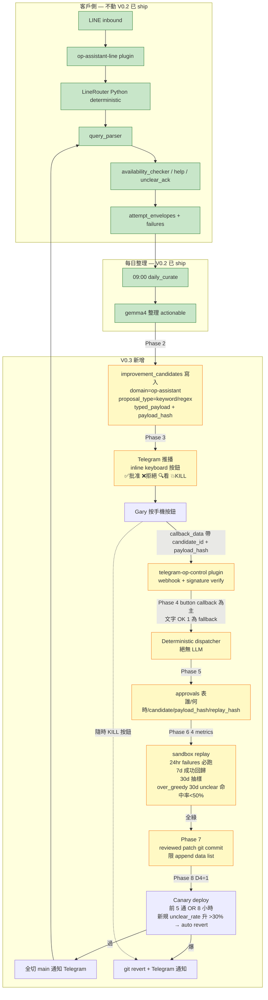

# OP Assistant V0.3 design — Telegram 雙向 + 學習迴圈生效

**狀態**:design canonical(2026-05-29 Gary 拍板自動度 + canary)
**前置**:[2026-05-28-learning-loop-design-v0.2.md](2026-05-28-learning-loop-design-v0.2.md)(V0.2 已 ship)
**諮詢**:codex gpt-5.5 high-effort review(`019e6f2d-25b9-7f52-aeac-3e058d3f6b88`)+ karpathy-guidelines 4 原則 + Gary 自動度討論(2026-05-29)
**Code is Rule 不能破**:routing / decision = deterministic Python;LLM 只能在「整理 / 建議」介入,絕不在「決策 / apply」做 orchestrator
**自動度拍板(2026-05-29)**:D1-D5 dial 全拉到 1(半自動有護欄)+ canary 5 通/8 小時/30% threshold + Telegram inline keyboard + KILL 按鈕 + 自動 metric 異常 revert + 限 append data list
**迭代設計**:Plan B karpathy-aligned per-phase ship loop;round-by-round log in [v0.3-iteration-log/](v0.3-iteration-log/)

---

> **V0.3 一句話 framing(codex Round 1 提案,2026-05-29):**
>
> **「V0.3 不是『AI 自動改規則』,是『AI 提案,人批准,系統可重播、可驗證、可回滾』。」**
>
> 任何 Phase 2-8 spec 違背這句話 → 重做。

---

## 1. 這個 doc 解什麼問題

V0.2 把閉環學習機制做了一半:bot 看不懂的客戶問題會被結構化記錄,gemma4 每天整理 + 推 Telegram 給 Gary 看建議。但 **Telegram 是單向推**,Gary 在路上點頭沒人接,bot 不會自己變聰明。

V0.3 把回程那條線接通 — 讓 Gary 在 Telegram 一句「OK 1」就能讓 bot 真的學會新關鍵字,**但每一步都不能違背 Code is Rule**。

## 2. 核心信念再確認(動工前要先念三遍)

1. **routing/decision 全部 deterministic**。Gary 訊息進系統 → 用 whitelist regex parse,不丟 LLM。
2. **LLM 只在「整理 / 建議」介入**。gemma4 可以提 keyword/regex/intent 建議,但**不能直接寫 source code**。
3. **kernel 是 audit truth,Telegram 是 transport**(codex Q6 catch)。Gary 在 Telegram 按 OK 不能當批准紀錄;真正紀錄要寫進 kernel:**誰、何時、批准哪個 candidate、看到的 payload hash、replay 結果 hash**。否則未來 bot 回錯,沒辦法回答「Gary 當時到底批准了什麼」。
4. **apply 前必須 sandbox replay 通過 + Gary explicit approve**。兩個條件缺一不可。

## 3. Scope 範圍

### 會做(Phase 1-7 共用骨架)

| Phase | 模塊 | 一句話 |
|---|---|---|
| 1 | Telegram inbound plugin | 新獨立 plugin `telegram-op-control`,setWebhook,verify signature,dedupe |
| 2 | improvement_candidates 寫入 | gemma4 daily actionable 自動建 candidate row(以前只存在 events.payload) |
| 3 | Telegram daily 推附短編號 + candidate_id | 訊息文末塞 `1=A1B2C3D4` 對照表 |
| 4 | Approve command grammar(deterministic) | `OK 1` / `APPROVE 1,3` / `REJECT 2` / `看 1` whitelist regex |
| 5 | Approval audit record | 寫 kernel `approvals` 表 + payload_hash + replay_result_hash |
| 6 | Sandbox replay engine | 24hr failures(必)+ 7d 成功(回歸)+ 30d 抽樣 corpus |
| 7 | Reviewed patch 產出 | 通過 replay 後產出 git diff / YAML row patch,**不寫進 main** |

### 不做(留 V0.4 以後)

- **query_parser.py refactor 成 rule-as-data**(codex Q2)
  - 理由:query_parser.py 已經 70% 是 module-level keyword tuple,refactor 其實便宜(1 天),但跟 V0.3 approve flow 綁一起 blast radius 太大。先把 approve chain 做實,refactor 留 V0.4。
- **多 channel 接管**(LINE OA 控制 / Slack / Email)
  - V0.3 只支援 Telegram + op-assistant,但**資料契約必須 multi-domain**(留接口不過早抽象)
- **LLM 解讀 Gary 自然語言**(永遠不會做,違反 Code is Rule)
  - 「ok 但第二招我不確定」直接拒絕,回 Gary 改成按 inline keyboard 按鈕或 `OK 1` 文字(codex Q3)
- **自動改 dispatch logic**(V0.3 自動 patch **只允許 append data list / regex list**,**永遠不准改** `parse_query` / `LineRouter` 等控制流。Gary 2026-05-29 拍板邊界)
- **D4=2 LLM 自己決定 merge**(永遠不做,違反 Code is Rule)

## 4. 架構圖



## 5. 工作模塊細節

### Phase 1: Telegram inbound plugin(獨立 plugin)

(**使用**:新 Hermes plugin `plugins/telegram-op-control/`;**關聯**:讀寫 `op_assistant_kernel.improvement_candidates` / `approvals`,**不碰 LINE router 主流程**;**用途**:收 Gary 在 Telegram 的指令)

**為什麼獨立 plugin 不合進 op-assistant-line**(codex Q1a):
- LINE bot = 客戶入口;Telegram = Gary 控制入口。責任邊界要分。
- 合併會讓「客戶問答」跟「老闆批准改規則」共用部署風險。客戶側壞了會影響老闆批准能力,反之亦然。

**做什麼**:
- Telegram Bot API `setWebhook` 指到 `https://wannavegtour.tail<...>.ts.net/telegram-op-control/webhook`
- 驗證 `X-Telegram-Bot-Api-Secret-Token` header(setWebhook 時設一個 32-char secret)
- dedupe by `update_id`(Telegram retry 同一條會帶同 id)
- chat_id whitelist:只接 `TELEGRAM_HOME_CHANNEL`(其他人不能批准)

**不做**:任何訊息解析。原始訊息丟給 Phase 4 command parser。

### Phase 2: gemma4 actionable → improvement_candidates 寫入

(**使用**:`op_assistant_kernel.improvement_candidates`;**關聯**:`scripts/op_assistant/op_assistant_daily_curate.py` 加寫入 + `closed_loop_kernel/postgres.py` schema migration;**用途**:把整理結果從「只存 events.payload」升級成「契約級 candidate row,可追、可批准、可測試、可套用」)

**Round 2 spec collapsed 2026-05-29**(`v0.3-iteration-log/round-02.md` 完整 trail)。下面是 final spec,改自 Round 1 粗描述:codex xhigh Round 2 review 我 7 條反提案我全收。

#### 2.1 schema 變動(改 `closed_loop_kernel/postgres.py`)

```sql
-- 既有 V0.2 schema 已有 status / target_artifact_id / patch_type /
-- validation_assertions / rollback_plan,本 phase 加 12 個 NULL-able 欄位:

ALTER TABLE improvement_candidates
  ADD COLUMN IF NOT EXISTS domain TEXT,                     -- 'op-assistant' (V0.3) / 'marketing-agent' (V0.4)
  ADD COLUMN IF NOT EXISTS source_event_id UUID,            -- events.daily_curation_summary.id (one per period_key)
  ADD COLUMN IF NOT EXISTS curation_run_id UUID,            -- daily_curate 每次跑 new uuid4 — Round 2 U2 dedupe key
  ADD COLUMN IF NOT EXISTS proposal_index INT,              -- 該 run 內 actionable list index
  ADD COLUMN IF NOT EXISTS proposal_type TEXT,              -- 'availability_keyword' / 'availability_regex'
  ADD COLUMN IF NOT EXISTS schema_version TEXT,             -- 'v0.3.0' — Round 2 U1 hash envelope 包進
  ADD COLUMN IF NOT EXISTS typed_payload JSONB,             -- structured slot data
  ADD COLUMN IF NOT EXISTS payload_hash TEXT,               -- Round 2 U1 sha256 over envelope
  ADD COLUMN IF NOT EXISTS generator_metadata JSONB,        -- Round 2 U37 — model / prompt_artifact_id / git_sha / corpus window
  ADD COLUMN IF NOT EXISTS candidate_sources JSONB
        NOT NULL DEFAULT '[]'::jsonb,                       -- Round 2 U39 — trace back to inbound events
  ADD COLUMN IF NOT EXISTS approval_channel TEXT,           -- 留接口 (V0.4 Slack/email)
  ADD COLUMN IF NOT EXISTS approved_by TEXT,
  ADD COLUMN IF NOT EXISTS replay_result_hash TEXT;         -- Phase 6 後 backfill

-- Round 2 U2 idempotency — 同 curation run 同 index 不能雙寫:
ALTER TABLE improvement_candidates
  ADD CONSTRAINT IF NOT EXISTS candidates_run_proposal_unique
    UNIQUE (curation_run_id, proposal_index);

-- Round 2 U34 狀態 enum (PG 端硬擋):
ALTER TABLE improvement_candidates
  ADD CONSTRAINT IF NOT EXISTS candidates_status_check
    CHECK (status IN ('created', 'pushed_to_telegram',
                       'approved', 'rejected',
                       'sandbox_pending', 'sandbox_verified', 'sandbox_failed',
                       'patch_emitted', 'patch_too_invasive',
                       'canary_running', 'applied', 'killed'));
```

**Karpathy 3 surgical**:既有 `target_artifact_id` / `patch_type` / `validation_assertions` / `rollback_plan` 欄位保留不動;`status` 加 CHECK 但既有值('draft' 等)需 migration 對應(計畫:既有 row alter 成 'created')。15+ V0.2 consumers 全部讀既有欄位 → 不受影響。

#### 2.2 candidate lifecycle 狀態機(Round 2 U34)

```
created → pushed_to_telegram → approved | rejected
                                    ↓ (approved)
                              sandbox_pending → sandbox_verified | sandbox_failed
                                                       ↓ (sandbox_verified)
                                                 patch_emitted | patch_too_invasive
                                                       ↓ (patch_emitted)
                                                 canary_running → applied | killed
```

每次 status update 必同 transaction 寫 `events.candidate_status_changed`:`{candidate_id, from_status, to_status, by_phase, by_actor}` — append-only,可重建時間線。

Python module-level `CandidateStatus(StrEnum)` + `_VALID_TRANSITIONS: dict[CandidateStatus, set[CandidateStatus]]` 拒絕非法 jump;PG CHECK 是第二道防線。

#### 2.3 payload_hash 演算法(Round 2 U1)

```python
def compute_payload_hash(proposal_type: str, typed_payload: dict,
                          schema_version: str = "v0.3.0") -> str:
    envelope = {
        "proposal_type": proposal_type,
        "schema_version": schema_version,
        "typed_payload": typed_payload,
    }
    canon = json.dumps(envelope, sort_keys=True,
                       ensure_ascii=False, separators=(',', ':'))
    return hashlib.sha256(canon.encode("utf-8")).hexdigest()
```

callback_data 用前 8 字。整個 approval/replay/audit chain 都以此為錨點。

#### 2.4 typed_payload validator(Round 2 U3)

```python
class TypedPayloadError(ValueError): ...

_FORBIDDEN_KW_METACHARS = set(".^$*+?{}[]\\|()")
_MAX_KEYWORD_LEN = 50
_MAX_REGEX_LEN = 200
_FORBIDDEN_REGEX_PATTERNS = [
    r"(?:.+){2,}",         # nested quantifier (catastrophic backtracking)
    r"\(\?\:[^)]*\)\+",    # (?:...) +
]

def validate_typed_payload(proposal_type: str, payload: dict) -> None:
    if proposal_type == "availability_keyword":
        kw = payload.get("keyword")
        if not isinstance(kw, str):
            raise TypedPayloadError("keyword must be str")
        if not (1 <= len(kw) <= _MAX_KEYWORD_LEN):
            raise TypedPayloadError(f"keyword len must be 1-{_MAX_KEYWORD_LEN}")
        if _FORBIDDEN_KW_METACHARS & set(kw):
            raise TypedPayloadError("keyword contains regex metachars")
    elif proposal_type == "availability_regex":
        pat = payload.get("pattern")
        if not isinstance(pat, str):
            raise TypedPayloadError("pattern must be str")
        if not (1 <= len(pat) <= _MAX_REGEX_LEN):
            raise TypedPayloadError(f"pattern len must be 1-{_MAX_REGEX_LEN}")
        for forbidden in _FORBIDDEN_REGEX_PATTERNS:
            if re.search(forbidden, pat):
                raise TypedPayloadError(f"pattern matches forbidden form: {forbidden}")
        try:
            re.compile(pat)
        except re.error as exc:
            raise TypedPayloadError(f"pattern not compilable: {exc}") from None
    else:
        raise TypedPayloadError(f"unsupported proposal_type: {proposal_type}")
```

**重點**:用 `raise TypedPayloadError`,不用 `assert`(`python -O` 會關 assert);regex 還禁 nested quantifier 防 catastrophic backtracking。V0.4 評估 RE2 取代 `re`。

#### 2.5 generator_metadata 結構(Round 2 U37)

```python
generator_metadata = {
    "generator_name": "op_assistant_daily_curate",
    "generator_code_version": "<git rev-parse HEAD on daily_curate.py>",
    "model": "gemma4:e4b",
    "model_params": {"temperature": 0.2, "response_format": "json_object"},
    "prompt_artifact_id": "<events.id of daily_curate_prompt_archive>",
    "prompt_version": "v0.3.1",
    "prompt_hash": "<sha256 of full prompt text>",
    "schema_version": "v0.3.0",
    "corpus_window_start_at": "ISO8601",
    "corpus_window_end_at": "ISO8601",
    "corpus_inbound_count": 0,
    "corpus_failure_count": 0,
}
```

完整 prompt 全文以 `events.daily_curate_prompt_archive` event 落地(uuid5 idempotent by `prompt_hash`);candidate 引用 `prompt_artifact_id`,Phase 6 replay 真正能找回當時 prompt。

#### 2.6 candidate_sources 結構(Round 2 U39)

```python
# JSONB array, each entry:
{
    "source_type": "failure",            # | "inbound_event" | "manual"
    "source_id": "<failures.id or events.id>",
    "inbound_event_id": "<events.op_assistant_line_inbound.id>",
    "match_reason": "curated_failure",   # | "substring_match" | "manual_pin"
    "confidence": 1.0,                   # curated=1.0, heuristic<1.0
}
```

**優先順序**:curated_failure(failures 表的 attempt_id → attempt_envelopes → events.inbound 鏈)> substring_match(fallback) > manual_pin。 **Round 3 必 spike** failures→inbound 鏈穩定性(R18)。

#### 2.7 proposal_type 嚴格 enum

V0.3 只開兩種:
- `availability_keyword` — append 進 `_AVAILABILITY_KEYWORDS`
- `availability_regex` — append 進 `_DATE_PATTERNS` 或自訂 list

**V0.3 不開放** `new_intent`(連動 worker,複雜度跳一級)。gemma4 給 `intent` 類 actionable → Phase 2 寫 `events.improvement_candidate_rejected`(payload 完整保留 raw actionable + rejection_reason='intent_not_supported_v0.3')→ V0.4 開放後可回頭批次處理。

### Phase 3: Telegram daily 推 inline keyboard 按鈕

(**使用**:`scripts/op_assistant/op_assistant_daily_curate.py` `_render_telegram_text` + `_render_inline_keyboard`;**關聯**:Phase 2 寫的 candidate row,callback_data 帶 `candidate_id + payload_hash`;**用途**:讓 Gary 在路上**按按鈕**,不用打字)

文案 + 按鈕(範例):

```
📋 阿玩 OP 助手日報 5/29

今天客人發 5 句話進來,bot 處理 3 通。

❓ 有 1 通 bot 沒聽懂:
「小弟 你能找到有哪些團沒有賣完的嗎」

💡 我建議讓 bot 學 2 招:
1. 關鍵字「沒有賣完」— 重複出現,該識別剩餘團體
2. 句型「有哪些團.*?沒有賣完」— 整句固定查詢

[✅ 批准 1]  [❌ 拒絕 1]  [🔍 看 1 sandbox]
[✅ 批准 2]  [❌ 拒絕 2]  [🔍 看 2 sandbox]
[💥 全部 KILL(緊急 rollback)]

(候選編號 1=A1B2C3D4 2=E5F6G7H8 — 文字 fallback 用)
```

**callback_data 結構**(Telegram 限 64 bytes):
- `apv:<short_id>:<payload_hash_prefix>` — 批准
- `rej:<short_id>` — 拒絕
- `vw:<short_id>` — 看 sandbox
- `kill:<yyyymmdd>` — KILL 該日所有 auto-applied

**為什麼必須 inline keyboard 不只文字**:
- callback_data 自帶 `payload_hash_prefix` → R6 自動緩解(payload 被下輪改寫時 hash 對不上,refuse)
- Gary 路上不用打字
- 但**保留文字 fallback**(`OK 1` / `REJECT 2`),萬一 Telegram client 不支援按鈕還是能批

(codex Q1b 升級版:短編號 + payload_hash 一起 carry)

### Phase 4: Deterministic dispatcher(button callback 為主,文字 fallback)

(**使用**:`plugins/telegram-op-control/dispatcher.py`;**關聯**:Phase 1 webhook 拿到 update;**用途**:把「Gary 按了哪個按鈕 / 打了什麼字」變 deterministic 結構)

**Primary path — button callback**(99% case):
```python
# update.callback_query.data 格式由 Phase 3 決定
PREFIX_HANDLERS = {
    "apv": _handle_approve,   # apv:<short_id>:<payload_hash_prefix>
    "rej": _handle_reject,    # rej:<short_id>
    "vw":  _handle_view,      # vw:<short_id>
    "kill": _handle_kill,     # kill:<yyyymmdd>
}
# callback_data 解析失敗 → 不處理,寫 events.telegram_callback_malformed
```

**Fallback path — text command**(client 不支援按鈕,或 Gary 手動打字):
```python
APPROVE_RE = re.compile(r"^(OK|APPROVE|好|批准)\s+([\d,\s]+)$", re.IGNORECASE)
REJECT_RE  = re.compile(r"^(REJECT|NO|拒|不要)\s+([\d,\s]+)$", re.IGNORECASE)
VIEW_RE    = re.compile(r"^(看|VIEW|SHOW)\s+(\d+)$", re.IGNORECASE)
KILL_RE    = re.compile(r"^(KILL|緊急|RB|rollback)$", re.IGNORECASE)
HELP_RE    = re.compile(r"^(HELP|\?|？|幫助)$", re.IGNORECASE)
```

**模糊訊息處理**(codex Q3,我同意):
- 不匹配 → 回 Telegram:「沒看懂,請按按鈕或回 `OK 1` / `REJECT 2`,`HELP` 看完整指令」
- **絕不部分猜測**。「不確定」不是 approval。

**Code is Rule 踩線檢查**:這 Phase **絕無 LLM**。
- 即使 Gary 打錯字「Ok 1.」(尾巴多個句點)也要 strict 拒絕(避免一旦開「智能修正」就漂向 LLM orchestrator)
- 文字 fallback 走「老闆批准全 candidate (full payload_hash 對齊)」這條路,**不繞過 payload_hash check**(R6 緩解一致)

**Phase 4 transactional claim**(codex xhigh review #5,補進 Phase 4 spec):
- Phase 4 dispatcher 在「讀 inbound、寫 approval、更新 candidate」這條鏈上不能是三個獨立 INSERT — dispatcher 重啟可能會重複處理同一 callback
- 解:`approvals` 表加 `source_event_id UUID UNIQUE`(指 events.id of telegram_inbound row),靠 PG unique constraint 保證冪等
- dispatcher pipeline:讀 events.telegram_inbound → 同 transaction 內 INSERT approvals + UPDATE candidate.status → unique 衝突就 noop(已被先前 dispatch 處理過)
- 這同時收尾 V0.3 R10/R11:dedupe 從 in-memory 移到 DB unique constraint

### Phase 5: Approval audit record(kernel = truth)

(**使用**:既有 `approvals` 表 + 新欄位;**關聯**:Phase 4 解析結果寫入;**用途**:**這是 codex Q6 catch — Telegram 訊息不能當批准紀錄**)

```sql
ALTER TABLE approvals ADD COLUMN IF NOT EXISTS approval_channel TEXT;       -- 'telegram' / 'web' / 'cli'
ALTER TABLE approvals ADD COLUMN IF NOT EXISTS channel_message_id TEXT;     -- Telegram update_id
ALTER TABLE approvals ADD COLUMN IF NOT EXISTS candidate_payload_hash TEXT; -- 批准當下看到的 typed_payload hash
ALTER TABLE approvals ADD COLUMN IF NOT EXISTS replay_result_hash TEXT;     -- replay 結果 hash (NULL 在 Phase 5,Phase 6 後 backfill)
```

**為什麼**:未來 bot 回錯,要能回答「Gary 當時批准的是什麼版本的 candidate?Telegram 訊息看到的 payload 跟 apply 進去的 payload 是不是同一份?」這要靠 hash 鏈。Telegram 自己的 message log 不算數(可能被刪、可能被改、可能對方 server 出包)。

### Phase 6: Sandbox replay engine

(**使用**:既有 `replays` 表;**關聯**:Phase 5 approve 後觸發;**用途**:在 patch 真上 prod 前驗證不會打壞既有行為)

**Corpus**(codex Q5):
- **必跑**:最近 24hr `failures` rows(原本沒被命中,看新規則有沒有命中)
- **回歸**:最近 7d 成功 parsed(`attempt_envelopes.machine_record.parser_intent != 'unclear'`)
- **抽樣**:30d 高頻 inbound query(去重後 top 100)

**Validation metric**(4 條,codex Q5 + Gary 拍板加 over-greedy):
- `regression_count` = 舊成功 case 被新規則打壞數 → **必須 = 0**
- `improvement_count` = 原 failure 被新規則命中數 → **必須 ≥ 1**
- `ambiguity_count` = 同一句命中多個 intent → **必須 = 0**
- `over_greedy_rate` = 新規則在過去 30d **unclear** corpus 的命中率 → **必須 < 50%**(防新 keyword 太貪,把不相關 unclear 也吸走 → R5 緩解之一)

任何一條沒過,candidate.status = `replay_failed`,Telegram 推回:「第 N 招 sandbox 沒過,原因:〈具體 metric〉」。Gary 收到 → 不能 apply。

### Phase 7: Reviewed patch 產出(不寫 main)

(**使用**:工作目錄 `~/.hermes/run/op-assistant/patches/<candidate_id>.diff` 或同 dir 的 `_rules.yaml.proposed`;**關聯**:Phase 6 sandbox 通過後產出;**用途**:給人或下一階段(Phase 8 自動 merge)使用)

**產出格式**(由 proposal_type 決定):
- `availability_keyword`:純 Python source diff,patch 是 `_AVAILABILITY_KEYWORDS = (... 既有, "新詞")`
- `availability_regex`:同上,加進 `_DATE_PATTERNS` 或新 list

**rollback 路徑**(codex Q5):**git branch + git revert**。`artifacts` 表的 version 機制**不夠當 source code rollback truth** — source code rollback 的 source of truth 是 git。

**Phase 7 結束 = Gary 拿到一個 PR 連結(or local diff path)**。bot 還沒變,要 Gary 進到 Phase 8 才生效。

## 6. Phase 8:Canary auto-merge with KILL switch(2026-05-29 拍板)

V0.3 沒有「manual vs 自動」二選一。拍板做「**自動成分加重 + 5 個 dial 全拉到 1**」,但**自動寫 source code 的邊界鎖死成「append data list only」**。

### Dial framework(Gary 拍板:D1-D5 全 = 1)

| Dial | 0:手動 | **1:半自動有護欄(V0.3)** | 2:全自動 |
|---|---|---|---|
| D1 候選建立 | 人工 SQL insert | gemma4 高信心自動建 candidate row;中/低信心進 review queue | gemma4 出啥都建 |
| D2 Sandbox 跑 | 人工 cron | approve 後自動跑三 corpus + 4 metric | 候選一建就跑 |
| D3 Patch 產出 | 人工寫 diff | sandbox 通過 → 系統產 git commit(append data list only) | 同 1 |
| D4 Merge | 回電腦 git merge | **Telegram 按鈕 → canary deploy → 通過自動全切** | LLM 自己決定 ❌ 違規 |
| D5 Rollback | 人工 git revert | **Telegram KILL 按鈕 + 自動 metric 異常自動 revert** | 全 metric 自動 |

D4=2 永遠禁區(LLM 不能做決策)。其他 dial 拉到 1 都不踩 Code is Rule。

### Phase 8 三個關鍵概念

#### 概念 1:Telegram inline keyboard(已在 Phase 3 描述)
你按按鈕,callback_data 自帶 candidate_id + payload_hash。R6 緩解 + 路上不用打字。

#### 概念 2:Canary deploy(5 通 OR 8 小時)

(**使用**:patch merge 進 main 後,LineRouter 加 hash-bucket canary mode;**關聯**:`LineRouter._is_canary_user(user_hash, candidate_id)` 用 candidate_id 為 seed 做 stable hash 分桶;**用途**:你不在電腦前的時候,系統自己看新規則有沒有爆,**這是 R4 物理限制的最強緩解**)

**Canary 規格(Gary 2026-05-29 拍板「適中」)**:
- 觸發樣本:**前 5 通 inbound 走新規則**,其他走舊
- 超時保護:**8 小時內若沒湊到 5 通,即視作 canary 結束**(看當下指標,沒爆就全切)
- 判斷條件:**canary 5 通(或 timeout 樣本)的 `unclear_rate` 不能比同時段歷史平均高 30%**
- 同時段歷史 = 過去 7 天同一個小時段(09:00 排程,就比過去 7 天 09:00-17:00 的平均 unclear_rate)

**Canary 流程**:
```
Phase 7 patch 進 main(git commit author = gemma4 co-author Gary)
        ↓
canary_state 表寫 row:{candidate_id, started_at, sample_target=5, timeout_at=+8h}
        ↓
LineRouter import 時讀 active canary,新 inbound 看 user_hash bucket 決定走新走舊
        ↓
每通 canary inbound 落 events.canary_sample,標 outcome(parsed/unclear)
        ↓
收滿 5 通 OR timeout → 觸發 canary_judge cron(也可 inbound 自己觸發)
        ↓
  ✅ unclear_rate 沒超 30% threshold → 推 Telegram「✅ canary 過,全切」 + canary_state.status='passed'
  ❌ 超過 → 自動 git revert HEAD + 推 Telegram「💥 已 rollback,新規 unclear_rate XX% > 歷史 YY%」 + canary_state.status='reverted'
```

**Code is Rule 踩線檢查**:
- judge 邏輯 100% 寫在 Python source(`scripts/op_assistant/op_assistant_canary_judge.py`),**LLM 不參與判斷**
- threshold 30% 是 config 常數,不是 LLM 出題
- 自動 revert 用 `git revert <commit_sha>`,不是「LLM 重寫 patch」

#### 概念 3:Telegram KILL 按鈕(emergency rollback)

(**使用**:Phase 3 每則 Telegram 訊息底部都帶 `[💥 全部 KILL]` 按鈕;**關聯**:callback_data=`kill:<yyyymmdd>` 觸發 git revert 該日所有 auto-applied commits;**用途**:你在路上發現 bot 怪了,1 鍵全 revert,不用打 git command)

**Kill 範圍**:
- 預設:當日所有 `auto-applied` tag 的 commits(按時間倒序 revert)
- 進階指令:Telegram 文字 fallback `KILL 1A2B3C4D`(只 revert 那個 candidate)— V0.3 留接口,UI 不暴露

### Append data list only(自動 patch 邊界,Gary 2026-05-29 拍板)

(**使用**:Phase 7 patch 產出器只允許「在 module-level tuple/list/dict 末尾 append」這類 surgical 改動;**關聯**:`scripts/op_assistant/op_assistant_patch_emitter.py` AST-level 驗證;**用途**:把自動寫 source code 的 blast radius 鎖到最小)

**允許的自動 patch 形式**:
```python
# Before
_AVAILABILITY_KEYWORDS = ("還有", "還剩", ..., "那團", "這團")

# After (allowed)
_AVAILABILITY_KEYWORDS = ("還有", "還剩", ..., "那團", "這團", "沒有賣完")
```

**禁止的自動 patch 形式**:
- 改 `parse_query` 函式 body
- 改 `LineRouter` dispatch logic
- 改 enum 定義(`QueryIntent`)
- 加新 import / 新函式
- 改任何 control flow(if / for / while)

**檢驗方式**:Phase 7 patch_emitter 用 Python `ast.parse(old)` vs `ast.parse(new)`,只比 module-level tuple/list/dict literal 的 elements 增量,其他 node hash 必須一致。差任何一行 → patch reject → status='patch_too_invasive'。

### 為什麼這設計不違反 Code is Rule(自我檢查)

| 自動環節 | 決策者是誰? |
|---|---|
| candidate 建立 | gemma4 出 typed payload → Python deterministic 寫進 candidate row |
| sandbox 跑不跑 | Python(approve 後自動觸發) |
| metric 判斷 pass/fail | Python(4 個常數 threshold) |
| patch 合不合法 | Python AST diff(禁止 control flow 改動) |
| canary 通不通過 | Python(unclear_rate 比歷史) |
| KILL 觸不觸發 | Python(callback_data parse → git revert) |

LLM 只負責「**整理 / 建議**」(gemma4 提 typed payload),從來不在決策路徑上。Code is Rule 不破。

## 7. 未來擴充性(codex Q4)

`marketing-agent` 將來做「上架行程到 WC 官網」需要同樣 approve flow:

```
marketing-agent gemma4 → improvement_candidates row (domain='marketing-agent')
                       ↓
              Telegram 推播(共用 telegram-op-control plugin)
                       ↓
              Gary 看 "OK 1" 批准
                       ↓
              approve dispatch by candidate.domain
                       ├─ domain='op-assistant' → 走 V0.3 Phase 6-7 (query_parser patch)
                       └─ domain='marketing-agent' → 走 marketing-agent apply handler
```

**V0.3 hardcode op-assistant handler 一個,但資料契約必須 multi-domain**(codex Q4)。這是「留接口」不是「過早抽象」:
- improvement_candidates.domain 欄位 V0.3 就要建
- approval dispatch 邏輯 V0.3 是 `if domain == 'op-assistant'`,V0.4 marketing-agent 進來加 `elif`
- Telegram approve grammar 對 domain 透明(`OK 1` 不管 candidate 屬於哪個 domain)

## 8. 資料契約變動匯總

```sql
-- improvement_candidates 加 8 欄(Phase 2)
ALTER TABLE improvement_candidates ADD COLUMN IF NOT EXISTS domain TEXT;
ALTER TABLE improvement_candidates ADD COLUMN IF NOT EXISTS source_event_id UUID;
ALTER TABLE improvement_candidates ADD COLUMN IF NOT EXISTS proposal_type TEXT;
ALTER TABLE improvement_candidates ADD COLUMN IF NOT EXISTS typed_payload JSONB;
ALTER TABLE improvement_candidates ADD COLUMN IF NOT EXISTS approval_channel TEXT;
ALTER TABLE improvement_candidates ADD COLUMN IF NOT EXISTS approved_by TEXT;
ALTER TABLE improvement_candidates ADD COLUMN IF NOT EXISTS payload_hash TEXT;
ALTER TABLE improvement_candidates ADD COLUMN IF NOT EXISTS replay_result_hash TEXT;

-- approvals 加 4 欄(Phase 5)
ALTER TABLE approvals ADD COLUMN IF NOT EXISTS approval_channel TEXT;
ALTER TABLE approvals ADD COLUMN IF NOT EXISTS channel_message_id TEXT;
ALTER TABLE approvals ADD COLUMN IF NOT EXISTS candidate_payload_hash TEXT;
ALTER TABLE approvals ADD COLUMN IF NOT EXISTS replay_result_hash TEXT;
```

**Karpathy 3 surgical**:全 NULL-able,既有 consumers 不受影響。

**append-only**?
- `improvement_candidates`:**不在** append-only list(`closed_loop_kernel/postgres.py` `APPEND_ONLY_TABLES`),status 欄位需要 update — 維持現狀。
- `approvals`:**在** append-only list — 不能 UPDATE,只能 INSERT。每次 approve 寫新 row(連 reject、re-approve 都新 row,history 自然展開)。

## 9. 風險登錄

| # | Risk | 緩解 |
|---|---|---|
| R1 | **Telegram message ≠ approval record**(codex Q6 ⭐) | Phase 5 寫 `approvals.candidate_payload_hash` + `replay_result_hash`,kernel 是 truth |
| R2 | Gary 在 Telegram 點 OK 後,候選 row 的 typed_payload 被 gemma4 跑下一輪 daily 改寫,導致 apply 進去的 patch 跟 Gary 看到的不同 | Phase 5 比對 `approval.candidate_payload_hash == candidate.payload_hash`,不一致 → reject + 推 Telegram「候選已過期,請重新看新版」 |
| R3 | Telegram webhook 被釣魚(假 Telegram server 推假 update) | Phase 1 verify `X-Telegram-Bot-Api-Secret-Token`,chat_id whitelist |
| R4 | Phase 6 sandbox replay 的 corpus 取樣偏差,某類問題沒被測到 | 三層 corpus(24hr failures / 7d 成功 / 30d 抽樣)+ 後續加自動 corpus 擴充 |
| R5 | 自動 merge 後 bot 立刻爆,Gary 在路上沒救援(物理限制) | **Canary 5 通/8hr/30% threshold + 自動 metric revert + Telegram KILL 按鈕**(§6 概念 2/3) |
| R6 | gemma4 提的 `proposal_type=new_intent` V0.3 直接 reject,但建議本身有價值卻丟失 | Phase 2 reject 時寫 `events.improvement_candidate_rejected`(payload 完整保留),V0.4 開放後可回頭批次處理 |
| R7 | 新 keyword 太貪 — sandbox 三 metric 沒抓到「把過多無關 unclear 一網打盡」這種 over-greedy 行為 | Phase 6 加第 4 metric `over_greedy_rate`,新規則在 30d unclear corpus 命中率 ≥ 50% 直接 replay_failed |
| R8 | wannavegtour 流量低,canary 百分比 spec 沒樣本 → 永遠湊不齊判斷 | Canary 改成**絕對通數 + 超時保護**(5 通 OR 8hr 先到先算);流量再低也有 ground 收結論 |
| R9 | gemma4 自己提的 actionable 本身就爛(LLM hallucination) | (V0.3 部分緩解)gemma4 prompt 帶 confidence score,只 high 進 candidate;V0.4 評估 double-LLM(claude haiku 二意見)|
| R10 | Webhook DB 寫入失敗導致 Telegram retry 處理不一致(dedupe bit 已 mark 但 events row 沒寫) | Phase 1 接受;Phase 4 改用 PostgreSQL unique constraint on `update_id` 取代 in-memory dedupe,寫入+mark 變 atomic |
| R11 | In-memory dedupe 無法跨 process restart / 多 worker process | Phase 1 接受(Telegram retry window 數分鐘,restart 罕見);Phase 4 同 R10 改 DB |
| R12 | Webhook secret 只證明「知道 secret」,public URL 暴露後 attacker spam 401 會產生 audit noise | V0.3 不修;部署層 Cloudflare / tailscale ACL + 後續 Phase 加 rate limit。記為 ops risk |
| R13 | `raw_update` 含 Telegram user profile(name / username),retention 邊界沒定 | events 表 30 天 retention 已涵蓋(Phase 4 Gary Q5);但若 events 表延長 retention,要回頭加 redaction。Phase 4 dispatcher 寫 approvals 時要 redact user fields(只留 user_id_suffix) |
| R14 | DB liveness / reconnect — KernelStore single connection;PG restart 後全服務 500 | Phase 1 standalone test 跑得起,但部署前必補;最簡單:catch psycopg.OperationalError 自動重建 connection + `/health` 拆 live/readiness(readiness 真碰 DB) |
| R15 | LLM-import fence 目前只靠社交守則(README 註明、code review)。沒 technical guard | V0.3.5 加 pre-commit / pytest AST 規則,禁 `import (openai|anthropic|ollama)` 進 `plugins/telegram-op-control/`;Phase 7 patch_emitter 同樣禁 LLM import 進入 auto-patched data files |
| R16 | Stale button replay — 舊 callback button 沒過期就一直能按,Phase 4 可能接受過期決策 | callback_data 已含 `payload_hash_prefix`(候選 payload 變了就對不上);Phase 4 dispatcher 額外查 `candidate.status in {'sandbox_verified'}` 才接受;成功處理後 edit_message 移除 keyboard |
| R17 | **Reviewer separation rule**(Round 1 codex U35)— 同一個 AI 不能 propose + review + apply 同條改善,違反 human quality gate | 設計層強制:gemma4 只 propose;Gary explicit approve(deterministic dispatcher 不能代);sandbox replay 純 Python(無 LLM);AST guard 純 Python。Phase 6/7/8 任何 LLM 介入 = 違反 → V0.3.5 加 pre-commit AST 掃 LLM import |
| R18 | **failures → inbound event 鏈穩定性**(Round 2 codex assumption #2)— U39 candidate_sources 取「curated_failure」優先,但 failures 表的 attempt_id → attempt_envelopes → events.inbound 鏈我們沒實證 | **Round 3 必 spike**:讀 `closed_loop_kernel/postgres.py` failures schema,抽 5 個 production failures row 跟 inbound 對照,確認 chain 可 reconstruct;不穩 → 加 `failures.inbound_event_id` direct FK 列 |

## 10. 施工順序 + success criteria

| Phase | 工作 | success criteria(Karpathy 4 goal-driven) |
|---|---|---|
| 1 | Telegram inbound plugin | curl 模擬 Telegram update 進來,plugin 落 events.telegram_inbound + dedupe 同 update_id 不重複 |
| 2 | gemma4 → candidate row | daily_curate 跑完 events.daily_curation_summary + improvement_candidates 同步出 N 條(N=actionable 數)+ `proposal_type` 嚴格 enum 通過 + payload_hash 算對 |
| 3 | Telegram 推附短編號 | Telegram 收到的訊息含 `1=A1B2C3D4` 對照表,人類肉眼能解 |
| 4 | Approve command parser | unit test:`OK 1` / `APPROVE 1,3` / `REJECT 2` / `看 1` / 模糊訊息 各一條 case |
| 5 | Approval audit | Gary 回 `OK 1` 後,approvals 表新 row 含 candidate_payload_hash;後續 candidate update payload 不影響歷史 approval row |
| 6 | Sandbox replay 4 metric | 三 corpus 各跑通,4 個 validation_results 都記錄;任一沒過 → status='replay_failed' Telegram 推回 |
| 7 | Reviewed patch + AST guard | patch_emitter 用 ast.parse diff 檢查;改動 control flow → reject;能跑 `git apply` 還原 |
| 8a | Canary deploy | `LineRouter._is_canary_user` bucket 對;前 5 通走新規則 OR 8hr timeout;events.canary_sample 落 |
| 8b | Canary judge + auto revert | unclear_rate 比 7d 同時段歷史升 >30% → `git revert` HEAD + Telegram 通知 |
| 8c | KILL 按鈕 | callback_data=`kill:<date>` → revert 該日 auto-applied commits |

**整體 V0.3 ship 標準**:
- 從 Gary 在 Telegram 按 [✅ 批准 1] 到 Phase 7 commit 上 main、Phase 8 canary 通過全切,**端對端跑通一次真實 case**(用 5/28 那條「沒有賣完」當測試 input)
- 上面 Risk R1-R9 都有 unit test 或 integration test 覆蓋
- 「append data list only」AST guard 有反例 test:嘗試改 dispatch logic 的 patch 必被 reject
- doc 同步 `docs/plans/INDEX.md`

## 11. 諮詢痕跡(transparency)

- codex review session: `019e6f2d-25b9-7f52-aeac-3e058d3f6b88`(gpt-5.5 high effort)
- codex review prompt: 留存於 `.claude/jobs/1d06a75b/v0.3_review_prompt.md`(disposable job dir)
- codex review output: 留存於 `.claude/jobs/1d06a75b/v0.3_review_output.md`
- karpathy-guidelines 套用紀錄:
  - 原則 1(Think Before Coding):scope 分「會做 / 不做 / 待拍板」,假設都展開
  - 原則 2(Simplicity First):不做 query_parser refactor,不做多 channel,不做 LLM 自然語言理解
  - 原則 3(Surgical Changes):既有 plugin 不動,既有 schema 只加欄位
  - 原則 4(Goal-Driven Execution):每 phase success criteria
- 與 codex 不同:
  - codex 推 manual merge(Plan A);**Gary 2026-05-29 對話後改 dial framework D1-D5=1**,自動成分加重但有護欄
  - codex 沒提到 `improvement_candidate_rejected` event 保留 V0.3 reject 的 actionable(我加進去,V0.4 開放後不丟失)
  - codex 沒提到 R2(候選 payload 被 gemma4 下一輪改寫),我加入
  - codex 沒提到 R7 over-greedy / R8 流量過低 canary 失效 / R9 LLM 自身錯誤,Gary 對話後加入

### 2026-05-29 接續設計 iteration loop(Round 1 + 2)

Gary 2026-05-29 mandate「思考拉滿 + codex xhigh + 100 輪 iteration + 必要技能全開 + 範圍含 AI Native Company」。karpathy lens 後改 Plan B(per-phase ship loop)。Round-by-round artifact 在 [v0.3-iteration-log/](v0.3-iteration-log/)。

**Round 1**(`round-01.md`):
- Claude enumerate 33 條 architectural unknowns + codex xhigh 加 8 條 → 41 total
- 15 p0 / 22 p1 / 3 p2 / 1 defer
- codex 神 catch:U34 lifecycle / U35 reviewer separation(R17)/ U37 prompt-version pinning / U39 observation→candidate trace
- 一句話 framing(已寫入本 doc 開頭):「V0.3 不是『AI 自動改規則』,是『AI 提案,人批准,系統可重播、可驗證、可回滾』」
- codex demote U30 marketing handler / U31 V0.4 path / U23 author tag / U8 layout(scope creep)

**Round 2**(`round-02.md`):
- 8 條 p0 spec proposal vs codex xhigh
- Claude 1 ✓ + 7 ✗(全反提案)→ **全 7 個反提案採納**
  - U1 hash envelope 包 proposal_type + schema_version
  - U2 `curation_run_id` 為 dedupe key,不用 LLM 排序 index
  - U3 `raise TypedPayloadError` 不 `assert`(防 `-O`)+ regex 禁 nested quantifier
  - U37 metadata 加 generator_name / prompt_artifact_id / git_sha / model_params
  - U39 `candidate_sources` JSONB array of typed object,優先 curated failures inbound link
  - U10 `TELEGRAM_ALLOWED_ACTORS` production 必填,dev 用 explicit escape hatch
  - U11 三層防護:source_event_id UNIQUE + candidate UNIQUE final + guarded UPDATE
- Phase 2 spec collapsed,Round 3 預備:Phase 2 brief 寫 + R18 spike + U35 enforcement spec

### 2026-05-29 codex xhigh deeper Phase 1 review

第二輪同份 code,改 xhigh effort(`-c model_reasoning_effort=xhigh`),要求不重複上輪 4 個 finding。xhigh 找 9 個 deeper issue(session 留 `.claude/jobs/1d06a75b/phase1_xhigh_review_output.md`):

- **必修(commit `60016e1`)**:#1 dedupe-before-durable-write 真實資料遺失 → 兩階段 pending/committed;#2 nested payload 型別不防(`message:"x"` → 500)→ `_safe_dict` 每層守;#4 Phase 4 KILL 需要 actor user_id 而不只 chat_id → Phase 1 預存 `actor_user_id`;#7 setwebhook 加 `--delete` / `--verify-only` 給 secret rotate 用。新增 16 個 test。
- **doc 補(本 commit)**:#5 Phase 4 transactional claim(`source_event_id UNIQUE`);#6 R14 DB liveness/reconnect;#8 R15 LLM-import AST guard fence;#9 R16 stale button replay 對應緩解。
- **skip**:#3 oversized body test 鎖死 status code(test quality 議題,功能 OK,aiohttp framework 自擋 413)。

### 2026-05-29 codex Phase 1 post-hoc review

- Codex CLI execution 被 DGX bubblewrap sandbox 擋住(`kernel.unprivileged_userns_clone=0`);Claude 直接寫 Phase 1。Codex 改做 **LLM-only post-hoc review**(session 含於 `.claude/jobs/1d06a75b/`)。
- Codex 找到 4 個實質 bug,全在同一個 patch commit 修掉(`4ae81e2`):token-leak via traceback、sync DB write 卡 event loop、dedupe 在 allowlist 之前讓未授權 retry 無 audit、X-Forwarded-For 可偽造。
- Codex D 點 4 條風險(webhook persistence、in-memory dedupe restart、rate limit、PII retention)併入本 doc §9 R10-R13。
- Codex skip 點:`raw_update` 預提冗餘欄位(YAGNI 過早 optimize);`TELEGRAM_ALLOWED_CHATS` 從 optional 提到 required(description 已寫 fail-closed,語意清楚)。

### 2026-05-29 dial framework 拍板對話紀錄

- Gary 直覺:codex 推的 manual merge 太保守,**自動成分要加重但會危險**,要重新評估討論
- 我重新評估:7 風險拆解 → 其中 5 條工程可解,2 條(R4/R5)部分緩解
- 提 5 個獨立 dial 而非 manual vs 自動二選一
- Gary 拍板:D1-D5 全 = 1;append data list only 接受;canary 細節要白話
- canary spec reality check:百分比 spec(5%/1hr)在 wannavegtour 流量太低不適用 → 改絕對通數(5 通/8hr/30% threshold)
- Gary 拍板:canary 適中檔(5 通 / 8 小時)

---

## 附錄 A — 對齊既有契約

- `docs/company-data-contract-v0.md` §6 attempt envelope:V0.3 不動
- 同上 §9 failure_type:V0.3 不動
- `docs/contracts/op_assistant_event_mapping_v0.md`:V0.3 不動

## 附錄 B — 與 marketing-agent 邊界

memory `project_marketing_agent.md`:行銷 + 行程上架 LINE bot。**V0.3 不碰 marketing-agent code**,只在 `improvement_candidates.domain` 欄位留接口。marketing-agent 何時接入 = marketing-agent 自己的 roadmap 決定。
