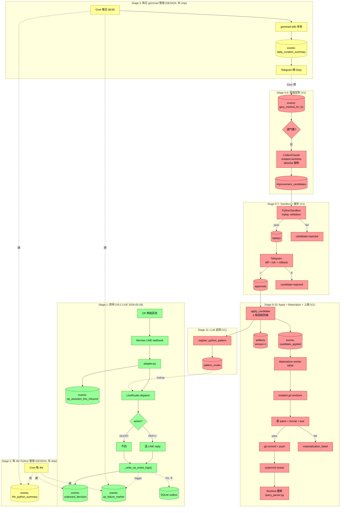

# OP Bot + AI Native Company — System State Overview

**Status**:active overview(2026-05-28 snapshot)
**用途**:新 agent / 新 reviewer 一份看完全局 — V0.2 已 LIVE 的部分 + V1 設計中的部分 + 每個元件對到哪個程式
**與相關文件的關係**:本檔是 snapshot,**不取代** `2026-05-28-learning-loop-design-v0.2.md`(才是設計 canonical);本檔變過時時改寫不另開新檔

---

## 一句話總結

**V0.2(2026-05-28 剛 ship)**:OP bot 每次處理 LINE 訊息,**第一次把決策過程 + 失敗線索結構化寫進 PostgreSQL**;PG 卡住自動退到本地 SQLite 暫存。
**V1(設計中)**:廉價 LLM 每天找 pattern,貴 LLM 觸發才產 patch,sandbox 跑過 + Gary 在 Telegram ✓ 後,**materializer 自動改實檔 + git commit + push + service restart**。

---

## 完整情境故事 — 美鳳問「小弟有國內團嗎?」

從 OP 同事打字 → bot 自己學會這個 intent 的全程。目前走完 **階段 1**(秒級即時),階段 2-11 設計中。

### 階段 1:即時處理(秒級,V0.2 已 LIVE)

> 時間 13:00:00 美鳳發訊息

1. LINE webhook → DGX Spark 的 Hermes gateway(**使用**:`hermes-gateway-op-assistant.service`(systemd user unit);**關聯**:跟 Telegram 一龍馬 bot 的 `hermes-gateway.service` 是兩條獨立 process;**用途**:LINE 平台適配)
2. adapter 寫一筆 inbound event(**使用**:`plugins/op-assistant-line/adapter.py` `_log_inbound_to_kernel` → `closed_loop_kernel.events` 表 `event_type='op_assistant_line_inbound'`;**用途**:每則 LINE 訊息留 trace,自 2026-05-27 已 LIVE)
3. invocation 偵測「小弟」前綴 → 確認叫 bot
4. 進 B1 Python-first 路由(**使用**:`wannavegtour/line_router.py` `LineRouter.dispatch()`;**用途**:純 Python 確定性分派,不經 LLM)
5. parser 看不懂(沒「國內團」keyword)→ 回 UNCLEAR
6. bot 送 ack「看不出你想問什麼...」回 LINE(美鳳 1 秒看到)
7. **【2026-05-28 新】**adapter 寫 decision log(**使用**:`adapter._write_op_event_logs` → `events.outbound_decision`;**用途**:每次 routing 都留結構化紀錄)
8. **【2026-05-28 新】**trigger 命中 → 同時寫 failure marker(**使用**:`events.op_failure_marker`,payload 含 `failure_type='outcome_failure'`(契約 §9 enum)+ `domain_failure_code='missed_actionable_intent'` + `trigger_reason='parser_returned_unclear'`)
9. PG 卡住 → enqueue 本地 SQLite outbox(**使用**:`~/.hermes/run/wannavegtour/outbox.sqlite`;**用途**:備援不漏資料,Q4=B 鎖定 no daemon)

### 階段 2:每 4 hr Python 整理(設計中,未 ship)

> 時間 17:00 cron 跑

Python script 掃過去 4 hr `outbound_decision` + `op_failure_marker`,純 deterministic 分群 / 算頻率,寫 `events.4hr_python_summary`。免費,內部材料給下一階段 gemma4 用。

### 階段 3:每日 09:00 gemma4 整理(設計中)

> 隔日 09:00

gemma4:e4b 本地推論(**使用**:`localhost:11434/v1` Ollama;**關聯**:跟 Hermes auxiliary 共用模型;**用途**:免費 LLM 找 pattern + 寫人話摘要),寫 `events.daily_curation_summary` + 推 Telegram 給 Gary。

### 階段 4-5:Gary 標 + 候選提案(V1,門檻觸發)

Gary 在 Telegram 回「這個要修」→ 寫 `events.gary_marked_for_fix` → 觸發貴 code writer(Codex CLI / Claude)在隔離 git worktree 寫 patch,**只允許改 `wannavegtour/query_parser.py`**(target_path_allowlist 強制),proposer 看 redacted 資料不看 raw。寫 `improvement_candidates` row。

### 階段 6-7:Sandbox + 審批(V1)

PythonSandbox 跑 `validation_assertions`(過往真實 audit 樣本)→ 過了寫 `replays.status='success'` → Telegram 推 Gary 看 diff + before/after + risk + rollback → Gary ✓ 寫 `approvals`。

### 階段 8-10:Apply + Materialize + 上線(V1)

`engine.apply_candidate` 4 點指紋防線 → DB artifact version+1 + 發 `candidate_applied` event → **Materializer worker** 監聽事件 → 隔離 git worktree 套 patch + format + test + replay → `git commit && git push` → `systemctl restart hermes-gateway-op-assistant.service` → **美鳳下次再問「國內團」→ bot 認得 → 正確回答**

### 階段 11:Pattern routes LLM 退場(V1,並行階段 10)

`engine.register_python_pattern(signature, artifact_id)` 寫 `pattern_routes` → 下次同 signature → `lookup_python_route` hit → 跳過 LLM。

---

## Mermaid 流程圖(色碼狀態)



**色碼**:🟢 綠 LIVE / 🟡 黃 DESIGN(鎖定但未寫 code)/ 🔴 紅 V1(未來階段)

---

## 元件 → 程式 → 狀態 對照表

| 元件 | 程式 / 檔 | 狀態 |
|---|---|---|
| LINE webhook + service | `hermes-gateway-op-assistant.service`(systemd user unit) | 🟢 LIVE |
| Adapter + 3 個新 hook + helper | `plugins/op-assistant-line/adapter.py`(commit `4b6f3fd`) | 🟢 **LIVE 2026-05-28** |
| Python 路由器 | `wannavegtour/line_router.py` | 🟢 LIVE |
| Parser | `wannavegtour/query_parser.py` | 🟢 LIVE |
| Workers + formatter | `availability_checker.py` / `historical_lookup.py` / `response_formatter.py` | 🟢 LIVE |
| **Decision log + failure marker** | `adapter._write_op_event_logs` + `adapter._op_kernel_write` | 🟢 **LIVE 2026-05-28** |
| **PII redaction** | `wannavegtour/redact.py` + tests | 🟢 **LIVE 2026-05-28** |
| **Outbox SQLite buffer** | `wannavegtour/outbox.py` `KernelOutbox` + tests | 🟢 **LIVE 2026-05-28** |
| Kernel events DB | `closed_loop_kernel.events`(PostgreSQL @ Docker port 5434) | 🟢 LIVE |
| Outbox SQLite 檔 | `~/.hermes/run/wannavegtour/outbox.sqlite` | 🟢 **LIVE 2026-05-28** |
| OP event mapping doc | `docs/contracts/op_assistant_event_mapping_v0.md` | 🟢 **LIVE 2026-05-28** |
| Cron 4hr Python | `scripts/op_assistant_4hr_cluster.py`(未寫) | 🟡 DESIGN |
| Cron 24hr gemma4 | v2 doc Cron 2 已 spec,未實作 | 🟡 DESIGN |
| Telegram 推播 daily summary | 從 cron script push,未寫 | 🟡 DESIGN |
| Gary mark for fix | Telegram interaction handler,未寫 | 🔴 V1 |
| Candidate proposer | 貴 LLM(Codex/Claude)+ orchestration,未寫 | 🔴 V1 |
| improvement_candidates 表 | schema LIVE,**0 row** | 🟡 ready |
| Sandbox replay | `closed_loop_kernel/sandbox.py` PythonSandbox(code LIVE,**未對 OP 用過**) | 🟡 ready |
| replays / approvals 表 | schema LIVE,0 row | 🟡 ready |
| apply_candidate | `closed_loop_kernel/engine.py:358`(code LIVE,**未對 OP 用過**) | 🟡 ready |
| Materializer worker | `scripts/op_assistant_materialize.py`(未寫) | 🔴 V1 |
| pattern_routes | schema + code LIVE,**0 row** | 🟡 ready |
| Shadow mode / Rollback contract / Actor separation | 未設計細節 | 🔴 V1 |
| **跨 agent 規矩** | `AGENTS.md`(How To Talk / Doc Discovery / Karpathy 4 原則) | 🟢 LIVE |
| **設計文件 canonical** | `docs/plans/2026-05-28-learning-loop-design-v0.2.md` | 🟢 LIVE canonical |
| **公司契約** | `docs/company-data-contract-v0.md` §9 + `docs/agent-profile-registry-v0.md` | 🟢 LIVE(OP 已對齊) |

---

## V0.2 vs V1 分野(白話)

**V0.2 = 「累積真實資料」階段(現在)**:
- 美鳳問問題 → bot 回 ack → **同時寫一筆結構化紀錄**(這是新加的)
- 一週後 Gary 有真實 failure 資料可看
- **沒有任何自動改 production code 的能力**
- 對 OP 同事:**體驗完全沒變,bot 還是一樣答不出國內團**

**V1 = 「真的閉環自我改進」(下階段)**:
- Gary 看到「過去一週『國內團』查詢失敗 8 筆」(Telegram)
- Gary 回「這個要修」
- 系統自動:寫 patch → sandbox 驗 → Telegram 求簽核 → ✓ 後 commit + push + restart
- 對 OP 同事:**美鳳幾天後再問「國內團」會得到正確答案,完全沒人手動改 code**

---

## 建議的下一步(按重要度)

1. **跑一週 V0.2,累積真實 row**(0 行 code,純真實流量)
   - 美鳳 + 其他 OP 同事正常使用 bot
   - Gary 每天 / 每 2 天看一次 events 表
   - **這週的目的:確認 hook 沒擋訊息、確認 redaction 正確、看實際 failure 分布**

2. **寫 cron 24hr gemma4 curation script + Telegram push**(V0.2 後續,~200 行 / 1 天工)
   - 串 Ollama gemma4
   - 推 Telegram 給 Gary
   - 開始有「每日摘要」習慣

3. **開始設計 candidate proposer**(V1 第一步)
   - **要等 1 完成才能設計**:需要實際 failure data 才能設定門檻

---

## 查資料指令(本機 DGX 跑)

```bash
# events 表近 10 筆所有 event_type
docker exec op-assistant-kernel psql -U op_kernel -d op_kernel \
  -c "SELECT event_type, created_at, payload->>'profile_id' AS profile, \
       payload->>'task_id' AS task, payload->>'reply_kind' AS reply_kind \
       FROM events ORDER BY created_at DESC LIMIT 10;"

# outbox SQLite 看有沒有 pending(預期 0,PG 健康時)
sqlite3 ~/.hermes/run/wannavegtour/outbox.sqlite \
  "SELECT status, COUNT(*) FROM kernel_outbox GROUP BY status;"

# 失敗紀錄分布(過去 24 hr by domain_failure_code)
docker exec op-assistant-kernel psql -U op_kernel -d op_kernel \
  -c "SELECT payload->>'domain_failure_code' AS code, \
       payload->>'failure_type' AS contract_type, COUNT(*) \
       FROM events WHERE event_type='op_failure_marker' \
       AND created_at > NOW() - INTERVAL '24 hours' \
       GROUP BY 1, 2 ORDER BY 3 DESC;"
```

---

## Cross-references

- `docs/plans/INDEX.md` — 所有 plan 索引(本檔在 OP canonical 區)
- `docs/plans/2026-05-28-learning-loop-design-v0.2.md` — v0.2 設計 canonical(本檔是 snapshot,設計變更看那邊)
- `docs/plans/2026-05-27-learning-loop-design-v0.md` — v0.1 Superseded,留歷史脈絡
- `docs/plans/2026-05-26-op-kernel-db-operations-v2.md` — kernel DB ops canonical
- `docs/contracts/op_assistant_event_mapping_v0.md` — OP event → 契約 §9 映射
- `docs/company-data-contract-v0.md` §9 — L1 Failure Record 契約
- `AGENTS.md` — cross-agent 規矩(How To Talk / Doc Discovery / Karpathy)
- `closed_loop_kernel/postgres.py:31-209` — events / attempts / failures / candidates / replays / approvals / artifacts / pattern_routes 真實 schema
- `closed_loop_kernel/engine.py:358-430` — apply_candidate
- `closed_loop_kernel/sandbox.py:139-153` — PythonSandbox AST lint
- Codex consult session: `019e6576-53de-7ac0-8b33-749dafd9958c`
