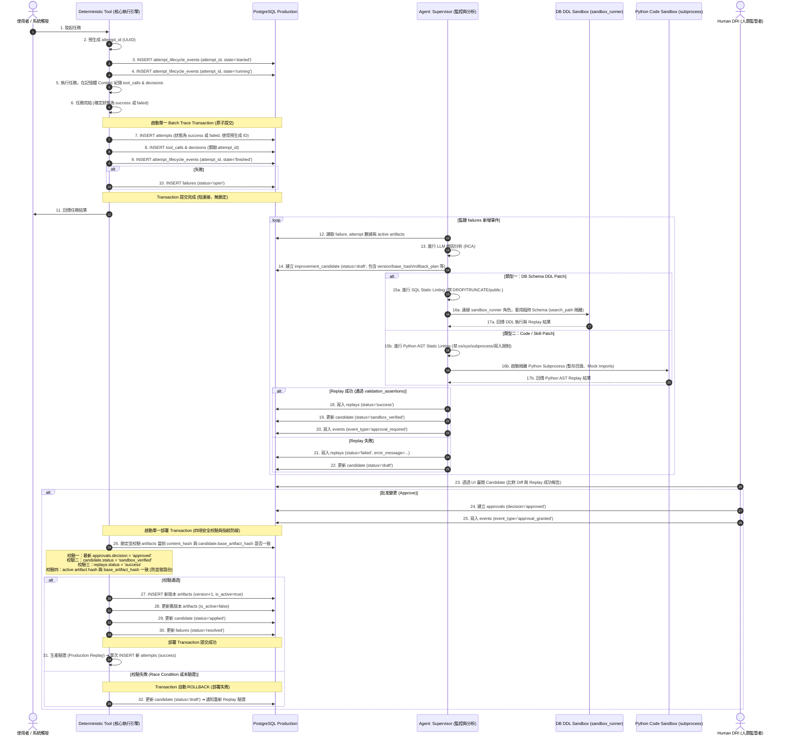

# Event Flow Specification (Loop 3 - Fixed)

本文件詳細定義 **Closed Loop Kernel v0** 的核心事件流（Event Flow）與執行時的資料流向。本設計解決了舊版本中「attempts 唯讀卻被 UPDATE」的致命邏輯矛盾，並導入了「雙沙盒安全防禦」與「多重審批防線校驗」以保障生產環境安全。

---

## 1. 核心流程設計：預生成 ID、生命週期事件與單次寫入交易 (Batch Trace Transaction)

為了同時滿足 **1) 歷史不可變（防篡改）**、**2) 實時生命週期監控** 與 **3) 避免長連接鎖定與 update attempts 衝突**，內核採用以下高度優化的事件寫入策略：

1.  **啟動期 (Client-side ID Generation & Lifecycle Started)**：
    *   核心引擎在任務啟動時，於記憶體中預先生成 `attempt_id` (UUID)。
    *   **實時生命週期紀錄**：核心引擎向唯增表 `attempt_lifecycle_events` 中 `INSERT` 一筆狀態為 `started` 的事件紀錄：
        ```sql
        INSERT INTO attempt_lifecycle_events (attempt_id, state, metadata) 
        VALUES ('pre-generated-uuid', 'started', '{"trigger": "user_query"}');
        ```
    *   這能讓監控 UI 實時看見任務啟動，而不需要寫入尚未完結的 attempt 實體。

2.  **執行期 (Execution Context Buffer & Running State)**：
    *   進入執行階段，系統向 `attempt_lifecycle_events` 寫入 `state = 'running'`。
    *   任務執行期間（如呼叫 LLM、多步推理），核心引擎在記憶體中收集所有的決策紀錄（`decisions`）與工具呼叫軌跡（`tool_calls`）。這避免了在 LLM 網路請求期間鎖定資料庫連線，同時完全不需要 UPDATE 任何 DB 紀錄。

3.  **完結期 (Outcome Batch Commit & Finished State)**：
    *   當任務最終成功或失敗時，核心引擎開啟一個短暫且**原子性的資料庫交易 (Atomic DB Transaction)**：
        1.  `INSERT` 最終的 `attempts` 紀錄（狀態為 `success` 或 `failed`，直接寫入 final outcome，不包含任何 UPDATE）：
            ```sql
            INSERT INTO attempts (id, status, input, output, error_message)
            VALUES ('pre-generated-uuid', 'failed', '{"query": "..."}', NULL, 'TypeError: ...');
            ```
        2.  `INSERT` 記憶體中收集的所有 `tool_calls` 與 `decisions` 紀錄（均關聯此 `attempt_id`）。
        3.  `INSERT` 唯讀生命週期事件 `attempt_lifecycle_events` (state = 'finished')。
        4.  （若失敗）`INSERT` 追蹤紀錄到 `failures` (status = 'open')。
    *   **交易提交完成**。這確保了所有關聯資料的強一致性，且完全無須執行 `UPDATE`。

---

## 2. 閉環生命週期序列圖 (Sequence Diagram)



---

## 3. 雙沙盒安全防禦機制 (Sandbox Security & AST Lint)

為避免 AI 產出的修正案在沙盒中執行時產生越權、破壞或繞過隔離，系統對 DB DDL 與 Python Code 實施**徹底分離**的雙沙盒安全防禦：

### 1. DB Schema DDL 沙盒
主要用來驗證資料庫遷移（Migrations）或結構變更：
*   **Static SQL DDL Linting**：
    在 SQL DDL 執行前進行語法解析與靜態過濾，直接攔截阻斷含有 `DROP TABLE`（除非是臨時 sandbox 開頭的 DDL）、`TRUNCATE`、或帶有任何 `public.` 前綴的語句，強制防堵試圖繞過隔離修改生產環境主 Schema 的行為。
*   **Least-Privilege Role 連線**：
    沙盒重播由獨立的資料庫連線帳號 `sandbox_runner` 執行。該角色沒有 `public` schema 的 `CREATE` 權限，且不繼承生產連線帳號的權限，只能在被動態授予 `USAGE` 的臨時 `sandbox_temp_xxxx` Schema 下建立與讀寫資料。
    ```sql
    REVOKE ALL ON SCHEMA public FROM PUBLIC;
    REVOKE ALL ON ALL TABLES IN SCHEMA public FROM sandbox_runner;
    ```

### 2. Python Code Sandbox
主要用來驗證 Agent Skills、Helpers 或 Python 代碼的修補：
*   **AST Static Linting (抽象語法樹過濾)**：
    使用 Python 的 `ast` 模組解析 AI 產出的 Python 補丁。直接攔截阻斷以下行為：
    - 調用 `os`、`sys`、`subprocess`、`socket`、`builtins.__import__`、`shutil` 等敏感與作業系統交互模組。
    - 任何使用 `open()` 寫入本機敏感目錄的行為。
*   **隔離 Subprocess 執行**：
    Python 補丁必須在隔離的子進程（Subprocess）中執行，且運作於專屬的暫時虛擬目錄（Ephemeral Virtual Directory）下。所有的敏感模組與檔案寫入均使用 Python Mock 機制重導向，絕對無法直接覆寫生產環境的實體 `skills/` 或 `src/` 目錄。

---

## 4. 變更套用的指紋防線 (Deployment Verification)

當人類 DRI 給予 Approval 後，套用引擎在生產資料庫的交易中強制執行以下**四項硬性安全校驗**：

1.  **審批校驗**：查詢 `approvals` 表中，最新一筆針對此 candidate_id 的決策必須為 `decision = 'approved'`。
2.  **狀態校驗**：`improvement_candidates` 表中狀態必須為 `status = 'sandbox_verified'`。
3.  **重播校驗**：關聯的 `replays` 紀錄中必須有至少一筆為 `status = 'success'` 且通過所有 `validation_assertions`。
4.  **防競合校驗 (Optimistic Lock)**：比對當前 active 資產的 `content_hash` 是否與 `base_artifact_hash` 相同，確保在 Gary 審批期間沒有其他 Agent 修改過該資產。

```sql
-- 確保部署交易在單一鎖定中安全執行
BEGIN;

-- 1. 鎖定並取得當前 active 資產的最新 Hash，確保無其他平行交易修改它
SELECT content_hash 
FROM public.artifacts 
WHERE name = :target_name AND is_active = TRUE 
FOR UPDATE;

-- [核心驗證邏輯：比對當前 active hash 與 candidate 當初基於的 base_hash]
-- IF active_hash != candidate.base_artifact_hash THEN
--     RAISE EXCEPTION 'Race condition detected: Artifact has changed since verification.';
-- END IF;

-- 2. 升級與切換
INSERT INTO public.artifacts (name, artifact_type, content, content_hash, version, is_active)
VALUES (:name, :type, :new_content, :new_hash, :next_version, TRUE);

UPDATE public.artifacts 
SET is_active = FALSE 
WHERE name = :name AND version = :current_version;

-- 3. 變更狀態
UPDATE public.improvement_candidates SET status = 'applied' WHERE id = :candidate_id;
UPDATE public.failures SET status = 'resolved' WHERE id = :failure_id;

COMMIT;
```

這項指紋防線徹底杜絕了多 Agent 或人機協同併發修改時的 Race Condition 危害。
